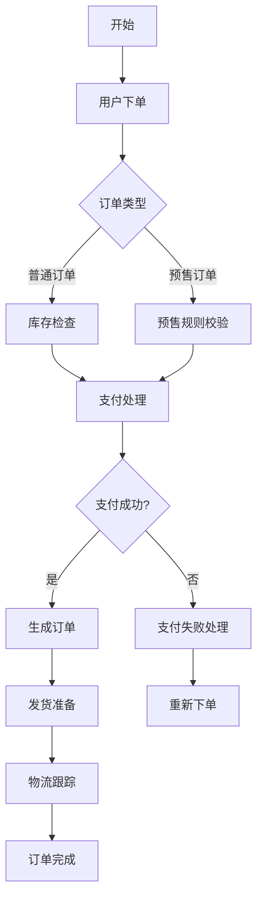
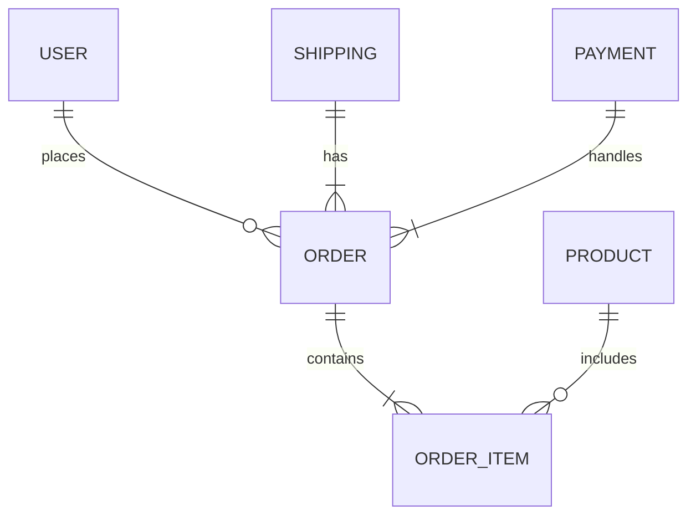
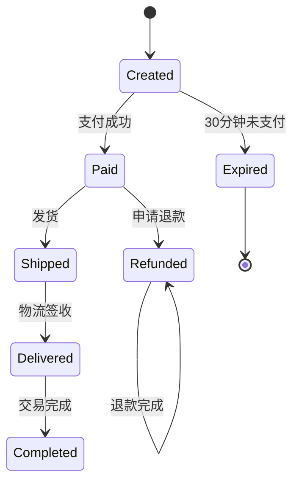

# 核心业务逻辑文档模板

## 业务背景

[在此处用 1-3 句话清晰描述系统存在的原因、解决的问题和目标用户。例如：本系统旨在为电商平台提供高效的订单处理能力，解决传统订单管理中人工操作效率低、易出错的问题，服务对象包括商家、平台运营人员和消费者。]

## 核心业务流程

_注：此流程图展示了核心业务流程，仅包含主要步骤，省略了异常处理等次要路径。_

## 关键业务规则

1. **订单有效期**：普通订单需在下单后 30 分钟内完成支付，否则自动取消
2. **库存规则**：库存不足时，系统自动将商品加入"缺货待补"队列
3. **支付规则**：支付失败超过 3 次，系统将暂时冻结该用户支付功能 1 小时
4. **促销规则**：同一用户同一活动最多享受 3 次优惠，超过次数按原价计算
5. **退款规则**：订单发货后，仅支持部分退款；未发货订单支持全额退款

## 业务实体关系

_注：此关系图展示了核心业务实体间的关联，省略了次要实体和属性。_

## 业务状态流转

_注：此状态图包含所有关键状态，展示了订单从创建到完成的完整流转过程。_

## 业务约束

1. **系统约束**：订单状态变更需记录操作日志，保留至少 180 天
2. **业务约束**：同一用户同一活动优惠次数上限为 3 次
3. **数据约束**：订单金额必须大于 0 且小于 100,000 元
4. **时间约束**：预售订单需在指定预售日期前完成支付
5. **合规约束**：涉及金融交易的订单必须符合当地金融监管要求

---

**文档使用说明**：

- 本模板适用于各类业务系统，只需替换方括号中的内容
- 请确保业务规则具体可验证，避免模糊表述
- 流程图和状态图应聚焦核心流程，避免包含技术实现细节
- 业务约束需明确、具体，便于后续验证和测试
