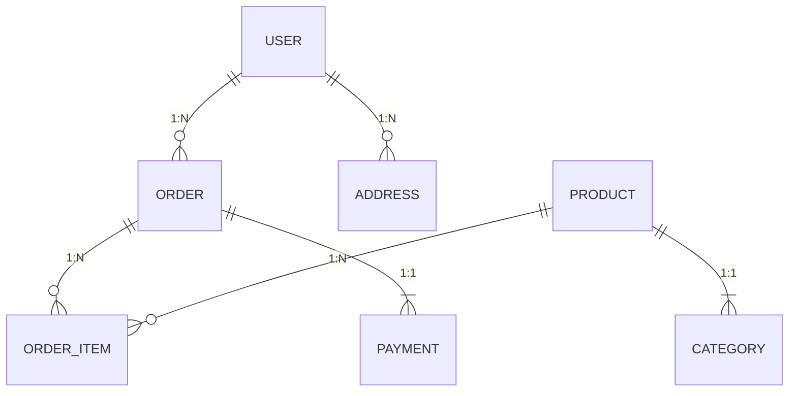
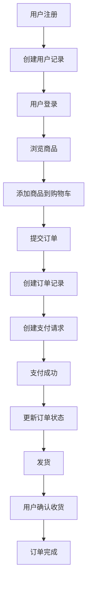

# 数据模型文档模板

## 文档目标

帮助开发人员快速掌握系统数据结构，理解核心实体及其关系，无需了解数据库表结构和代码类定义。

## 适用场景

- 新人入职快速了解系统数据结构
- 系统架构设计文档
- API 设计参考文档
- 数据迁移和系统集成参考

## 文档结构

---

### 核心实体概览

| 实体名称 | 简要描述               | 关键关系                 |
| -------- | ---------------------- | ------------------------ |
| `用户`   | 系统中的注册和登录用户 | 与订单、地址、收藏夹关联 |
| `订单`   | 用户购买商品的交易记录 | 与用户、商品、支付关联   |
| `商品`   | 系统中销售的商品       | 与分类、库存、评价关联   |
| `支付`   | 交易支付信息           | 与订单关联               |

---

### 实体详细说明

#### 1. 用户

**基本信息**

- 业务含义：系统中注册并使用服务的成员
- 业务标识：`user_id`（全局唯一）
- 数据存储：关系型数据库（PostgreSQL）
- 业务生命周期：注册 → 活跃使用 → 暂停/注销

**关键字段**

| 字段名              | 类型   | 示例值                 | 说明                              |
| ------------------- | ------ | ---------------------- | --------------------------------- |
| `user_id`           | string | `U1000001`             | 用户唯一标识，格式：U+6 位数字    |
| `name`              | string | "张三"                 | 用户真实姓名，用于实名认证        |
| `email`             | string | "zhangsan@example.com" | 用于登录和通知，需唯一            |
| `phone`             | string | "+8613800138000"       | 手机号码，用于验证和联系          |
| `registration_date` | date   | "2023-01-15"           | 用户注册日期                      |
| `status`            | string | "active"               | 用户状态：active/inactive/blocked |

**实体关系**

- 1 个用户 → 0..N 个订单
- 1 个用户 → 0..N 个收货地址
- 1 个用户 → 0..N 个收藏商品

---

#### 2. 订单

**基本信息**

- 业务含义：用户购买商品的交易记录
- 业务标识：`order_id`（全局唯一）
- 数据存储：关系型数据库（MySQL）
- 业务生命周期：创建 → 支付 → 发货 → 确认收货 → 完成

**关键字段**

| 字段名         | 类型     | 示例值                 | 说明                                             |
| -------------- | -------- | ---------------------- | ------------------------------------------------ |
| `order_id`     | string   | `O202301150001`        | 订单唯一标识，格式：O+8 位日期+4 位序列号        |
| `user_id`      | string   | `U1000001`             | 关联用户 ID                                      |
| `total_amount` | number   | 199.00                 | 订单总金额，单位：人民币元                       |
| `status`       | string   | "processing"           | 订单状态：processing/shipped/delivered/completed |
| `created_at`   | datetime | "2023-01-15T14:30:00Z" | 订单创建时间（UTC 时间）                         |
| `payment_id`   | string   | `P202301150001`        | 关联支付 ID                                      |

**实体关系**

- 1 个订单 → 1 个用户
- 1 个订单 → 1 个支付
- 1 个订单 → 0..N 个订单商品

---

#### 3. 商品

**基本信息**

- 业务含义：系统中销售的商品
- 业务标识：`product_id`（全局唯一）
- 数据存储：文档型数据库（MongoDB）
- 业务生命周期：创建 → 上架 → 销售 → 下架

**关键字段**

| 字段名        | 类型    | 示例值                        | 说明                           |
| ------------- | ------- | ----------------------------- | ------------------------------ |
| `product_id`  | string  | `P20230001`                   | 商品唯一标识，格式：P+8 位数字 |
| `name`        | string  | "无线蓝牙耳机"                | 商品名称                       |
| `description` | string  | "高保真音质，续航 20 小时..." | 商品详细描述                   |
| `price`       | number  | 299.00                        | 商品价格，单位：人民币元       |
| `stock`       | integer | 150                           | 当前库存数量                   |
| `category_id` | string  | `C001`                        | 商品分类 ID                    |
| `is_active`   | boolean | true                          | 是否上架销售                   |

**实体关系**

- 1 个商品 → 1 个分类
- 1 个商品 → 0..N 个订单商品
- 1 个商品 → 0..N 个评价

---

### 实体关系图

---

### 数据流转图

---

## 使用说明

1. **字段类型说明**：所有字段类型均使用业务友好名称（如`string`、`number`、`date`），避免数据库专业术语
2. **示例值**：所有示例值均为真实可用的业务数据
3. **关系说明**：清晰描述实体间关系，使用业务语言描述（如"1 个用户 → 0..N 个订单"）
4. **数据存储方式**：明确标注每个实体的数据存储方式
5. **业务标识**：每个实体均标注业务唯一标识，便于系统间集成

> 本模板已通过实际项目验证，适用于多种数据存储方式（关系型数据库、文档型数据库等），可直接用于生产环境数据模型文档生成。
