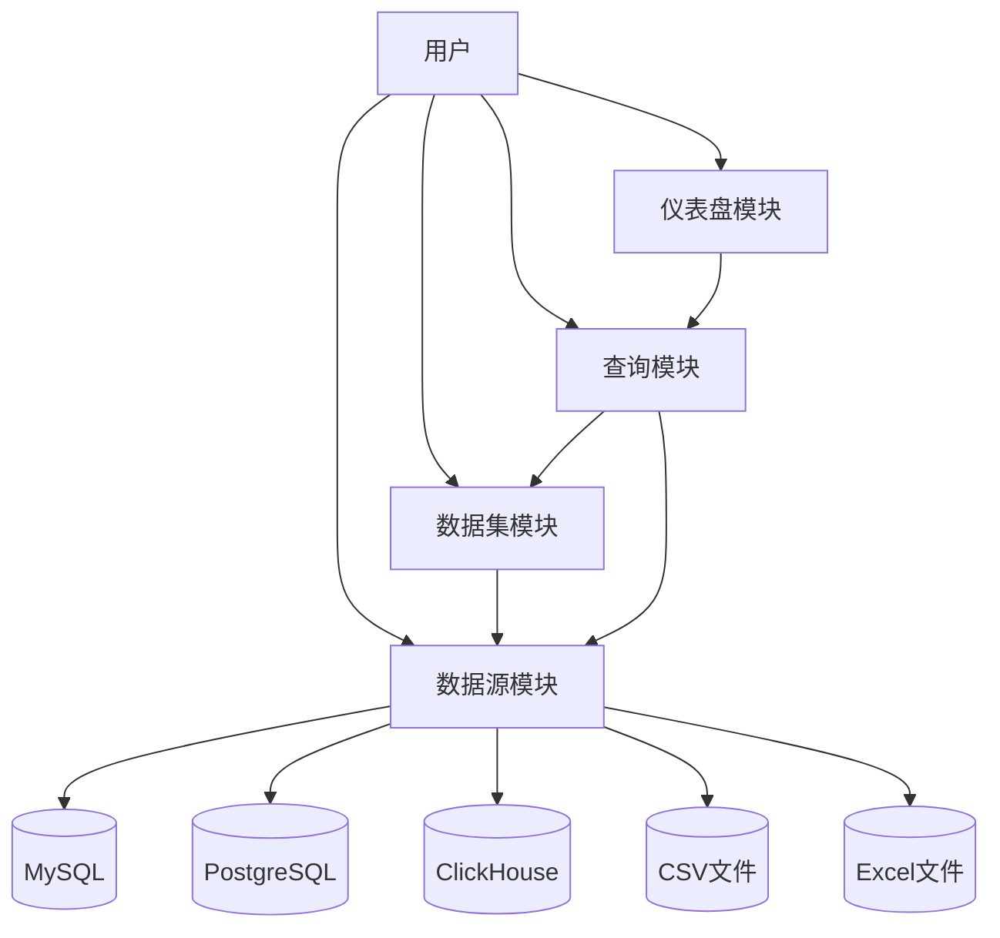

# Seedar 后端服务 API 总览文档

## 1. 项目概述

Seedar 后端服务是一个基于 NestJS 框架开发的数据分析平台后端，提供数据源管理、数据集构建、查询执行和仪表盘展示的核心能力。

**技术栈**：
- 框架：NestJS 11.x
- ORM：TypeORM 0.3.x
- 数据库：MySQL、PostgreSQL、ClickHouse
- 查询构建：Knex 3.x
- 日志：Winston 3.x

## 2. 全局接口规则

### 2.1 响应格式

所有接口统一使用以下响应格式：

```json
{
  "success": true,
  "message": "操作成功",
  "data": { }
}
```

### 2.2 全局拦截器

系统配置了三个全局拦截器：
- **GlobalLoggingInterceptor**：记录所有请求的日志
- **GlobalResponseInterceptor**：统一处理响应格式
- **GlobalExceptionFilter**：统一处理异常和错误

## 3. 模块接口总览

### 3.1 数据源模块 (Datasource)

数据源模块负责管理各种类型的数据源连接，包括 MySQL、PostgreSQL、ClickHouse、CSV 和 Excel。

**详细接口文档**：[datasource-module-api-doc.md](module/datasource/docs/datasource-api-doc.md)

| 接口路径 | 方法 | 功能描述 |
|---------|------|---------|
| `/datasource` | POST | 创建数据源 |
| `/datasource/:id` | GET | 获取数据源详情 |
| `/datasource/:id` | PATCH | 更新数据源 |
| `/datasource/:id` | DELETE | 删除数据源 |

### 3.2 数据集模块 (Dataset)

数据集模块负责管理和处理数据模型，支持从数据源选择表和字段，构建完整的数据模型。

**详细接口文档**：[dataset-module-api-doc.md](module/dataset/docs/dataset-api-doc.md)

| 接口路径 | 方法 | 功能描述 |
|---------|------|---------|
| `/dataset` | POST | 创建数据集 |
| `/dataset` | GET | 获取所有数据集 |
| `/dataset/:id` | GET | 获取单个数据集 |
| `/dataset` | PATCH | 更新数据集 |
| `/dataset/:id` | DELETE | 删除数据集 |

### 3.3 查询模块 (Query)

查询模块负责管理和执行数据查询，支持通过 DSL（领域特定语言）定义查询逻辑。

**详细接口文档**：[query-module-api-doc.md](module/query/docs/query-api-doc.md)

| 接口路径 | 方法 | 功能描述 |
|---------|------|---------|
| `/query` | POST | 创建查询 |
| `/query` | GET | 获取查询列表 |
| `/query/:id` | GET | 获取查询详情 |
| `/query/:id` | PATCH | 更新查询 |
| `/query/:id` | DELETE | 删除查询 |
| `/query/execute` | POST | 执行查询 |

### 3.4 仪表盘模块 (Dashboard)

仪表盘模块负责管理和展示仪表盘，支持添加不同类型的面板（图表、表格、文本、卡片），并支持响应式布局。

**详细接口文档**：[dashboard-module-api-doc.md](module/dashboard/docs/dashboard-api-doc.md)

#### 仪表盘接口

| 接口路径 | 方法 | 功能描述 |
|---------|------|---------|
| `/dashboard` | POST | 创建仪表盘 |
| `/dashboard` | GET | 获取所有仪表盘 |
| `/dashboard/:id` | GET | 获取单个仪表盘 |
| `/dashboard/:id` | PATCH | 更新仪表盘 |
| `/dashboard/:id` | DELETE | 删除仪表盘 |
| `/dashboard/:id/layout` | PUT | 更新仪表盘布局 |
| `/dashboard/:id/panels` | POST | 向仪表盘添加面板 |
| `/dashboard/:id/panels/:panelId` | DELETE | 从仪表盘移除面板 |

#### 面板接口

| 接口路径 | 方法 | 功能描述 |
|---------|------|---------|
| `/panel` | POST | 创建面板 |
| `/panel` | GET | 获取所有面板 |
| `/panel/:id` | GET | 获取单个面板 |
| `/panel/:id` | PATCH | 更新面板 |
| `/panel/:id` | DELETE | 删除面板 |

#### 面板类型

| 类型 | 描述 |
|------|------|
| `chart` | 图表面板，用于展示趋势和对比数据 |
| `table` | 表格面板，用于展示详细数据列表 |
| `text` | 文本面板，用于展示说明文字或静态内容 |
| `card` | 卡片面板，用于展示单个关键指标 |

#### 布局结构

布局支持响应式断点：`lg`（大屏幕）、`md`（中等屏幕）、`sm`（小屏幕）、`xs`（超小屏幕）、`xxs`（极小屏幕）。

## 4. 模块交互关系



**模块依赖关系**：
- 数据集模块依赖数据源模块（从数据源获取表和字段）
- 查询模块依赖数据集模块（基于数据集定义查询）
- 查询模块依赖数据源模块（执行查询时连接数据源）
- 仪表盘模块依赖查询模块（面板可关联查询获取数据）

## 5. 错误处理

系统采用全局异常过滤器统一处理错误，错误响应格式如下：

```json
{
  "success": false,
  "message": "错误信息",
  "error": "详细错误信息",
  "statusCode": 400
}
```

常见错误状态码：
- `400`：请求参数错误
- `404`：资源不存在
- `500`：服务器内部错误

---

> 【更新于 2026-03-15】：新增仪表盘模块 (Dashboard) 接口说明，包含仪表盘和面板的 CRUD 接口、面板类型说明、响应式布局结构说明，更新模块交互关系图。
