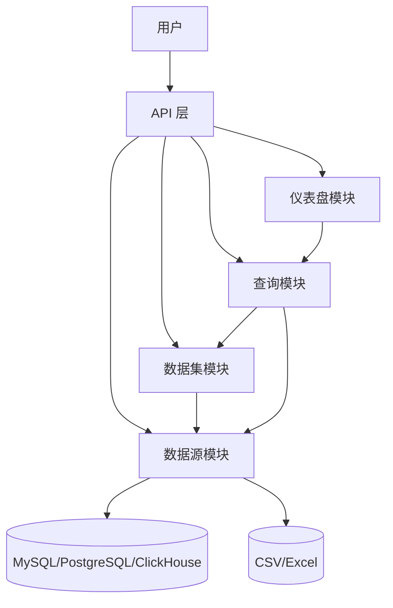
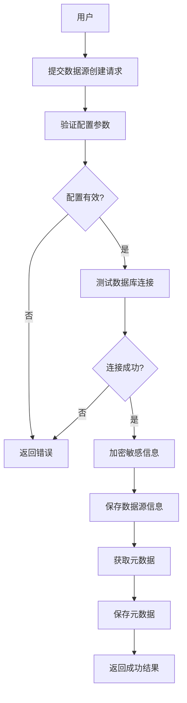
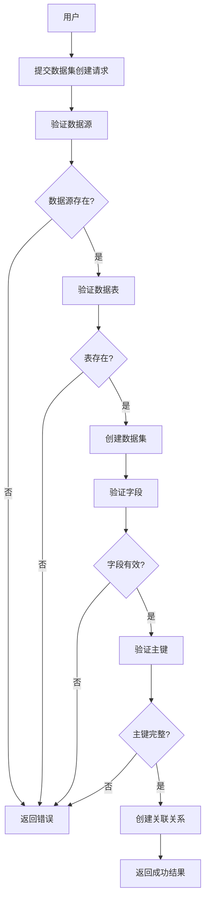
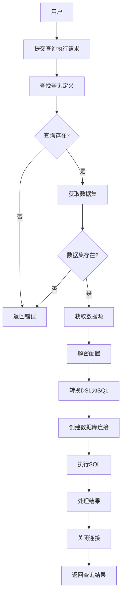
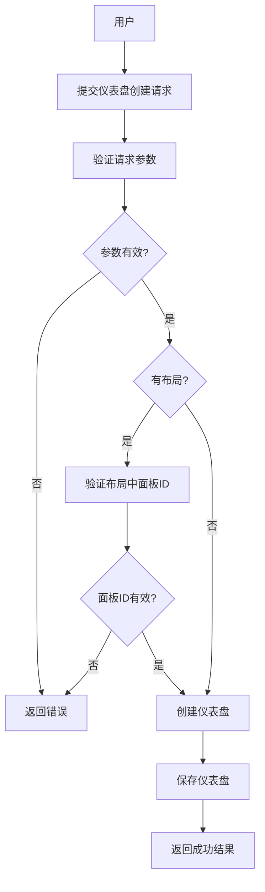

# Seedar 后端服务核心业务逻辑文档

## 1. 项目概述

Seedar 后端服务是一个基于 NestJS 框架开发的数据分析平台，提供数据源管理、数据集构建、查询执行和仪表盘展示的核心能力。系统采用模块化设计，主要包含四个核心业务模块：数据源模块、数据集模块、查询模块和仪表盘模块。

## 2. 系统架构

### 2.1 模块架构



### 2.2 核心流程

系统核心业务流程是：用户先创建数据源，然后从数据源中选择表和字段构建数据集，接着基于数据集定义查询并执行，最后将查询结果通过仪表盘可视化展示。

**典型业务场景**：

1. 用户创建 MySQL 数据源
2. 系统自动获取数据源的表结构和字段信息
3. 用户创建数据集，选择需要的表和字段
4. 用户创建查询，使用 DSL 定义维度和指标
5. 系统执行查询，返回分析结果
6. 用户创建仪表盘，添加面板展示查询结果

## 3. 模块业务逻辑

### 3.1 数据源模块

数据源模块是系统的基础组件，负责管理各种类型的数据源连接、元数据获取和数据处理。

**核心功能**：

- **数据源管理**：创建、查询、更新、删除数据源
- **配置验证**：验证不同数据源类型的配置参数
- **连接测试**：测试数据库连接的有效性
- **元数据获取**：自动获取表结构、列信息、外键关系
- **安全管理**：配置加密存储、软删除机制

**支持的类型**：
- MySQL
- PostgreSQL
- ClickHouse
- CSV 文件
- Excel 文件

**详细业务逻辑**：[datasource-business-logic.md](module/datasource/docs/datasource-business-logic.md)

### 3.2 数据集模块

数据集模块负责管理和处理数据模型，支持从数据源选择表和字段，构建完整的数据模型。

**核心功能**：

- **数据集管理**：创建、查询、更新、删除数据集
- **字段管理**：管理数据集中的字段信息
- **表管理**：管理数据集中的表
- **关联关系管理**：手动或自动创建表之间的关联
- **指标管理**：定义和管理数据指标

**数据集类型**：
- 语义型数据集
- 宽表型数据集

**详细业务逻辑**：[dataset-business-logic.md](module/dataset/docs/dataset-business-logic.md)

### 3.3 查询模块

查询模块负责管理和执行数据查询，支持通过 DSL（领域特定语言）定义查询逻辑。

**核心功能**：

- **查询管理**：创建、查询、更新、删除查询定义
- **DSL 转换**：将查询 DSL 转换为 SQL 语句
- **查询执行**：执行查询并返回结果
- **动态连接**：根据数据源配置动态创建数据库连接

**查询状态**：
- DRAFT（草稿）
- ACTIVE（使用中）
- STOPPED（已停止）

**详细业务逻辑**：[query-business-logic.md](module/query/docs/query-business-logic.md)

### 3.4 仪表盘模块

仪表盘模块负责管理和展示仪表盘，支持添加不同类型的面板，并支持响应式布局。

**核心功能**：

- **仪表盘管理**：创建、查询、更新、删除仪表盘
- **面板管理**：创建、查询、更新、删除面板
- **布局管理**：更新仪表盘布局（支持响应式断点）
- **面板关联**：向仪表盘添加或移除面板
- **布局验证**：验证布局中的面板 ID 是否有效

**面板类型**：
- chart（图表面板）：展示趋势和对比数据
- table（表格面板）：展示详细数据列表
- text（文本面板）：展示说明文字或静态内容
- card（卡片面板）：展示单个关键指标

**响应式布局**：
支持五个响应式断点：lg（≥1200px）、md（≥996px）、sm（≥768px）、xs（≥480px）、xxs（<480px）

**详细业务逻辑**：[dashboard-business-logic.md](module/dashboard/docs/dashboard-business-logic.md)

## 4. 模块交互流程

### 4.1 创建数据源流程



### 4.2 创建数据集流程



### 4.3 执行查询流程



### 4.4 创建仪表盘流程



## 5. 全局机制

### 5.1 响应拦截器

系统使用全局拦截器统一处理响应格式：

```json
{
  "success": true,
  "message": "操作成功",
  "data": { }
}
```

### 5.2 异常处理

系统使用全局异常过滤器统一处理错误：

```json
{
  "success": false,
  "message": "错误信息",
  "error": "详细错误信息",
  "statusCode": 400
}
```

### 5.3 日志记录

系统使用自定义日志服务记录操作日志，支持不同级别的日志输出。

## 6. 数据类型标准化

系统将不同数据源的原始数据类型统一标准化为以下类型：

| 原始类型 | 标准化类型 |
|---------|------------|
| char, varchar, text | string |
| int, decimal, numeric, float, double, real | number |
| date, time, timestamp | date |
| bool | boolean |

## 7. 错误处理规则

| 错误类型 | 状态码 | 处理方式 |
|---------|--------|----------|
| 请求参数错误 | 400 | 返回具体验证失败原因 |
| 资源不存在 | 404 | 提示资源不存在 |
| 数据库错误 | 500 | 返回服务器内部错误 |

## 8. 业务规则约束

### 8.1 数据源规则

- 数据源名称不能为空
- 数据源类型必须是支持的类型
- 连接测试必须成功才能创建或更新

### 8.2 数据集规则

- 数据集字段不能为空
- 每个表的主键字段必须包含在数据集中
- 关联关系必须存在（手动指定或使用外键）

### 8.3 查询规则

- 查询名称不能为空
- 必须关联有效的数据集
- 执行时必须提供 DSL 定义

### 8.4 仪表盘规则

- 仪表盘名称不能为空
- 布局中的面板 ID 必须对应已存在的面板
- 布局支持五个响应式断点

## 9. 依赖关系

- 数据集模块依赖数据源模块
- 查询模块依赖数据集模块和数据源模块
- 仪表盘模块依赖查询模块（面板可关联查询获取数据）
- 所有模块依赖 TypeORM 进行数据持久化
- 查询模块依赖 metric-engine 进行 DSL 转换

## 10. 总结

Seedar 后端服务通过四个核心模块的协作，提供了完整的数据分析能力。数据源模块作为基础组件管理各种数据源，数据集模块在其上构建数据模型，查询模块实现数据分析功能，仪表盘模块提供数据可视化展示。模块之间职责清晰，依赖关系明确，便于扩展和维护。

---

> 【更新于 2026-03-15】：新增仪表盘模块业务逻辑说明，包含核心功能、面板类型、响应式布局、创建仪表盘流程图，更新系统架构图和模块依赖关系。
