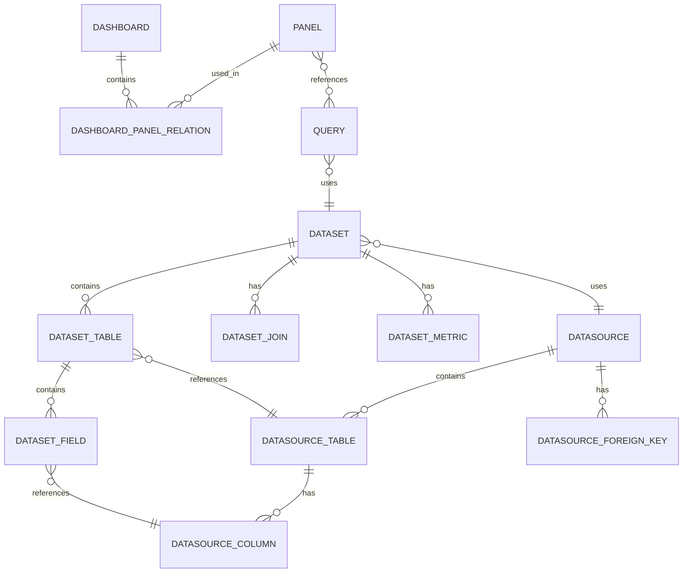

# Seedar 后端服务数据模型总览文档

## 1. 项目概述

Seedar 后端服务的数据模型体系围绕数据分析平台的四个核心模块设计：数据源模块、数据集模块、查询模块和仪表盘模块。这些数据模型通过 TypeORM 进行管理，存储在 MySQL/PostgreSQL 数据库中。

## 2. 实体关系总览



## 3. 模块数据模型

### 3.1 数据源模块

包含 4 个核心实体：

| 实体 | 描述 | 关键字段 |
|------|------|----------|
| `Datasource` | 数据源基本信息 | id, name, type, config, status |
| `DatasourceTable` | 数据源中的表 | id, data_source_id, table_name |
| `DatasourceColumn` | 表的列信息 | id, table_id, column_name, normalized_type |
| `DatasourceForeignKey` | 外键关系 | id, fk_name, source_table_name, target_table_name |

**详细数据模型**：[datasource-data-model.md](module/datasource/docs/datasource-data-model.md)

### 3.2 数据集模块

包含 5 个核心实体：

| 实体 | 描述 | 关键字段 |
|------|------|----------|
| `Dataset` | 数据集基本信息 | id, name, datasource_id, type, status |
| `DatasetTable` | 数据集中的表 | id, dataset_id, datasource_table_id |
| `DatasetField` | 数据集中的字段 | id, table_id, name, type, business_name |
| `DatasetJoin` | 表之间的关联 | id, join_type, left_table_id, right_table_id |
| `DatasetMetric` | 数据指标 | id, name, metric_type, aggregate_function |

**详细数据模型**：[dataset-data-model.md](module/dataset/docs/dataset-data-model.md)

### 3.3 查询模块

包含 1 个核心实体：

| 实体 | 描述 | 关键字段 |
|------|------|----------|
| `Query` | 查询定义 | id, name, dataset_id, dsl, status |

**详细数据模型**：[query-data-model.md](module/query/docs/query-data-model.md)

### 3.4 仪表盘模块

包含 3 个核心实体：

| 实体 | 描述 | 关键字段 |
|------|------|----------|
| `Dashboard` | 仪表盘基本信息 | id, name, layout |
| `Panel` | 面板信息 | id, title, type, query_id, config, width, height |
| `DashboardPanelRelation` | 仪表盘与面板的关联关系 | dashboard_id, panel_id |

**详细数据模型**：[dashboard-data-model.md](module/dashboard/docs/dashboard-data-model.md)

## 4. 数据流关系

```
数据源 → 数据集 → 查询 → 仪表盘
  ↓         ↓       ↓        ↓
表结构    字段定义   DSL     面板
  ↓         ↓       ↓        ↓
列信息    关联关系   SQL     布局
```

## 5. 数据类型标准化

系统将不同数据源的数据类型统一标准化为以下类型：

| 标准化类型 | 原始类型示例 |
|------------|--------------|
| `string` | char, varchar, text |
| `number` | int, decimal, numeric, float, double |
| `date` | date, time, timestamp, datetime |
| `boolean` | bool |

## 6. 枚举类型

### 数据源类型 (DataSourceType)

| 值 | 描述 |
|-----|------|
| `mysql` | MySQL 数据库 |
| `postgres` | PostgreSQL 数据库 |
| `clickhouse` | ClickHouse 数据库 |
| `csv` | CSV 文件 |
| `excel` | Excel 文件 |

### 数据源状态 (DataSourceStatus)

| 值 | 描述 |
|-----|------|
| `active` | 可用 |
| `invalid` | 校验失败 |
| `deleted` | 逻辑删除 |

### 数据集类型 (DatasetType)

| 值 | 描述 |
|-----|------|
| `semantic` | 语义型数据集 |
| `wide` | 宽表型数据集 |

### 查询状态 (QueryStatus)

| 值 | 描述 |
|-----|------|
| `DRAFT` | 草稿 |
| `ACTIVE` | 使用中 |
| `STOPPED` | 已停止 |

### 指标类型 (MetricType)

| 值 | 描述 |
|-----|------|
| `row_level` | 行级指标 |
| `aggregate` | 聚合指标 |
| `post_aggregate` | 后聚合指标 |
| `arithmetic` | 算术运算指标 |
| `period_over_period` | 同环比指标 |

### 连接类型 (JoinType)

| 值 | 描述 |
|-----|------|
| `inner` | 内连接 |
| `left` | 左连接 |
| `right` | 右连接 |

### 面板类型 (PanelType)

| 值 | 描述 |
|-----|------|
| `chart` | 图表面板 |
| `table` | 表格面板 |
| `text` | 文本面板 |
| `card` | 卡片面板 |

## 7. 数据安全

### 配置加密

- 数据源配置中的敏感信息（如密码）在存储前会被加密
- 查询时会自动解密配置信息

### 软删除

- 数据源和数据集删除采用软删除方式
- 通过 `deletedAt` 字段标记

## 8. 数据约束

### 主键约束

- 所有实体都有自增主键 `id`（UUID 类型）

### 外键约束

- 实体之间的关联使用外键约束
- 确保数据完整性
- 支持级联删除

### 非空约束

- 必要字段（如名称、类型等）设置非空约束

## 9. 性能优化

### 索引策略

- 所有外键字段建立索引
- 常用查询字段（如状态、类型）建立索引

### 批量操作

- 使用批量查询减少数据库交互次数
- 使用预加载减少 N+1 查询问题

### 缓存策略

- 元数据信息存储在数据库中，避免重复查询

## 10. 总结

Seedar 后端服务的数据模型设计遵循以下原则：

1. **分层设计**：数据源层 → 数据集层 → 查询层 → 仪表盘层，职责清晰
2. **标准化**：数据类型统一标准化，提供统一的数据访问接口
3. **安全性**：敏感信息加密存储，采用软删除机制
4. **性能优化**：合理设计索引，采用批量操作提高性能
5. **扩展性**：使用枚举类型和 JSON 字段，便于后续扩展

---

> 【更新于 2026-03-15】：新增仪表盘模块数据模型说明，包含 Dashboard、Panel、DashboardPanelRelation 三个核心实体，新增面板类型枚举 (PanelType)，更新实体关系总览图。
