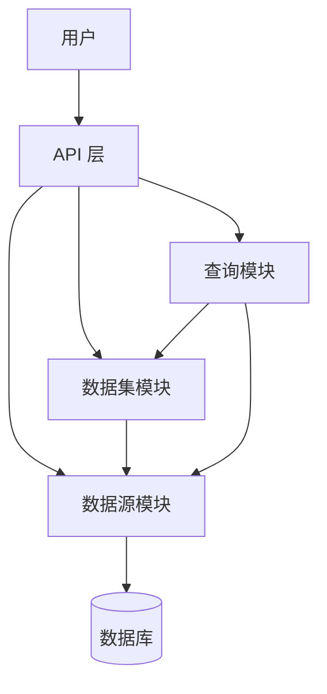
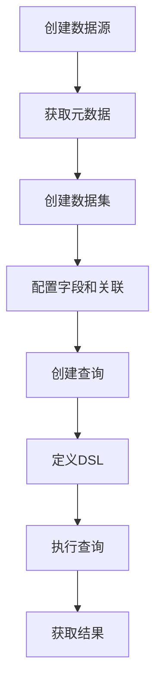

# Seedar 后端服务产品需求文档

## 1. 产品概述

Seedar 后端服务是一个基于 NestJS 框架开发的数据分析平台后端，提供完整的数据源管理、数据集构建和查询执行能力。

**核心目标**：
- 提供统一的数据源管理接口，简化数据接入流程
- 支持多种数据源类型，满足不同业务场景需求
- 提供灵活的数据模型构建能力
- 支持通过 DSL 定义复杂的查询逻辑
- 确保数据操作的安全性和可靠性

**目标用户**：
- 数据分析师：使用数据集进行数据分析和报表生成
- 数据工程师：创建和维护数据模型
- 业务用户：通过查询获取业务数据

## 2. 系统架构

### 2.1 模块架构

系统采用模块化设计，包含三个核心业务模块：

### 2.2 技术栈

- **后端框架**：NestJS 11.x
- **ORM**：TypeORM 0.3.x
- **数据库**：MySQL、PostgreSQL、ClickHouse
- **查询构建**：Knex 3.x
- **日志**：Winston 3.x

## 3. 核心功能

### 3.1 数据源模块

**功能描述**：管理各种类型的数据源连接、元数据获取和数据处理。

**详细PRD**：[datasource-prd.md](module/datasource/docs/datasource-prd.md)

**核心功能**：
| 功能 | 描述 | 优先级 |
|------|------|--------|
| 数据源管理 | 创建、查询、更新、删除数据源 | 高 |
| 配置验证 | 验证不同数据源类型的配置 | 高 |
| 连接测试 | 测试数据库连接的有效性 | 高 |
| 元数据获取 | 自动获取表结构、列信息、外键关系 | 高 |
| 安全管理 | 配置加密存储、软删除机制 | 中 |

**支持的类型**：
- MySQL
- PostgreSQL
- ClickHouse
- CSV 文件
- Excel 文件

### 3.2 数据集模块

**功能描述**：管理和处理数据模型，支持从数据源选择表和字段构建数据模型。

**详细PRD**：[dataset-prd.md](module/dataset/docs/dataset-prd.md)

**核心功能**：
| 功能 | 描述 | 优先级 |
|------|------|--------|
| 数据集管理 | 创建、查询、更新、删除数据集 | 高 |
| 字段管理 | 管理数据集中的字段信息 | 高 |
| 表管理 | 管理数据集中的表 | 高 |
| 关联关系管理 | 手动或自动创建表之间的关联 | 高 |
| 指标管理 | 定义和管理数据指标 | 中 |

**数据集类型**：
- 语义型（semantic）
- 宽表型（wide）

### 3.3 查询模块

**功能描述**：管理和执行数据查询，支持通过 DSL 定义查询逻辑。

**详细PRD**：[query-prd.md](module/query/docs/query-prd.md)

**核心功能**：
| 功能 | 描述 | 优先级 |
|------|------|--------|
| 查询管理 | 创建、查询、更新、删除查询定义 | 高 |
| DSL 转换 | 将查询 DSL 转换为 SQL 语句 | 高 |
| 查询执行 | 执行查询并返回结果 | 高 |
| 动态连接 | 根据数据源配置动态创建数据库连接 | 高 |

**查询状态**：
- DRAFT（草稿）
- ACTIVE（使用中）
- STOPPED（已停止）

## 4. 业务流程

### 4.1 典型业务流程

### 4.2 模块交互流程

1. **数据源创建流程**：验证配置 → 测试连接 → 加密保存 → 获取元数据
2. **数据集创建流程**：验证数据源 → 选择表 → 配置字段 → 定义关联
3. **查询执行流程**：获取数据集 → 转换DSL → 生成SQL → 执行查询

## 5. 数据模型

系统数据模型包含以下核心实体：

### 5.1 数据源模块

| 实体 | 描述 |
|------|------|
| Datasource | 数据源基本信息 |
| DatasourceTable | 数据源中的表 |
| DatasourceColumn | 表的列信息 |
| DatasourceForeignKey | 外键关系 |

### 5.2 数据集模块

| 实体 | 描述 |
|------|------|
| Dataset | 数据集基本信息 |
| DatasetTable | 数据集中的表 |
| DatasetField | 数据集中的字段 |
| DatasetJoin | 表之间的关联 |
| DatasetMetric | 数据指标 |

### 5.3 查询模块

| 实体 | 描述 |
|------|------|
| Query | 查询定义 |

详细数据模型参考 [server-data-model-overview.md](server-data-model-overview.md)

## 6. 非功能需求

### 6.1 性能需求

| 指标 | 要求 |
|------|------|
| 数据源创建响应时间 | ≤ 5秒 |
| 查询执行响应时间 | ≤ 5秒（中等数据量） |
| 并发处理 | 支持 10+ 并发请求 |

### 6.2 可靠性需求

- 数据操作的原子性，使用事务确保一致性
- 完善的错误处理机制
- 详细的日志记录

### 6.3 安全性需求

- 数据源配置加密存储
- 软删除机制保护数据
- 访问权限控制

### 6.4 可扩展性需求

- 模块化设计，便于扩展
- 支持多种数据源类型
- 支持自定义指标类型

## 7. 验收标准

### 7.1 功能验收

- [ ] 成功创建和管理多种类型的数据源
- [ ] 成功创建和查询数据集
- [ ] 成功创建和执行查询
- [ ] 元数据自动获取功能正常

### 7.2 性能验收

- [ ] 数据源创建响应时间符合要求
- [ ] 查询执行响应时间符合要求
- [ ] 并发处理能力满足需求

### 7.3 安全性验收

- [ ] 敏感信息加密存储
- [ ] 软删除机制正常工作
- [ ] 错误处理机制完善

## 8. 风险评估

| 风险 | 影响程度 | 可能性 | 缓解措施 |
|------|----------|--------|----------|
| 连接稳定性 | 高 | 中 | 提供详细的错误信息 |
| 性能问题 | 高 | 中 | 优化SQL生成，添加缓存 |
| 安全风险 | 高 | 低 | 加密存储，权限控制 |
| 依赖风险 | 中 | 中 | 设计模块化架构 |

## 9. 项目边界

### 9.1 功能边界

- 仅支持已定义的数据源类型
- 不支持实时数据处理
- 查询模块不支持直接编写SQL

### 9.2 技术边界

- 基于 NestJS 框架开发
- 使用 TypeORM 进行数据持久化
- 依赖 metric-engine 进行 DSL 转换

## 10. 总结

Seedar 后端服务通过三个核心模块的协作，提供了完整的数据分析平台能力。数据源模块作为基础组件管理各种数据源，数据集模块在其上构建数据模型，查询模块最终实现数据分析功能。

系统采用模块化设计，职责清晰，依赖关系明确，便于扩展和维护。通过标准化的数据类型处理和统一的安全机制，为用户提供了灵活、安全、高效的数据访问能力。

## 11. 相关文档

- [API 总览文档](server-api-overview.md)
- [快速入门指南](server-quick-start-overview.md)
- [业务逻辑文档](server-business-logic-overview.md)
- [数据模型文档](server-data-model-overview.md)
- [FAQ 文档](server-faq-overview.md)
