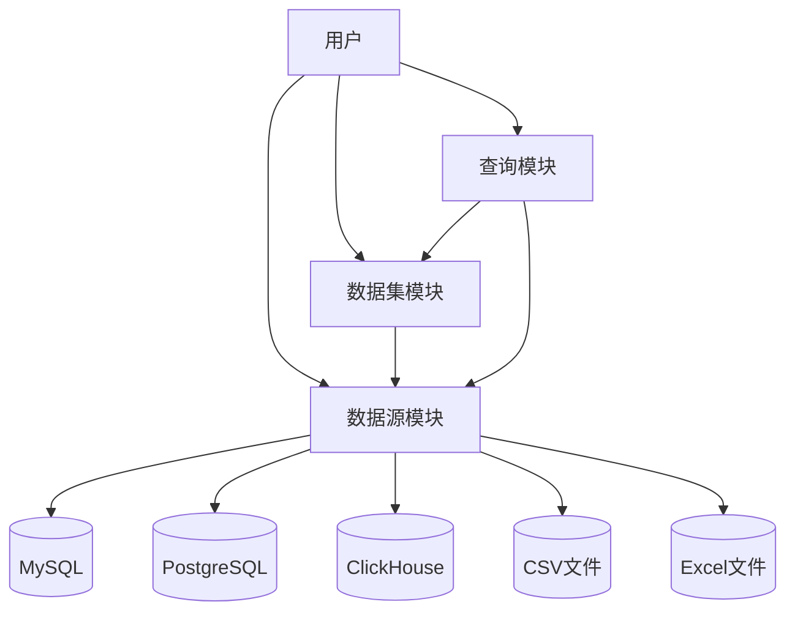
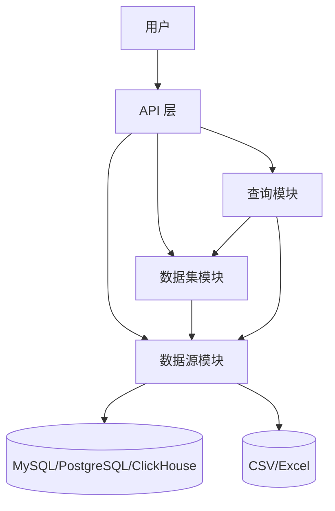
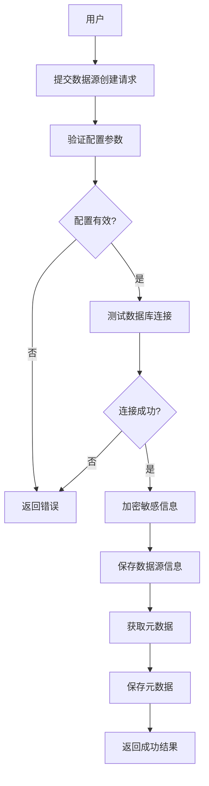
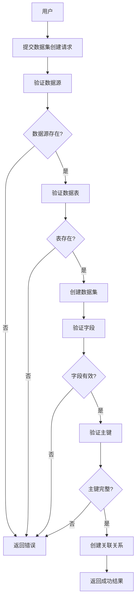
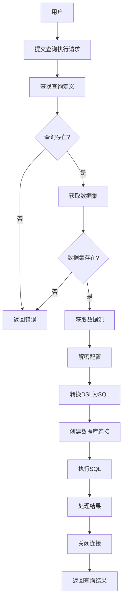
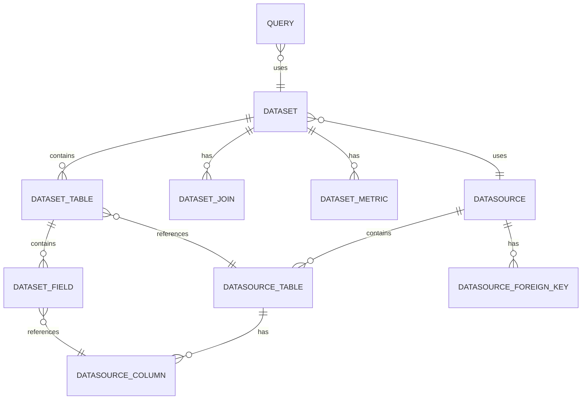
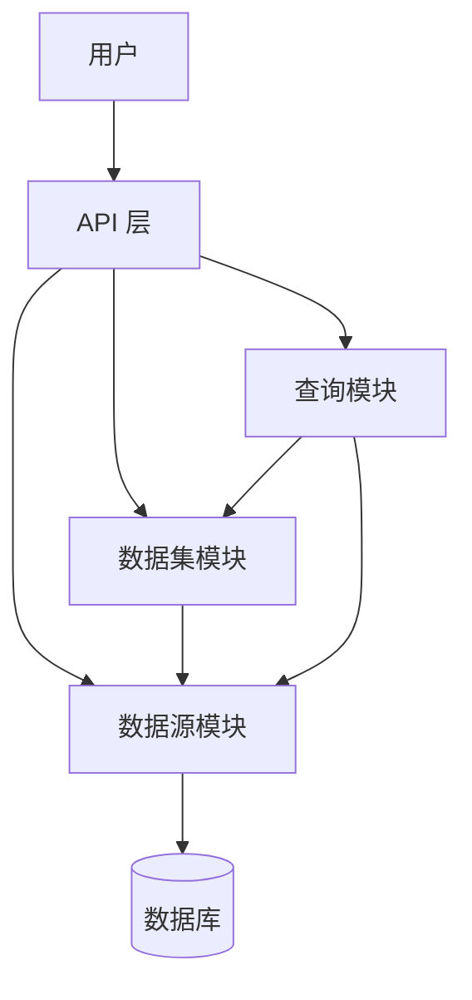
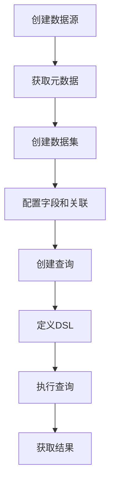

# Seedar 后端服务 API 总览文档

## 1. 项目概述

Seedar 后端服务是一个基于 NestJS 框架开发的数据分析平台后端，提供数据源管理、数据集构建和查询执行的核心能力。

**技术栈**：

- 框架：NestJS 11.x
- ORM：TypeORM 0.3.x
- 数据库：MySQL、PostgreSQL、ClickHouse
- 查询构建：Knex 3.x
- 日志：Winston 3.x

## 2. 全局接口规则

### 2.1 响应格式

所有接口统一使用以下响应格式：

```json
{
  "success": true,
  "message": "操作成功",
  "data": {}
}
```

### 2.2 全局拦截器

系统配置了三个全局拦截器：

- **GlobalLoggingInterceptor**：记录所有请求的日志
- **GlobalResponseInterceptor**：统一处理响应格式
- **GlobalExceptionFilter**：统一处理异常和错误

## 3. 模块接口总览

### 3.1 数据源模块 (Datasource)

数据源模块负责管理各种类型的数据源连接，包括 MySQL、PostgreSQL、ClickHouse、CSV 和 Excel。

**详细接口文档**：[datasource-module-api-doc.md](module/datasource/docs/datasource-api-doc.md)

| 接口路径          | 方法   | 功能描述       |
| ----------------- | ------ | -------------- |
| `/datasource`     | POST   | 创建数据源     |
| `/datasource/:id` | GET    | 获取数据源详情 |
| `/datasource/:id` | PATCH  | 更新数据源     |
| `/datasource/:id` | DELETE | 删除数据源     |

### 3.2 数据集模块 (Dataset)

数据集模块负责管理和处理数据模型，支持从数据源选择表和字段，构建完整的数据模型。

**详细接口文档**：[dataset-module-api-doc.md](module/dataset/docs/dataset-api-doc.md)

| 接口路径描述 |
|---------| | 方法 | 功能------|---------|
| `/dataset` | POST | 创建数据集 |
| `/dataset` | GET | 获取所有数据集 |
| `/dataset/:id` | GET | 获取单个数据集 |
| `/dataset` | PATCH | 更新数据集 |
| `/dataset/:id` | DELETE | 删除数据集 |

### 3.3 查询模块 (Query)

查询模块负责管理和执行数据查询，支持通过 DSL（领域特定语言）定义查询逻辑。

**详细接口文档**：[query-module-api-doc.md](module/query/docs/query-api-doc.md)

| 接口路径         | 方法   | 功能描述     |
| ---------------- | ------ | ------------ |
| `/query`         | POST   | 创建查询     |
| `/query`         | GET    | 获取查询列表 |
| `/query/:id`     | GET    | 获取查询详情 |
| `/query/:id`     | PATCH  | 更新查询     |
| `/query/:id`     | DELETE | 删除查询     |
| `/query/execute` | POST   | 执行查询     |

## 4. 模块交互关系



**模块依赖关系**：

- 数据集模块依赖数据源模块（从数据源获取表和字段）
- 查询模块依赖数据集模块（基于数据集定义查询）
- 查询模块依赖数据源模块（执行查询时连接数据源）

## 5. 错误处理

系统采用全局异常过滤器统一处理错误，错误响应格式如下：

```json
{
  "success": false,
  "message": "错误信息",
  "error": "详细错误信息",
  "statusCode": 400
}
```

常见错误状态码：

- `400`：请求参数错误
- `404`：资源不存在
- `500`：服务器内部错误

# Seedar 后端服务核心业务逻辑文档

## 1. 项目概述

Seedar 后端服务是一个基于 NestJS 框架开发的数据分析平台，提供数据源管理、数据集构建和查询执行的核心能力。系统采用模块化设计，主要包含三个核心业务模块：数据源模块、数据集模块和查询模块。

## 2. 系统架构

### 2.1 模块架构



### 2.2 核心流程

系统核心业务流程是：用户先创建数据源，然后从数据源中选择表和字段构建数据集，最后基于数据集定义查询并执行。

**典型业务场景**：

1. 用户创建 MySQL 数据源
2. 系统自动获取数据源的表结构和字段信息
3. 用户创建数据集，选择需要的表和字段
4. 用户创建查询，使用 DSL 定义维度和指标
5. 系统执行查询，返回分析结果

## 3. 模块业务逻辑

### 3.1 数据源模块

数据源模块是系统的基础组件，负责管理各种类型的数据源连接、元数据获取和数据处理。

**核心功能**：

- **数据源管理**：创建、查询、更新、删除数据源
- **配置验证**：验证不同数据源类型的配置参数
- **连接测试**：测试数据库连接的有效性
- **元数据获取**：自动获取表结构、列信息、外键关系
- **安全管理**：配置加密存储、软删除机制

**支持的类型**：

- MySQL
- PostgreSQL
- ClickHouse
- CSV 文件
- Excel 文件

**详细业务逻辑**：[datasource-business-logic.md](module/datasource/docs/datasource-business-logic.md)

### 3.2 数据集模块

数据集模块负责管理和处理数据模型，支持从数据源选择表和字段，构建完整的数据模型。

**核心功能**：

- **数据集管理**：创建、查询、更新、删除数据集
- **字段管理**：管理数据集中的字段信息
- **表管理**：管理数据集中的表
- **关联关系管理**：手动或自动创建表之间的关联
- **指标管理**：定义和管理数据指标

**数据集类型**：

- 语义型数据集
- 宽表型数据集

**详细业务逻辑**：[dataset-business-logic.md](module/dataset/docs/dataset-business-logic.md)

### 3.3 查询模块

查询模块负责管理和执行数据查询，支持通过 DSL（领域特定语言）定义查询逻辑。

**核心功能**：

- **查询管理**：创建、查询、更新、删除查询定义
- **DSL 转换**：将查询 DSL 转换为 SQL 语句
- **查询执行**：执行查询并返回结果
- **动态连接**：根据数据源配置动态创建数据库连接

**查询状态**：

- DRAFT（草稿）
- ACTIVE（使用中）
- STOPPED（已停止）

**详细业务逻辑**：[query-business-logic.md](module/query/docs/query-business-logic.md)

## 4. 模块交互流程

### 4.1 创建数据源流程



### 4.2 创建数据集流程



### 4.3 执行查询流程



## 5. 全局机制

### 5.1 响应拦截器

系统使用全局拦截器统一处理响应格式：

```json
{
  "success": true,
  "message": "操作成功",
  "data": {}
}
```

### 5.2 异常处理

系统使用全局异常过滤器统一处理错误：

```json
{
  "success": false,
  "message": "错误信息",
  "error": "详细错误信息",
  "statusCode": 400
}
```

### 5.3 日志记录

系统使用自定义日志服务记录操作日志，支持不同级别的日志输出。

## 6. 数据类型标准化

系统将不同数据源的原始数据类型统一标准化为以下类型：

| 原始类型                                   | 标准化类型 |
| ------------------------------------------ | ---------- |
| char, varchar, text                        | string     |
| int, decimal, numeric, float, double, real | number     |
| date, time, timestamp                      | date       |
| bool                                       | boolean    |

## 7. 错误处理规则

| 错误类型     | 状态码 | 处理方式             |
| ------------ | ------ | -------------------- |
| 请求参数错误 | 400    | 返回具体验证失败原因 |
| 资源不存在   | 404    | 提示资源不存在       |
| 数据库错误   | 500    | 返回服务器内部错误   |

## 8. 业务规则约束

### 8.1 数据源规则

- 数据源名称不能为空
- 数据源类型必须是支持的类型
- 连接测试必须成功才能创建或更新

### 8.2 数据集规则

- 数据集字段不能为空
- 每个表的主键字段必须包含在数据集中
- 关联关系必须存在（手动指定或使用外键）

### 8.3 查询规则

- 查询名称不能为空
- 必须关联有效的数据集
- 执行时必须提供 DSL 定义

## 9. 依赖关系

- 数据集模块依赖数据源模块
- 查询模块依赖数据集模块和数据源模块
- 所有模块依赖 TypeORM 进行数据持久化
- 查询模块依赖 metric-engine 进行 DSL 转换

## 10. 总结

Seedar 后端服务通过三个核心模块的协作，提供了完整的数据分析能力。数据源模块作为基础组件管理各种数据源，数据集模块在其上构建数据模型，查询模块最终实现数据分析功能。模块之间职责清晰，依赖关系明确，便于扩展和维护。

# Seedar 后端服务数据模型总览文档

## 1. 项目概述

Seedar 后端服务的数据模型体系围绕数据分析平台的三个核心模块设计：数据源模块、数据集模块和查询模块。这些数据模型通过 TypeORM 进行管理，存储在 MySQL/PostgreSQL 数据库中。

## 2. 实体关系总览



## 3. 模块数据模型

### 3.1 数据源模块

包含 4 个核心实体：

| 实体                   | 描述           | 关键字段                                          |
| ---------------------- | -------------- | ------------------------------------------------- |
| `Datasource`           | 数据源基本信息 | id, name, type, config, status                    |
| `DatasourceTable`      | 数据源中的表   | id, data_source_id, table_name                    |
| `DatasourceColumn`     | 表的列信息     | id, table_id, column_name, normalized_type        |
| `DatasourceForeignKey` | 外键关系       | id, fk_name, source_table_name, target_table_name |

**详细数据模型**：[datasource-data-model.md](module/datasource/docs/datasource-data-model.md)

### 3.2 数据集模块

包含 5 个核心实体：

| 实体            | 描述           | 关键字段                                     |
| --------------- | -------------- | -------------------------------------------- |
| `Dataset`       | 数据集基本信息 | id, name, datasource_id, type, status        |
| `DatasetTable`  | 数据集中的表   | id, dataset_id, datasource_table_id          |
| `DatasetField`  | 数据集中的字段 | id, table_id, name, type, business_name      |
| `DatasetJoin`   | 表之间的关联   | id, join_type, left_table_id, right_table_id |
| `DatasetMetric` | 数据指标       | id, name, metric_type, aggregate_function    |

**详细数据模型**：[dataset-data-model.md](module/dataset/docs/dataset-data-model.md)

### 3.3 查询模块

包含 1 个核心实体：

| 实体    | 描述     | 关键字段                          |
| ------- | -------- | --------------------------------- |
| `Query` | 查询定义 | id, name, dataset_id, dsl, status |

**详细数据模型**：[query-data-model.md](module/query/docs/query-data-model.md)

## 4. 数据流关系

```
数据源 → 数据集 → 查询
  ↓         ↓       ↓
表结构    字段定义   DSL
  ↓         ↓       ↓
列信息    关联关系   SQL
```

## 5. 数据类型标准化

系统将不同数据源的数据类型统一标准化为以下类型：

| 标准化类型 | 原始类型示例                         |
| ---------- | ------------------------------------ |
| `string`   | char, varchar, text                  |
| `number`   | int, decimal, numeric, float, double |
| `date`     | date, time, timestamp, datetime      |
| `boolean`  | bool                                 |

## 6. 枚举类型

### 数据源类型 (DataSourceType)

| 值           | 描述              |
| ------------ | ----------------- |
| `mysql`      | MySQL 数据库      |
| `postgres`   | PostgreSQL 数据库 |
| `clickhouse` | ClickHouse 数据库 |
| `csv`        | CSV 文件          |
| `excel`      | Excel 文件        |

### 数据源状态 (DataSourceStatus)

| 值        | 描述     |
| --------- | -------- |
| `active`  | 可用     |
| `invalid` | 校验失败 |
| `deleted` | 逻辑删除 |

### 数据集类型 (DatasetType)

| 值         | 描述         |
| ---------- | ------------ |
| `semantic` | 语义型数据集 |
| `wide`     | 宽表型数据集 |

### 查询状态 (QueryStatus)

| 值        | 描述   |
| --------- | ------ |
| `DRAFT`   | 草稿   |
| `ACTIVE`  | 使用中 |
| `STOPPED` | 已停止 |

### 指标类型 (MetricType)

| 值                   | 描述         |
| -------------------- | ------------ |
| `row_level`          | 行级指标     |
| `aggregate`          | 聚合指标     |
| `post_aggregate`     | 后聚合指标   |
| `arithmetic`         | 算术运算指标 |
| `period_over_period` | 同环比指标   |

### 连接类型 (JoinType)

| 值      | 描述   |
| ------- | ------ |
| `inner` | 内连接 |
| `left`  | 左连接 |
| `right` | 右连接 |

## 7. 数据安全

### 配置加密

- 数据源配置中的敏感信息（如密码）在存储前会被加密
- 查询时会自动解密配置信息

### 软删除

- 数据源和数据集删除采用软删除方式
- 通过 `deletedAt` 字段标记

## 8. 数据约束

### 主键约束

- 所有实体都有自增主键 `id`

### 外键约束

- 实体之间的关联使用外键约束
- 确保数据完整性

### 非空约束

- 必要字段（如名称、类型等）设置非空约束

## 9. 性能优化

### 索引策略

- 所有外键字段建立索引
- 常用查询字段（如状态、类型）建立索引

### 批量操作

- 使用批量查询减少数据库交互次数
- 使用预加载减少 N+1 查询问题

### 缓存策略

- 元数据信息存储在数据库中，避免重复查询

## 10. 总结

Seedar 后端服务的数据模型设计遵循以下原则：

1. **分层设计**：数据源层 → 数据集层 → 查询层，职责清晰
2. **标准化**：数据类型统一标准化，提供统一的数据访问接口
3. **安全性**：敏感信息加密存储，采用软删除机制
4. **性能优化**：合理设计索引，采用批量操作提高性能
5. **扩展性**：使用枚举类型和 JSON 字段，便于后续扩展

# Seedar 后端服务常见问题解答

## 1. 项目基础问题

### 1.1 Seedar 项目是什么？

Seedar 是一个基于 NestJS 框架开发的数据分析平台后端服务，提供数据源管理、数据集构建和查询执行的核心能力。

### 1.2 技术栈是什么？

- **框架**：NestJS 11.x
- **ORM**：TypeORM 0.3.x
- **数据库**：MySQL、PostgreSQL、ClickHouse
- **查询构建**：Knex 3.x
- **日志**：Winston 3.x

### 1.3 项目包含哪些模块？

项目包含三个核心模块：

- **数据源模块**：管理各种类型的数据源连接
- **数据集模块**：管理和处理数据模型
- **查询模块**：管理和执行数据查询

## 2. 快速入门问题

### 2.1 如何启动项目？

```bash
cd apps/server
pnpm install
pnpm run start:dev
```

### 2.2 需要哪些环境配置？

需要配置以下环境变量：

- `PORT`：服务端口（默认 3000）
- `NODE_ENV`：运行环境
- 数据库连接配置（host、port、username、password、database）

## 3. 数据源模块问题

### 3.1 支持哪些数据源类型？

支持以下数据源类型：

- MySQL
- PostgreSQL
- ClickHouse
- CSV 文件
- Excel 文件

### 3.2 数据源配置验证失败怎么办？

请检查：

- 配置参数是否完整
- 数据源类型与配置是否匹配
- 网络连接是否正常
- 参考 [datasource-faq.md](module/datasource/docs/datasource-faq.md)

### 3.3 连接测试失败怎么办？

请检查：

- 数据库服务是否正常运行
- 连接配置是否正确
- 网络连接是否畅通
- 数据库用户权限是否足够

### 3.4 元数据获取失败怎么办？

请检查：

- 数据库用户是否有查询系统表的权限
- 数据库结构是否正常
- 网络连接是否稳定

## 4. 数据集模块问题

### 4.1 创建数据集需要哪些参数？

需要以下参数：

- `datasourceId`：数据源 ID
- `datasourceTableIds`：数据表 ID 列表
- `name`：数据集名称
- `fields`：字段列表

详细说明参考 [dataset-faq.md](module/dataset/docs/dataset-faq.md)

### 4.2 为什么提示"数据源不存在"？

请检查：

- 数据源是否已正确创建
- `datasourceId` 参数值是否正确
- 数据源状态是否为激活状态

### 4.3 为什么提示"主键字段必须包含在数据集中"？

每个表的主键字段必须包含在数据集中，请确保：

- 每个表的主键字段都包含在字段列表中
- 主键字段的 `isPrimaryKey` 属性设置为 `true`

### 4.4 为什么提示"需要配置表之间的关联关系"？

请确保：

- 手动配置表之间的关联关系（joins 字段）
- 或确保数据源中存在外键关系

## 5. 查询模块问题

### 5.1 什么是 DSL？

DSL（Domain Specific Language）是查询的领域特定语言，用于定义查询的具体逻辑，包括：

- 主表选择
- 维度设置
- 指标选择
- 筛选条件
- 表连接配置

详细说明参考 [query-faq.md](module/query/docs/query-faq.md)

### 5.2 如何执行查询？

1. 创建查询：POST /query
2. 执行查询：POST /query/execute

### 5.3 DSL 支持哪些操作符？

- `=`：等于
- `!=`：不等于
- `>`：大于
- `<`：小于
- `>=`：大于等于
- `<=`：小于等于
- `like`：模糊匹配
- `in`：在范围内
- `not_in`：不在范围内

### 5.4 查询执行时间过长怎么办？

优化方法：

- 优化 DSL，减少不必要的维度和指标
- 添加适当的筛选条件，减少数据量
- 确保数据库表有适当的索引
- 检查数据源服务器性能

## 6. 错误处理问题

### 6.1 常见错误状态码

| 状态码 | 含义           |
| ------ | -------------- |
| 400    | 请求参数错误   |
| 404    | 资源不存在     |
| 500    | 服务器内部错误 |

### 6.2 错误响应格式

```json
{
  "success": false,
  "message": "错误信息",
  "error": "详细错误信息",
  "statusCode": 400
}
```

## 7. 性能优化问题

### 7.1 如何优化查询性能？

- 只选择必要的维度和指标
- 使用适当的筛选条件减少数据量
- 合理使用表连接
- 考虑结果缓存
- 定期优化慢查询

### 7.2 如何优化元数据获取？

- 合理配置连接池
- 实现元数据缓存
- 批量处理操作
- 优化数据库查询

## 8. 安全问题

### 8.1 如何保护敏感数据？

- 数据源配置加密存储
- 避免在日志中记录敏感信息
- API 响应中适当处理敏感信息
- 实施访问控制

### 8.2 如何防止 SQL 注入？

- 使用 ORM 框架的参数化查询
- 避免直接拼接 SQL 语句
- 对所有用户输入进行严格验证

## 9. 模块交互问题

### 9.1 模块之间的依赖关系？

- 数据集模块依赖数据源模块
- 查询模块依赖数据集模块和数据源模块
- 查询模块依赖 metric-engine 进行 DSL 转换

### 9.2 典型的业务流程？

1. 创建数据源
2. 从数据源获取表结构
3. 创建数据集
4. 创建查询
5. 执行查询获取结果

## 10. 部署和维护问题

### 10.1 如何监控服务运行？

- 查看应用日志
- 监控查询执行时间
- 记录错误日志

### 10.2 如何备份数据？

- 定期备份数据库
- 导出查询定义为 JSON 文件
- 使用版本控制系统管理配置

## 11. 相关文档

- [API 总览文档](server-api-overview.md)
- [快速入门指南](server-quick-start-overview.md)
- [业务逻辑文档](server-business-logic-overview.md)
- [数据模型文档](server-data-model-overview.md)

## 12. 总结

如果遇到本文档未覆盖的问题，建议：

1. 查看系统日志获取详细错误信息
2. 参考各模块的详细 FAQ 文档
3. 联系技术支持

# Seedar 后端服务产品需求文档

## 1. 产品概述

Seedar 后端服务是一个基于 NestJS 框架开发的数据分析平台后端，提供完整的数据源管理、数据集构建和查询执行能力。

**核心目标**：

- 提供统一的数据源管理接口，简化数据接入流程
- 支持多种数据源类型，满足不同业务场景需求
- 提供灵活的数据模型构建能力
- 支持通过 DSL 定义复杂的查询逻辑
- 确保数据操作的安全性和可靠性

**目标用户**：

- 数据分析师：使用数据集进行数据分析和报表生成
- 数据工程师：创建和维护数据模型
- 业务用户：通过查询获取业务数据

## 2. 系统架构

### 2.1 模块架构

系统采用模块化设计，包含三个核心业务模块：



### 2.2 技术栈

- **后端框架**：NestJS 11.x
- **ORM**：TypeORM 0.3.x
- **数据库**：MySQL、PostgreSQL、ClickHouse
- **查询构建**：Knex 3.x
- **日志**：Winston 3.x

## 3. 核心功能

### 3.1 数据源模块

**功能描述**：管理各种类型的数据源连接、元数据获取和数据处理。

**详细PRD**：[datasource-prd.md](module/datasource/docs/datasource-prd.md)

**核心功能**：
| 功能 | 描述 | 优先级 |
|------|------|--------|
| 数据源管理 | 创建、查询、更新、删除数据源 | 高 |
| 配置验证 | 验证不同数据源类型的配置 | 高 |
| 连接测试 | 测试数据库连接的有效性 | 高 |
| 元数据获取 | 自动获取表结构、列信息、外键关系 | 高 |
| 安全管理 | 配置加密存储、软删除机制 | 中 |

**支持的类型**：

- MySQL
- PostgreSQL
- ClickHouse
- CSV 文件
- Excel 文件

### 3.2 数据集模块

**功能描述**：管理和处理数据模型，支持从数据源选择表和字段构建数据模型。

**详细PRD**：[dataset-prd.md](module/dataset/docs/dataset-prd.md)

**核心功能**：
| 功能 | 描述 | 优先级 |
|------|------|--------|
| 数据集管理 | 创建、查询、更新、删除数据集 | 高 |
| 字段管理 | 管理数据集中的字段信息 | 高 |
| 表管理 | 管理数据集中的表 | 高 |
| 关联关系管理 | 手动或自动创建表之间的关联 | 高 |
| 指标管理 | 定义和管理数据指标 | 中 |

**数据集类型**：

- 语义型（semantic）
- 宽表型（wide）

### 3.3 查询模块

**功能描述**：管理和执行数据查询，支持通过 DSL 定义查询逻辑。

**详细PRD**：[query-prd.md](module/query/docs/query-prd.md)

**核心功能**：
| 功能 | 描述 | 优先级 |
|------|------|--------|
| 查询管理 | 创建、查询、更新、删除查询定义 | 高 |
| DSL 转换 | 将查询 DSL 转换为 SQL 语句 | 高 |
| 查询执行 | 执行查询并返回结果 | 高 |
| 动态连接 | 根据数据源配置动态创建数据库连接 | 高 |

**查询状态**：

- DRAFT（草稿）
- ACTIVE（使用中）
- STOPPED（已停止）

## 4. 业务流程

### 4.1 典型业务流程



### 4.2 模块交互流程

1. **数据源创建流程**：验证配置 → 测试连接 → 加密保存 → 获取元数据
2. **数据集创建流程**：验证数据源 → 选择表 → 配置字段 → 定义关联
3. **查询执行流程**：获取数据集 → 转换DSL → 生成SQL → 执行查询

## 5. 数据模型

系统数据模型包含以下核心实体：

### 5.1 数据源模块

| 实体                 | 描述           |
| -------------------- | -------------- |
| Datasource           | 数据源基本信息 |
| DatasourceTable      | 数据源中的表   |
| DatasourceColumn     | 表的列信息     |
| DatasourceForeignKey | 外键关系       |

### 5.2 数据集模块

| 实体          | 描述           |
| ------------- | -------------- |
| Dataset       | 数据集基本信息 |
| DatasetTable  | 数据集中的表   |
| DatasetField  | 数据集中的字段 |
| DatasetJoin   | 表之间的关联   |
| DatasetMetric | 数据指标       |

### 5.3 查询模块

| 实体  | 描述     |
| ----- | -------- |
| Query | 查询定义 |

详细数据模型参考 [server-data-model-overview.md](server-data-model-overview.md)

## 6. 非功能需求

### 6.1 性能需求

| 指标               | 要求                |
| ------------------ | ------------------- |
| 数据源创建响应时间 | ≤ 5秒               |
| 查询执行响应时间   | ≤ 5秒（中等数据量） |
| 并发处理           | 支持 10+ 并发请求   |

### 6.2 可靠性需求

- 数据操作的原子性，使用事务确保一致性
- 完善的错误处理机制
- 详细的日志记录

### 6.3 安全性需求

- 数据源配置加密存储
- 软删除机制保护数据
- 访问权限控制

### 6.4 可扩展性需求

- 模块化设计，便于扩展
- 支持多种数据源类型
- 支持自定义指标类型

## 7. 验收标准

### 7.1 功能验收

- [ ] 成功创建和管理多种类型的数据源
- [ ] 成功创建和查询数据集
- [ ] 成功创建和执行查询
- [ ] 元数据自动获取功能正常

### 7.2 性能验收

- [ ] 数据源创建响应时间符合要求
- [ ] 查询执行响应时间符合要求
- [ ] 并发处理能力满足需求

### 7.3 安全性验收

- [ ] 敏感信息加密存储
- [ ] 软删除机制正常工作
- [ ] 错误处理机制完善

## 8. 风险评估

| 风险       | 影响程度 | 可能性 | 缓解措施              |
| ---------- | -------- | ------ | --------------------- |
| 连接稳定性 | 高       | 中     | 提供详细的错误信息    |
| 性能问题   | 高       | 中     | 优化SQL生成，添加缓存 |
| 安全风险   | 高       | 低     | 加密存储，权限控制    |
| 依赖风险   | 中       | 中     | 设计模块化架构        |

## 9. 项目边界

### 9.1 功能边界

- 仅支持已定义的数据源类型
- 不支持实时数据处理
- 查询模块不支持直接编写SQL

### 9.2 技术边界

- 基于 NestJS 框架开发
- 使用 TypeORM 进行数据持久化
- 依赖 metric-engine 进行 DSL 转换

## 10. 总结

Seedar 后端服务通过三个核心模块的协作，提供了完整的数据分析平台能力。数据源模块作为基础组件管理各种数据源，数据集模块在其上构建数据模型，查询模块最终实现数据分析功能。

系统采用模块化设计，职责清晰，依赖关系明确，便于扩展和维护。通过标准化的数据类型处理和统一的安全机制，为用户提供了灵活、安全、高效的数据访问能力。

## 11. 相关文档

- [API 总览文档](server-api-overview.md)
- [快速入门指南](server-quick-start-overview.md)
- [业务逻辑文档](server-business-logic-overview.md)
- [数据模型文档](server-data-model-overview.md)
- [FAQ 文档](server-faq-overview.md)

# Seedar 后端服务快速入门指南

## 1. 环境准备

### 1.1 基础要求

- Node.js 18.x 或更高版本
- pnpm 8.x 或更高版本
- MySQL 8.x 或 PostgreSQL 14.x（用于存储系统数据）

### 1.2 安装依赖

```bash
# 进入项目目录
cd d:\projects\seedar

# 安装根目录依赖
pnpm install

# 进入 server 目录
cd apps/server

# 安装 server 依赖
pnpm install
```

### 1.3 环境配置

在 `apps/server` 目录下创建 `.env` 文件：

```bash
# 复制示例配置
cp .env.example .env
```

配置项说明：

| 配置项        | 描述         | 示例值        |
| ------------- | ------------ | ------------- |
| `PORT`        | 服务端口     | `3000`        |
| `NODE_ENV`    | 运行环境     | `development` |
| `DB_HOST`     | 数据库主机   | `localhost`   |
| `DB_PORT`     | 数据库端口   | `3306`        |
| `DB_USERNAME` | 数据库用户名 | `root`        |
| `DB_PASSWORD` | 数据库密码   | `password`    |
| `DB_DATABASE` | 数据库名称   | `seedar`      |

## 2. 启动服务

### 2.1 开发模式

```bash
cd apps/server
pnpm run start:dev
```

服务启动成功后，访问 http://localhost:3000

### 2.2 生产模式

```bash
cd apps/server
pnpm run build
pnpm run start:prod
```

## 3. 快速使用流程

### 3.1 第一步：创建数据源

使用 POST 请求创建数据源：

```bash
curl -X POST http://localhost:3000/datasource \
  -H "Content-Type: application/json" \
  -d '{
    "name": "MySQL数据库",
    "type": "mysql",
    "config": {
      "host": "localhost",
      "port": 3306,
      "database": "test_db",
      "username": "root",
      "password": "password"
    }
  }'
```

**支持的数据源类型**：

- `mysql`：MySQL 数据库
- `postgresql`：PostgreSQL 数据库
- `clickhouse`：ClickHouse 数据库
- `csv`：CSV 文件
- `excel`：Excel 文件

### 3.2 第二步：创建数据集

```bash
curl -X POST http://localhost:3000/dataset \
  -H "Content-Type: application/json" \
  -d '{
    "datasourceId": 1,
    "datasourceTableIds": [1, 2],
    "name": "销售数据集",
    "description": "用于销售数据分析",
    "mainTableId": 1,
    "fields": [
      {
        "tableId": 1,
        "dataSourceColumnId": 1,
        "name": "order_id",
        "businessName": "订单ID",
        "isPrimaryKey": true
      }
    ]
  }'
```

### 3.3 第三步：创建查询

```bash
curl -X POST http://localhost:3000/query \
  -H "Content-Type: application/json" \
  -d '{
    "name": "月度销售查询",
    "datasetId": 1,
    "dsl": {
      "tableId": 1,
      "dimensions": ["month"],
      "metrics": ["sales_amount"]
    },
    "status": "ACTIVE"
  }'
```

### 3.4 第四步：执行查询

```bash
curl -X POST http://localhost:3000/query/execute \
  -H "Content-Type: application/json" \
  -d '{
    "queryId": 1
  }'
```

## 4. API 文档参考

- [API 总览文档](server-api-overview.md)
- [数据源模块 API 文档](module/datasource/docs/datasource-api-doc.md)
- [数据集模块 API 文档](module/dataset/docs/dataset-api-doc.md)
- [查询模块 API 文档](module/query/docs/query-api-doc.md)

## 5. 常用命令

| 命令                 | 描述                     |
| -------------------- | ------------------------ |
| `pnpm run start:dev` | 启动开发服务器（热重载） |
| `pnpm run build`     | 构建生产版本             |
| `pnpm run lint`      | 代码检查和修复           |
| `pnpm run test`      | 运行单元测试             |

## 6. 目录结构

```
apps/server/src/
├── main.ts                 # 应用入口
├── app.module.ts          # 根模块
├── config/                # 配置文件
│   ├── database.config.ts
│   └── logger.config.ts
├── logger/                # 日志模块
├── common/                # 公共模块
│   ├── global-exception.filter.ts
│   ├── global-logging.interceptor.ts
│   └── global-response.interceptor.ts
└── module/                # 功能模块
    ├── datasource/        # 数据源模块
    ├── dataset/           # 数据集模块
    └── query/             # 查询模块
```
