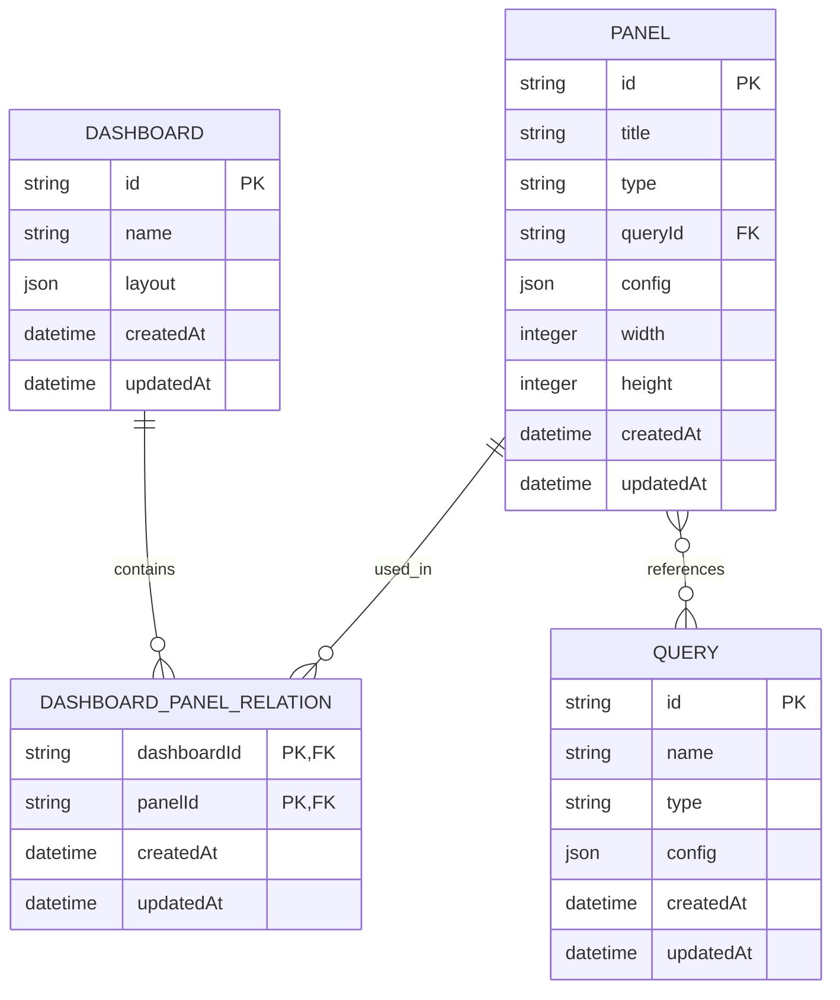

# Dashboard 模块数据模型文档

## 1. 数据模型概述

Dashboard 模块包含三个核心数据实体：`Dashboard`（仪表盘）、`Panel`（面板）和 `DashboardPanelRelation`（仪表盘与面板的关联关系）。这些实体之间通过关联关系形成完整的数据模型。

## 2. 实体关系图



## 3. 实体详细说明

### 3.1 Dashboard（仪表盘）

| 字段名 | 数据类型 | 约束 | 描述 |
|--------|----------|------|------|
| `id` | `string` | `PRIMARY KEY, UUID` | 仪表盘唯一标识符 |
| `name` | `string` | `NOT NULL, VARCHAR(255)` | 仪表盘名称 |
| `layout` | `json` | `NULL` | 仪表盘布局配置 |
| `createdAt` | `datetime` | `NOT NULL, DEFAULT CURRENT_TIMESTAMP` | 创建时间 |
| `updatedAt` | `datetime` | `NOT NULL, DEFAULT CURRENT_TIMESTAMP ON UPDATE CURRENT_TIMESTAMP` | 更新时间 |

**关联关系**：
- 一对多：`Dashboard` → `DashboardPanelRelation`
  - 一个仪表盘可以包含多个面板
  - 级联操作：删除仪表盘时，级联删除关联的面板关系

### 3.2 Panel（面板）

| 字段名 | 数据类型 | 约束 | 描述 |
|--------|----------|------|------|
| `id` | `string` | `PRIMARY KEY, UUID` | 面板唯一标识符 |
| `title` | `string` | `NULL, VARCHAR(255)` | 面板标题 |
| `type` | `string` | `NOT NULL, ENUM('chart', 'table', 'text', 'card')` | 面板类型 |
| `queryId` | `string` | `NULL, UUID, FOREIGN KEY` | 关联的查询 ID |
| `config` | `json` | `NULL` | 面板配置 |
| `width` | `integer` | `NULL` | 面板宽度 |
| `height` | `integer` | `NULL` | 面板高度 |
| `createdAt` | `datetime` | `NOT NULL, DEFAULT CURRENT_TIMESTAMP` | 创建时间 |
| `updatedAt` | `datetime` | `NOT NULL, DEFAULT CURRENT_TIMESTAMP ON UPDATE CURRENT_TIMESTAMP` | 更新时间 |

**关联关系**：
- 一对多：`Panel` → `DashboardPanelRelation`
  - 一个面板可以被多个仪表盘使用
  - 级联操作：删除面板时，级联删除关联的仪表盘关系
- 多对一：`Panel` → `Query`
  - 一个面板可以关联一个查询
  - 外键：`queryId` 关联 `Query.id`

### 3.3 DashboardPanelRelation（仪表盘与面板的关联关系）

| 字段名 | 数据类型 | 约束 | 描述 |
|--------|----------|------|------|
| `dashboardId` | `string` | `PRIMARY KEY, UUID, FOREIGN KEY` | 仪表盘 ID |
| `panelId` | `string` | `PRIMARY KEY, UUID, FOREIGN KEY` | 面板 ID |
| `createdAt` | `datetime` | `NOT NULL, DEFAULT CURRENT_TIMESTAMP` | 创建时间 |
| `updatedAt` | `datetime` | `NOT NULL, DEFAULT CURRENT_TIMESTAMP ON UPDATE CURRENT_TIMESTAMP` | 更新时间 |

**关联关系**：
- 多对一：`DashboardPanelRelation` → `Dashboard`
  - 外键：`dashboardId` 关联 `Dashboard.id`
- 多对一：`DashboardPanelRelation` → `Panel`
  - 外键：`panelId` 关联 `Panel.id`

## 4. 数据传输对象（DTO）

### 4.1 创建仪表盘请求（CreateDashboardRequest）

| 字段名 | 数据类型 | 约束 | 描述 |
|--------|----------|------|------|
| `name` | `string` | `REQUIRED` | 仪表盘名称 |
| `layout` | `object` | `OPTIONAL` | 仪表盘布局配置 |

### 4.2 更新仪表盘请求（UpdateDashboardRequest）

| 字段名 | 数据类型 | 约束 | 描述 |
|--------|----------|------|------|
| `name` | `string` | `OPTIONAL` | 仪表盘名称 |
| `layout` | `object` | `OPTIONAL` | 仪表盘布局配置 |

### 4.3 创建面板请求（CreatePanelRequest）

| 字段名 | 数据类型 | 约束 | 描述 |
|--------|----------|------|------|
| `title` | `string` | `OPTIONAL` | 面板标题 |
| `type` | `string` | `REQUIRED, ENUM('chart', 'table', 'text', 'card')` | 面板类型 |
| `queryId` | `string` | `OPTIONAL, UUID` | 关联的查询 ID |
| `config` | `object` | `OPTIONAL` | 面板配置 |
| `width` | `number` | `OPTIONAL` | 面板宽度 |
| `height` | `number` | `OPTIONAL` | 面板高度 |

### 4.4 更新面板请求（UpdatePanelRequest）

| 字段名 | 数据类型 | 约束 | 描述 |
|--------|----------|------|------|
| `title` | `string` | `OPTIONAL` | 面板标题 |
| `type` | `string` | `OPTIONAL, ENUM('chart', 'table', 'text', 'card')` | 面板类型 |
| `queryId` | `string` | `OPTIONAL, UUID` | 关联的查询 ID |
| `config` | `object` | `OPTIONAL` | 面板配置 |
| `width` | `number` | `OPTIONAL` | 面板宽度 |
| `height` | `number` | `OPTIONAL` | 面板高度 |

### 4.5 仪表盘响应（DashboardResponse）

| 字段名 | 数据类型 | 描述 |
|--------|----------|------|
| `id` | `string` | 仪表盘 ID |
| `name` | `string` | 仪表盘名称 |
| `layout` | `object` | 仪表盘布局配置 |
| `panels` | `array` | 仪表盘包含的面板列表 |
| `createdAt` | `datetime` | 创建时间 |
| `updatedAt` | `datetime` | 更新时间 |

### 4.6 面板响应（PanelResponse）

| 字段名 | 数据类型 | 描述 |
|--------|----------|------|
| `id` | `string` | 面板 ID |
| `title` | `string` | 面板标题 |
| `type` | `string` | 面板类型 |
| `queryId` | `string` | 关联的查询 ID |
| `config` | `object` | 面板配置 |
| `width` | `number` | 面板宽度 |
| `height` | `number` | 面板高度 |
| `createdAt` | `datetime` | 创建时间 |
| `updatedAt` | `datetime` | 更新时间 |

## 5. 数据模型设计考量

### 5.1 设计原则

- **模块化**：将仪表盘和面板分离为独立实体，便于单独管理
- **灵活性**：使用 JSON 字段存储布局和配置，支持灵活的自定义
- **可扩展性**：通过关联关系支持复杂的仪表盘结构
- **性能优化**：合理设计索引和关联关系，提高查询性能

### 5.2 数据一致性

- 使用事务确保数据操作的原子性
- 级联操作确保关联数据的一致性
- 外键约束确保数据引用的完整性

### 5.3 数据安全

- 所有数据操作都经过验证
- 敏感数据加密存储
- 访问控制确保数据安全

## 6. 数据库表结构

### 6.1 dashboard 表

```sql
CREATE TABLE "dashboard" (
  "id" uuid PRIMARY KEY DEFAULT gen_random_uuid(),
  "name" varchar(255) NOT NULL,
  "layout" jsonb,
  "createdAt" timestamp NOT NULL DEFAULT CURRENT_TIMESTAMP,
  "updatedAt" timestamp NOT NULL DEFAULT CURRENT_TIMESTAMP
);

CREATE INDEX "idx_dashboard_name" ON "dashboard" ("name");
```

### 6.2 panel 表

```sql
CREATE TABLE "panel" (
  "id" uuid PRIMARY KEY DEFAULT gen_random_uuid(),
  "title" varchar(255),
  "type" varchar(50) NOT NULL CHECK ("type" IN ('chart', 'table', 'text', 'card')),
  "query_id" uuid REFERENCES "query" ("id"),
  "config" jsonb,
  "width" integer,
  "height" integer,
  "createdAt" timestamp NOT NULL DEFAULT CURRENT_TIMESTAMP,
  "updatedAt" timestamp NOT NULL DEFAULT CURRENT_TIMESTAMP
);

CREATE INDEX "idx_panel_type" ON "panel" ("type");
CREATE INDEX "idx_panel_query_id" ON "panel" ("query_id");
```

### 6.3 dashboard_panel_relation 表

```sql
CREATE TABLE "dashboard_panel_relation" (
  "dashboardId" uuid NOT NULL REFERENCES "dashboard" ("id") ON DELETE CASCADE,
  "panelId" uuid NOT NULL REFERENCES "panel" ("id") ON DELETE CASCADE,
  "createdAt" timestamp NOT NULL DEFAULT CURRENT_TIMESTAMP,
  "updatedAt" timestamp NOT NULL DEFAULT CURRENT_TIMESTAMP,
  PRIMARY KEY ("dashboardId", "panelId")
);

CREATE INDEX "idx_relation_dashboard_id" ON "dashboard_panel_relation" ("dashboardId");
CREATE INDEX "idx_relation_panel_id" ON "dashboard_panel_relation" ("panelId");
```

## 7. 数据模型使用指南

### 7.1 基本操作

- **创建仪表盘**：插入 `dashboard` 表
- **创建面板**：插入 `panel` 表
- **关联面板**：插入 `dashboard_panel_relation` 表
- **查询仪表盘**：使用 JOIN 查询获取关联的面板
- **更新布局**：更新 `dashboard.layout` 字段

### 7.2 最佳实践

- **布局设计**：合理设计布局结构，避免过于复杂的嵌套
- **配置管理**：面板配置应根据面板类型进行合理设计
- **性能优化**：对于大型仪表盘，考虑分页加载面板数据
- **数据备份**：定期备份仪表盘和面板数据

### 7.3 常见问题

| 问题 | 原因 | 解决方案 |
|------|------|----------|
| 布局更新失败 | JSON 格式错误 | 确保布局 JSON 格式正确 |
| 面板关联失败 | 面板不存在 | 检查面板 ID 是否正确 |
| 查询性能慢 | 关联查询过多 | 优化查询语句，使用索引 |

## 8. 数据模型扩展

### 8.1 未来扩展方向

- **添加用户关联**：支持仪表盘和用户的关联，实现个人和共享仪表盘
- **添加版本控制**：支持仪表盘和面板的版本历史
- **添加模板系统**：支持仪表盘模板的创建和使用
- **添加数据缓存**：支持面板数据的缓存，提高加载速度

### 8.2 扩展建议

- 保持数据模型的简洁性
- 避免过度设计
- 考虑向后兼容性
- 定期优化数据库结构