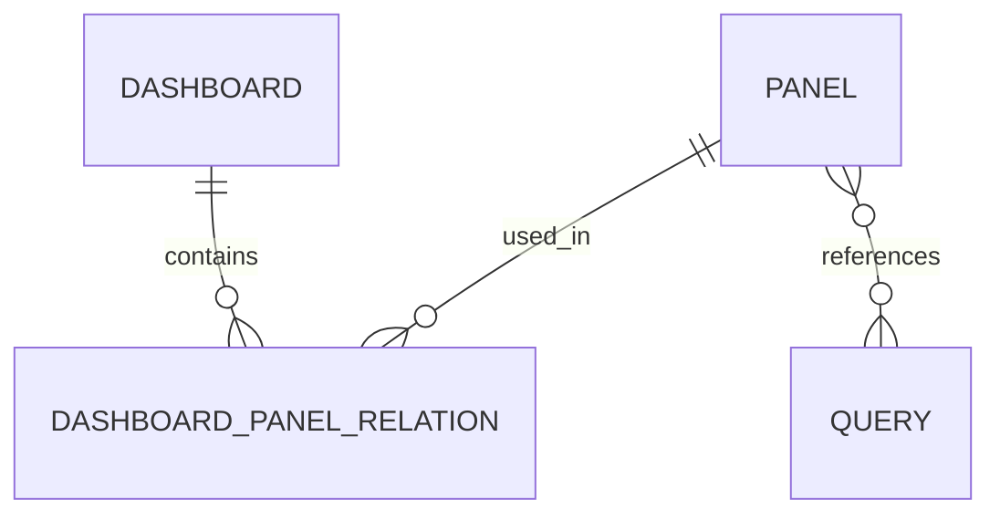

# Dashboard 模块产品需求文档

## 1. 产品概览

Dashboard 模块是一个用于创建、管理和展示仪表盘的功能模块，支持用户通过可视化方式组织和展示数据。该模块允许用户创建多个仪表盘，每个仪表盘可以包含多种类型的面板，如图表、表格、文本和卡片，以满足不同的数据展示需求。

### 1.1 核心价值

- **数据可视化**：通过多种面板类型，直观展示数据
- **灵活配置**：支持自定义仪表盘布局和面板配置
- **模块化设计**：支持面板的复用和共享
- **易于使用**：提供简洁的 API 接口，便于集成和使用

### 1.2 目标用户

- **业务分析师**：需要通过仪表盘分析业务数据
- **开发人员**：需要集成仪表盘功能到应用中
- **产品经理**：需要监控产品关键指标
- **管理层**：需要查看业务概览数据

## 2. 核心功能

### 2.1 功能模块

| 模块 | 功能描述 |
|------|----------|
| 仪表盘管理 | 创建、查询、更新、删除仪表盘 |
| 面板管理 | 创建、查询、更新、删除面板 |
| 布局管理 | 更新仪表盘布局 |
| 面板关联 | 向仪表盘添加或移除面板 |

### 2.2 功能详情

#### 2.2.1 仪表盘管理

| 功能 | 描述 |
|------|------|
| 创建仪表盘 | 创建新的仪表盘，设置名称和初始布局 |
| 查询仪表盘 | 查询所有仪表盘或单个仪表盘详情 |
| 更新仪表盘 | 更新仪表盘名称和其他属性 |
| 删除仪表盘 | 删除指定的仪表盘 |

#### 2.2.2 面板管理

| 功能 | 描述 |
|------|------|
| 创建面板 | 创建新的面板，设置标题、类型、查询 ID、配置等 |
| 查询面板 | 查询所有面板或单个面板详情 |
| 更新面板 | 更新面板的属性和配置 |
| 删除面板 | 删除指定的面板 |

#### 2.2.3 布局管理

| 功能 | 描述 |
|------|------|
| 更新布局 | 更新仪表盘的布局配置，包括面板位置和大小 |

#### 2.2.4 面板关联

| 功能 | 描述 |
|------|------|
| 添加面板 | 向仪表盘中添加面板 |
| 移除面板 | 从仪表盘中移除面板 |

## 3. 核心流程

### 3.1 仪表盘创建流程

1. 用户发送创建仪表盘请求
2. 系统验证请求参数
3. 系统创建仪表盘记录
4. 系统返回创建结果

### 3.2 面板创建流程

1. 用户发送创建面板请求
2. 系统验证请求参数
3. 系统创建面板记录
4. 系统返回创建结果

### 3.3 面板关联流程

1. 用户发送添加面板请求
2. 系统验证请求参数
3. 系统创建面板关联记录
4. 系统返回添加结果

### 3.4 布局更新流程

1. 用户发送更新布局请求
2. 系统验证请求参数
3. 系统更新仪表盘布局
4. 系统返回更新结果

## 4. 用户接口设计

### 4.1 API 接口

| API 路径 | 方法 | 功能描述 |
|----------|------|----------|
| `/dashboard` | POST | 创建仪表盘 |
| `/dashboard` | GET | 获取所有仪表盘 |
| `/dashboard/:id` | GET | 获取单个仪表盘 |
| `/dashboard/:id` | PATCH | 更新仪表盘 |
| `/dashboard/:id` | DELETE | 删除仪表盘 |
| `/dashboard/:id/layout` | PUT | 更新仪表盘布局 |
| `/dashboard/:id/panels` | POST | 向仪表盘添加面板 |
| `/dashboard/:id/panels/:panelId` | DELETE | 从仪表盘移除面板 |
| `/panel` | POST | 创建面板 |
| `/panel` | GET | 获取所有面板 |
| `/panel/:id` | GET | 获取单个面板 |
| `/panel/:id` | PATCH | 更新面板 |
| `/panel/:id` | DELETE | 删除面板 |

### 4.2 请求响应格式

#### 4.2.1 创建仪表盘

**请求**：
```json
{
  "name": "销售仪表盘",
  "layout": {"panels": []}
}
```

**响应**：
```json
{
  "id": "uuid",
  "name": "销售仪表盘",
  "layout": {"panels": []},
  "createdAt": "2024-01-01T00:00:00.000Z",
  "updatedAt": "2024-01-01T00:00:00.000Z"
}
```

#### 4.2.2 创建面板

**请求**：
```json
{
  "title": "销售趋势",
  "type": "chart",
  "queryId": "uuid",
  "config": {},
  "width": 6,
  "height": 4
}
```

**响应**：
```json
{
  "id": "uuid",
  "title": "销售趋势",
  "type": "chart",
  "queryId": "uuid",
  "config": {},
  "width": 6,
  "height": 4,
  "createdAt": "2024-01-01T00:00:00.000Z",
  "updatedAt": "2024-01-01T00:00:00.000Z"
}
```

## 5. 数据模型

### 5.1 实体关系



### 5.2 实体属性

#### 5.2.1 Dashboard（仪表盘）

| 属性 | 类型 | 描述 |
|------|------|------|
| `id` | `string` | 仪表盘唯一标识符 |
| `name` | `string` | 仪表盘名称 |
| `layout` | `json` | 仪表盘布局配置 |
| `createdAt` | `datetime` | 创建时间 |
| `updatedAt` | `datetime` | 更新时间 |

#### 5.2.2 Panel（面板）

| 属性 | 类型 | 描述 |
|------|------|------|
| `id` | `string` | 面板唯一标识符 |
| `title` | `string` | 面板标题 |
| `type` | `string` | 面板类型 |
| `queryId` | `string` | 关联的查询 ID |
| `config` | `json` | 面板配置 |
| `width` | `integer` | 面板宽度 |
| `height` | `integer` | 面板高度 |
| `createdAt` | `datetime` | 创建时间 |
| `updatedAt` | `datetime` | 更新时间 |

#### 5.2.3 DashboardPanelRelation（仪表盘与面板的关联关系）

| 属性 | 类型 | 描述 |
|------|------|------|
| `dashboardId` | `string` | 仪表盘 ID |
| `panelId` | `string` | 面板 ID |
| `createdAt` | `datetime` | 创建时间 |
| `updatedAt` | `datetime` | 更新时间 |

## 6. 技术实现

### 6.1 技术栈

- **后端框架**：NestJS
- **数据库**：TypeORM（支持 PostgreSQL、MySQL、SQLite 等）
- **数据验证**：class-validator
- **API 设计**：RESTful API

### 6.2 模块结构

```
dashboard/
├── controllers/
│   ├── dashboard.controller.ts
│   └── panel.controller.ts
├── services/
│   ├── dashboard.service.ts
│   └── panel.service.ts
├── entities/
│   ├── dashboard.entity.ts
│   ├── panel.entity.ts
│   └── dashboard-panel-relation.entity.ts
├── dto/
│   ├── create-dashboard.request.ts
│   ├── update-dashboard.request.ts
│   ├── create-panel.request.ts
│   ├── update-panel.request.ts
│   ├── dashboard.response.ts
│   └── panel.response.ts
├── docs/
│   ├── dashboard-api-doc.md
│   ├── dashboard-quick-start.md
│   ├── dashboard-business-logic.md
│   ├── dashboard-data-model.md
│   ├── dashboard-faq.md
│   └── dashboard-prd.md
├── panel-types.enum.ts
└── dashboard.module.ts
```

### 6.3 关键技术实现

- **数据验证**：使用 class-validator 对请求参数进行验证
- **错误处理**：统一的错误处理机制，返回标准化的错误响应
- **事务管理**：使用 TypeORM 的事务管理确保数据一致性
- **级联操作**：删除仪表盘或面板时，级联删除关联的关系记录

## 7. 边界与约束

### 7.1 功能边界

- **面板类型**：仅支持 chart、table、text、card 四种类型
- **布局配置**：布局配置格式需符合前端要求
- **查询关联**：面板关联的查询必须存在

### 7.2 性能约束

- **仪表盘数量**：建议单个用户不超过 50 个仪表盘
- **面板数量**：建议单个仪表盘不超过 20 个面板
- **布局复杂度**：建议布局不要过于复杂，以免影响加载性能

### 7.3 安全约束

- **权限控制**：需要集成权限系统，控制仪表盘和面板的访问权限
- **数据安全**：敏感数据需要加密存储
- **输入验证**：所有输入都需要进行验证，防止注入攻击

## 8. 测试策略

### 8.1 单元测试

- **服务层测试**：测试各个服务的核心功能
- **控制器测试**：测试 API 接口的响应和错误处理
- **数据模型测试**：测试数据模型的创建、更新和删除

### 8.2 集成测试

- **API 集成测试**：测试完整的 API 调用流程
- **模块集成测试**：测试模块与其他模块的集成
- **数据库集成测试**：测试数据库操作的正确性

### 8.3 性能测试

- **响应时间测试**：测试 API 响应时间
- **并发测试**：测试系统在并发请求下的性能
- **负载测试**：测试系统在高负载下的稳定性

## 9. 部署与集成

### 9.1 部署方式

- **容器化部署**：使用 Docker 容器化部署
- **云服务部署**：部署到云服务平台
- **本地部署**：本地开发环境部署

### 9.2 集成方式

- **API 集成**：通过 RESTful API 与其他系统集成
- **SDK 集成**：提供 SDK 方便其他系统集成
- **前端集成**：与前端框架集成，如 React、Vue 等

## 10. 监控与维护

### 10.1 监控指标

- **API 响应时间**：监控 API 响应时间
- **错误率**：监控 API 错误率
- **系统负载**：监控系统负载情况
- **数据库性能**：监控数据库查询性能

### 10.2 维护计划

- **定期备份**：定期备份仪表盘和面板数据
- **性能优化**：定期优化系统性能
- **安全更新**：定期更新系统安全补丁
- **功能迭代**：根据用户反馈迭代功能

## 11. 未来规划

### 11.1 功能增强

- **仪表盘模板**：提供预设的仪表盘模板
- **实时数据**：支持面板实时数据更新
- **数据导出**：支持仪表盘和面板数据导出
- **更丰富的面板类型**：支持更多类型的面板

### 11.2 技术演进

- **微服务架构**：将仪表盘模块拆分为独立的微服务
- **缓存优化**：引入更高效的缓存机制
- **AI 集成**：集成 AI 技术，提供智能数据分析
- **边缘计算**：支持边缘计算场景下的仪表盘展示