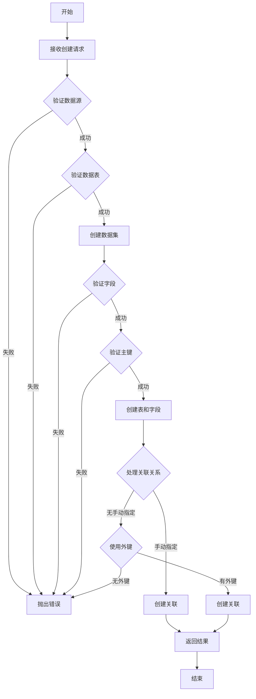

# 数据集模块核心业务逻辑文档

## 模块概述

数据集模块是系统中负责管理和处理数据模型的核心模块，主要提供数据集的创建、查询、更新和删除功能。该模块支持语义型和宽表型数据集，通过关联数据源和数据表，构建完整的数据模型。

## 核心业务流程

### 1. 数据集创建流程

**流程描述**：创建一个新的数据集，包括数据源验证、表选择、字段配置和关联关系设置。

**详细步骤**：

1. **数据源验证**
   - 验证请求中的 `datasourceId` 对应的数据源是否存在
   - 若数据源不存在，抛出错误

2. **数据表验证**
   - 验证请求中的 `datasourceTableIds` 列表中的所有表是否存在
   - 若有表不存在，抛出错误

3. **数据集创建**
   - 在事务中创建数据集实体
   - 设置数据集的基本属性（名称、描述、状态、类型）

4. **字段验证**
   - 验证请求中是否包含字段列表
   - 若字段列表为空，抛出错误

5. **主键验证**
   - 获取每个表的主键列信息
   - 验证每个表的主键字段是否包含在数据集中
   - 若某表的主键字段未包含在数据集中，抛出错误

6. **表和字段创建**
   - 创建 `DatasetTable` 实体
   - 创建 `DatasetField` 实体
   - 更新 `DatasetTable` 的 `primaryFieldId`

7. **关联关系处理**
   - 若请求中包含 `joins` 信息，创建 `DatasetJoin` 实体
   - 若请求中未包含 `joins` 信息，尝试使用数据源的外键关系
   - 若既无 `joins` 信息也无外键关系，抛出错误

8. **返回结果**
   - 返回创建的数据集信息

### 2. 数据集查询流程

**流程描述**：查询数据集信息，包括单条查询和批量查询。

**详细步骤**：

1. **批量查询（findAllWithDetails）**
   - 查询所有数据集及关联的数据源和主表
   - 批量查询所有关联的表、字段、指标和关联关系
   - 按 datasetId 分组数据
   - 转换为标准响应格式并返回

2. **单条查询（findOne）**
   - 根据 ID 查询数据集基本信息及关联的数据源和主表
   - 查询关联的表、字段、指标和关联关系
   - 转换为标准响应格式并返回

### 3. 数据集更新流程

**流程描述**：更新数据集的基本信息和关联实体。

**详细步骤**：

1. **数据集验证**
   - 验证请求中的 `dataSetId` 对应的数据集是否存在
   - 若数据集不存在，抛出错误

2. **基本信息更新**
   - 更新数据集的名称和描述

3. **关联实体更新**
   - 在事务中处理字段、指标、关联关系和表的更新
   - 使用对应的管理器（fieldManager、metricManager、joinManager、tableManager）处理具体更新操作

4. **返回结果**
   - 返回更新后的数据集完整信息

### 4. 数据集删除流程

**流程描述**：删除指定 ID 的数据集。

**详细步骤**：
   - 接收删除请求
   - 返回删除操作的确认信息

## 核心业务规则

### 1. 数据完整性规则

- **数据集字段不能为空**：创建数据集时必须包含至少一个字段
- **主键字段必须包含**：每个表的主键字段必须包含在数据集中
- **关联关系必须存在**：若未指定关联关系，数据源必须有外键关系

### 2. 数据验证规则

- **数据源验证**：确保使用的数据源存在
- **数据表验证**：确保选择的数据表存在
- **字段验证**：确保字段信息完整且有效

### 3. 事务处理规则

- **原子操作**：创建和更新操作使用事务确保数据一致性
- **级联删除**：数据集删除时，关联的表、字段、指标和关联关系会被级联删除

## 核心功能模块

### 1. 数据集管理

- **创建数据集**：支持从数据源选择表和字段，构建语义型或宽表型数据集
- **查询数据集**：支持查询单个数据集或批量查询所有数据集
- **更新数据集**：支持更新数据集的基本信息和关联实体
- **删除数据集**：支持删除指定的数据集

### 2. 字段管理

- **字段定义**：支持定义字段的名称、类型、描述、业务名称等属性
- **字段验证**：确保字段信息完整且有效
- **主键管理**：自动识别和管理表的主键字段

### 3. 表管理

- **表选择**：支持从数据源选择多个表
- **主表设置**：支持设置数据集的主表
- **表关系管理**：支持定义表之间的关联关系

### 4. 关联关系管理

- **手动关联**：支持手动定义表之间的关联关系
- **自动关联**：支持使用数据源的外键关系自动创建关联
- **关联类型**：支持内连接（INNER）、左连接（LEFT）、右连接（RIGHT）

### 5. 指标管理

- **指标定义**：支持定义不同类型的指标（行级、聚合、后聚合、算术运算、同环比）
- **指标计算**：支持各种聚合函数和计算方式
- **指标关联**：支持指标与字段和其他指标的关联

## 业务流程图

## 技术实现要点

### 1. 数据模型设计

- 使用 TypeORM 实现数据模型
- 支持复杂的关联关系
- 使用枚举类型定义状态和类型

### 2. 性能优化

- **批量查询**：使用 `In` 查询和分组操作减少数据库查询次数
- **事务处理**：使用事务确保数据一致性
- **延迟加载**：合理使用关联关系的加载策略

### 3. 错误处理

- 使用 `ExceptionFactory` 统一处理错误
- 提供清晰的错误信息
- 支持不同类型的错误处理策略

### 4. 扩展性设计

- 使用管理器模式（fieldManager、metricManager 等）处理不同类型的实体操作
- 支持不同类型的数据集（语义型、宽表型）
- 支持不同类型的指标和计算方式

## 典型业务场景

### 场景 1：创建销售数据集

**业务需求**：创建一个销售数据集，包含销售表、客户表和产品表，支持销售分析。

**实现步骤**：
1. 选择数据源（如 MySQL 数据源）
2. 选择销售表、客户表和产品表
3. 配置字段信息，确保每个表的主键字段包含在数据集中
4. 定义表之间的关联关系（销售表与客户表通过客户 ID 关联，销售表与产品表通过产品 ID 关联）
5. 创建数据集

### 场景 2：更新数据集字段

**业务需求**：向现有数据集添加新字段。

**实现步骤**：
1. 准备更新请求，包含数据集 ID 和新字段信息
2. 调用更新接口
3. 系统验证数据集存在并处理字段添加操作
4. 返回更新后的数据集信息

### 场景 3：查询数据集用于分析

**业务需求**：查询销售数据集的完整信息，用于构建分析报表。

**实现步骤**：
1. 调用查询接口，获取数据集完整信息
2. 系统返回包含表、字段、指标和关联关系的完整数据集信息
3. 使用返回的数据构建分析报表
