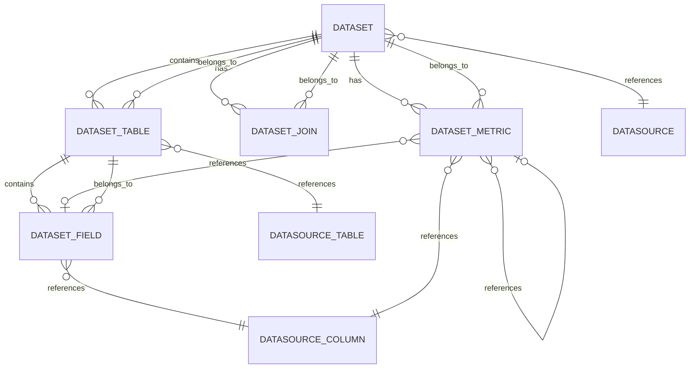

# 数据集模块数据模型文档

## 模块概述

数据集模块的数据模型设计用于管理和存储数据集相关的信息，包括数据集基本信息、关联的表、字段、指标和表间关联关系。该模型支持语义型和宽表型数据集，通过与数据源模块的关联，构建完整的数据模型体系。

## 核心实体

### 1. Dataset（数据集）

**描述**：数据集是数据模型的核心实体，代表一个完整的数据集合，包含多个表、字段、指标和关联关系。

**字段说明**：

| 字段名 | 数据类型 | 约束 | 描述 |
|--------|---------|------|------|
| `id` | number | 主键，自增 | 数据集 ID |
| `name` | string | 非空，长度 100 | 数据集名称 |
| `description` | string | 可选 | 数据集描述 |
| `datasource_id` | number | 外键，关联 Datasource | 数据源 ID |
| `status` | enum | 枚举值：active, disabled, deleted，默认 active | 数据集状态 |
| `type` | enum | 枚举值：semantic, wide，默认 wide | 数据集类型 |
| `main_table_id` | number | 外键，关联 DatasetTable，可选 | 主表 ID |

**关联关系**：
- **一对多**：Dataset → DatasetTable（一个数据集包含多个表）
- **一对多**：Dataset → DatasetJoin（一个数据集包含多个关联关系）
- **多对一**：Dataset → Datasource（多个数据集关联一个数据源）
- **多对一**：Dataset → DatasetTable（一个数据集关联一个主表）

### 2. DatasetTable（数据集表）

**描述**：DatasetTable 代表数据集中包含的表，关联到数据源中的表。

**字段说明**：

| 字段名 | 数据类型 | 约束 | 描述 |
|--------|---------|------|------|
| `id` | number | 主键，自增 | 表 ID |
| `dataset_id` | number | 外键，关联 Dataset | 数据集 ID |
| `datasource_table_id` | number | 外键，关联 DatasourceTable | 数据源表 ID |
| `dataset_name` | string | 非空，长度 100 | 数据集名称 |
| `table_name` | string | 非空，长度 255 | 表名称 |
| `description` | string | 可选 | 表描述 |
| `primary_field_id` | number | 外键，关联 DatasetField，可选 | 主键字段 ID |
| `created_at` | datetime | 自动生成 | 创建时间 |

**关联关系**：
- **多对一**：DatasetTable → Dataset（多个表属于一个数据集）
- **多对一**：DatasetTable → DatasourceTable（多个数据集表关联一个数据源表）
- **一对多**：DatasetTable → DatasetField（一个表包含多个字段）

### 3. DatasetField（数据集字段）

**描述**：DatasetField 代表数据集中表的字段，关联到数据源表的列。

**字段说明**：

| 字段名 | 数据类型 | 约束 | 描述 |
|--------|---------|------|------|
| `id` | number | 主键，自增 | 字段 ID |
| `dataset_id` | number | 外键，关联 Dataset | 数据集 ID |
| `data_source_column_id` | number | 外键，关联 DatasourceColumn | 数据源列 ID |
| `table_id` | number | 外键，关联 DatasetTable | 所属表 ID |
| `name` | string | 非空，长度 255 | 字段名称 |
| `type` | enum | 枚举值：string, number, boolean, date, datetime, decimal | 字段类型 |
| `alias` | string | 可选，长度 255 | 字段别名 |
| `description` | string | 可选 | 字段描述 |
| `business_name` | string | 非空，长度 255 | 业务名称 |
| `is_primary_key` | boolean | 默认 false | 是否为主键字段 |
| `created_at` | datetime | 自动生成 | 创建时间 |

**关联关系**：
- **多对一**：DatasetField → Dataset（多个字段属于一个数据集）
- **多对一**：DatasetField → DatasetTable（多个字段属于一个表）

### 4. DatasetJoin（数据集关联关系）

**描述**：DatasetJoin 代表数据集中表之间的关联关系。

**字段说明**：

| 字段名 | 数据类型 | 约束 | 描述 |
|--------|---------|------|------|
| `id` | number | 主键，自增 | 关联关系 ID |
| `dataset_id` | number | 外键，关联 Dataset | 数据集 ID |
| `join_type` | enum | 枚举值：inner, left, right，默认 inner | 连接类型 |
| `left_table_id` | number | 非空 | 左表 ID |
| `left_field` | string | 非空，长度 255 | 左表字段名 |
| `right_table_id` | number | 非空 | 右表 ID |
| `right_field` | string | 非空，长度 255 | 右表字段名 |
| `operator` | string | 默认 "="，长度 20 | 连接运算符 |

**关联关系**：
- **多对一**：DatasetJoin → Dataset（多个关联关系属于一个数据集）

### 5. DatasetMetric（数据集指标）

**描述**：DatasetMetric 代表数据集中的指标，支持多种类型的指标计算。

**字段说明**：

| 字段名 | 数据类型 | 约束 | 描述 |
|--------|---------|------|------|
| `id` | number | 主键，自增 | 指标 ID |
| `dataset_id` | number | 外键，关联 Dataset | 数据集 ID |
| `name` | string | 非空 | 指标名称 |
| `alias` | string | 可选 | 指标别名 |
| `description` | string | 可选 | 指标描述 |
| `business_name` | string | 可选 | 业务名称 |
| `metric_type` | enum | 枚举值：row_level, aggregate, post_aggregate, arithmetic, period_over_period | 指标类型 |
| `data_source_column_id` | number | 外键，关联 DatasourceColumn，可选 | 数据源列 ID |
| `aggregate_function` | enum | 枚举值：sum, count, avg, max, min, distinct_count，可选 | 聚合函数 |
| `distinct` | boolean | 默认 false | 是否去重 |
| `aggregate_condition` | json | 可选 | 聚合条件配置 |
| `left_operand` | number | 可选 | 左操作数 |
| `left_operand_field_id` | number | 外键，关联 DatasetField，可选 | 左操作数字段 ID |
| `row_operator` | enum | 枚举值：+, -, *, /，可选 | 行级运算符 |
| `right_operand` | number | 可选 | 右操作数 |
| `right_operand_field_id` | number | 外键，关联 DatasetField，可选 | 右操作数字段 ID |
| `source_metric_id` | number | 外键，关联 DatasetMetric，可选 | 源指标 ID |
| `left_metric_id` | number | 外键，关联 DatasetMetric，可选 | 左指标 ID |
| `arithmetic_operator` | enum | 枚举值：+, -, *, /，可选 | 算术运算符 |
| `right_metric_operand` | number | 可选 | 右指标操作数 |
| `right_metric_operand_field_id` | number | 外键，关联 DatasetField，可选 | 右指标操作数字段 ID |
| `base_metric_id` | number | 外键，关联 DatasetMetric，可选 | 基础指标 ID |
| `time_data_source_column_id` | number | 外键，关联 DatasourceColumn，可选 | 时间数据源列 ID |
| `period_type` | enum | 枚举值：day_over_day, week_over_week, month_over_month, quarter_over_quarter, year_over_year，可选 | 同环比类型 |
| `calculation_mode` | enum | 枚举值：percentage, absolute, both，可选 | 同环比计算模式 |

**关联关系**：
- **多对一**：DatasetMetric → Dataset（多个指标属于一个数据集）
- **多对一**：DatasetMetric → DatasetField（多个指标关联一个字段）
- **多对一**：DatasetMetric → DatasetMetric（多个指标关联一个源指标）

## 实体关系图

## 数据模型设计要点

### 1. 关系设计

- **数据集与表**：一对多关系，一个数据集可以包含多个表
- **表与字段**：一对多关系，一个表可以包含多个字段
- **数据集与关联关系**：一对多关系，一个数据集可以包含多个关联关系
- **数据集与指标**：一对多关系，一个数据集可以包含多个指标
- **指标与字段**：多对一关系，多个指标可以关联同一个字段
- **指标与指标**：多对一关系，多个指标可以关联同一个源指标

### 2. 数据完整性

- **主键约束**：每个实体都有自增主键
- **外键约束**：实体之间的关联使用外键约束
- **非空约束**：必要字段设置非空约束
- **枚举约束**：使用枚举类型确保数据一致性

### 3. 性能优化

- **索引设计**：外键字段和常用查询字段应建立索引
- **关联查询**：使用批量查询和预加载减少 N+1 查询问题
- **数据类型**：选择合适的数据类型，减少存储空间

### 4. 扩展性

- **枚举类型**：使用枚举类型定义状态和类型，便于后续扩展
- **JSON 字段**：使用 JSON 字段存储复杂配置，提高灵活性
- **关联关系**：设计灵活的关联关系，支持复杂的数据模型

## 数据模型使用指南

### 1. 数据集创建

1. **创建 Dataset 实体**：设置名称、描述、数据源 ID、状态和类型
2. **创建 DatasetTable 实体**：关联到 Dataset 和 DatasourceTable
3. **创建 DatasetField 实体**：关联到 Dataset 和 DatasetTable
4. **创建 DatasetJoin 实体**：定义表之间的关联关系
5. **创建 DatasetMetric 实体**：定义数据集的指标

### 2. 数据集查询

1. **查询 Dataset**：获取数据集基本信息
2. **查询关联实体**：获取关联的表、字段、关联关系和指标
3. **使用批量查询**：减少数据库查询次数，提高性能

### 3. 数据集更新

1. **更新基本信息**：更新 Dataset 的名称和描述
2. **更新关联实体**：使用管理器模式处理字段、指标、关联关系和表的更新
3. **使用事务**：确保更新操作的原子性

### 4. 数据集删除

- **级联删除**：删除 Dataset 时，关联的表、字段、关联关系和指标会被级联删除

## 典型数据模型使用场景

### 场景 1：销售数据分析

**数据模型**：
- **Dataset**：销售数据集
- **DatasetTable**：销售表、客户表、产品表
- **DatasetField**：销售 ID、销售金额、客户 ID、客户名称、产品 ID、产品名称等
- **DatasetJoin**：销售表与客户表的关联、销售表与产品表的关联
- **DatasetMetric**：销售总额、平均销售金额、销售数量等

**使用方式**：
1. 创建销售数据集，关联销售表、客户表和产品表
2. 配置字段信息，确保包含所有必要字段
3. 定义表之间的关联关系
4. 创建销售相关的指标
5. 使用数据集进行销售分析

### 场景 2：用户行为分析

**数据模型**：
- **Dataset**：用户行为数据集
- **DatasetTable**：用户表、行为表、商品表
- **DatasetField**：用户 ID、用户名称、行为类型、行为时间、商品 ID、商品名称等
- **DatasetJoin**：用户表与行为表的关联、行为表与商品表的关联
- **DatasetMetric**：用户活跃度、行为次数、转化率等

**使用方式**：
1. 创建用户行为数据集，关联用户表、行为表和商品表
2. 配置字段信息，确保包含所有必要字段
3. 定义表之间的关联关系
4. 创建用户行为相关的指标
5. 使用数据集进行用户行为分析
