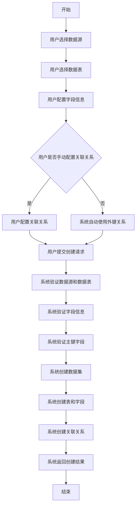
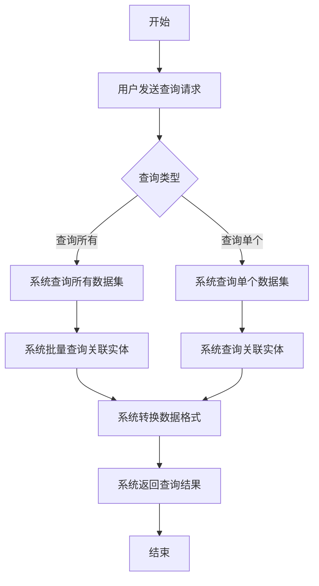
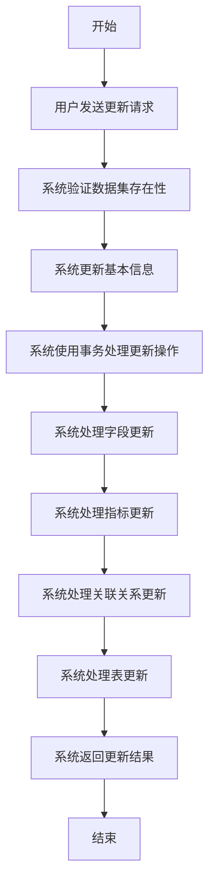

# 数据集模块产品需求文档（PRD）

## 1. 产品概览

数据集模块是系统中负责管理和处理数据模型的核心模块，旨在为用户提供一个灵活、高效的数据模型管理平台。该模块支持从数据源选择表和字段，构建完整的数据模型，为后续的数据分析和报表生成提供基础。

**核心目标**：
- 提供统一的数据模型管理界面
- 支持多种类型的数据集和指标计算
- 简化数据模型的创建和维护过程
- 提高数据模型的可重用性和可扩展性

**目标用户**：
- 数据分析师：使用数据集进行数据分析和报表生成
- 数据工程师：创建和维护数据模型
- 业务用户：通过数据集获取业务数据

## 2. 核心功能

### 2.1 功能模块

| 模块名称 | 功能描述 | 优先级 |
|---------|---------|--------|
| 数据集管理 | 创建、查询、更新、删除数据集 | 高 |
| 字段管理 | 管理数据集中的字段，包括添加、更新、删除字段 | 高 |
| 表管理 | 管理数据集中的表，包括添加、更新、删除表 | 高 |
| 关联关系管理 | 管理表之间的关联关系，支持手动配置和自动关联 | 高 |
| 指标管理 | 管理数据集中的指标，支持多种类型的指标计算 | 中 |

### 2.2 详细功能描述

#### 2.2.1 数据集管理

| 功能点 | 描述 | 输入/输出 | 详细说明 |
|--------|------|-----------|----------|
| 创建数据集 | 创建一个新的数据集，包含数据源验证、表选择、字段配置和关联关系设置 | **输入**：数据源 ID、数据表 ID 列表、数据集名称、描述、主表 ID、字段列表、关联关系列表 **输出**：创建的数据集信息 | 支持语义型和宽表型数据集，验证数据源和数据表的存在性，确保字段列表不为空，验证主键字段的存在性 |
| 查询所有数据集 | 查询所有数据集的完整信息，包括关联的表、字段、指标和关联关系 | **输入**：无 **输出**：数据集列表 | 使用批量查询优化性能，返回完整的数据集信息 |
| 查询单个数据集 | 根据 ID 查询单个数据集的完整信息 | **输入**：数据集 ID **输出**：数据集详细信息 | 返回包含表、字段、指标和关联关系的完整数据集信息 |
| 更新数据集 | 更新数据集的基本信息和关联实体 | **输入**：数据集 ID、名称、描述、字段更新列表、指标更新列表、关联关系更新列表、表更新列表 **输出**：更新后的数据集信息 | 使用事务确保更新操作的原子性，支持添加、更新、删除字段、指标、关联关系和表 |
| 删除数据集 | 删除指定 ID 的数据集 | **输入**：数据集 ID **输出**：删除确认信息 | 支持级联删除关联的表、字段、指标和关联关系 |

#### 2.2.2 字段管理

| 功能点 | 描述 | 输入/输出 | 详细说明 |
|--------|------|-----------|----------|
| 添加字段 | 向数据集中添加新字段 | **输入**：表 ID、数据源列 ID、字段名称、描述、业务名称、是否为主键 **输出**：添加的字段信息 | 验证字段信息的完整性，确保字段名称唯一 |
| 更新字段 | 更新数据集中的字段信息 | **输入**：字段 ID、字段名称、描述、业务名称、是否为主键 **输出**：更新后的字段信息 | 验证字段的存在性，确保更新操作的有效性 |
| 删除字段 | 从数据集中删除字段 | **输入**：字段 ID **输出**：删除确认信息 | 确保删除的字段不是主键字段，避免影响数据完整性 |

#### 2.2.3 表管理

| 功能点 | 描述 | 输入/输出 | 详细说明 |
|--------|------|-----------|----------|
| 添加表 | 向数据集中添加新表 | **输入**：数据源表 ID、表名称、描述 **输出**：添加的表信息 | 验证数据源表的存在性，确保表名称唯一 |
| 更新表 | 更新数据集中的表信息 | **输入**：表 ID、表名称、描述 **输出**：更新后的表信息 | 验证表的存在性，确保更新操作的有效性 |
| 删除表 | 从数据集中删除表 | **输入**：表 ID **输出**：删除确认信息 | 确保删除的表不是主表，避免影响数据完整性 |

#### 2.2.4 关联关系管理

| 功能点 | 描述 | 输入/输出 | 详细说明 |
|--------|------|-----------|----------|
| 添加关联关系 | 向数据集中添加新的表关联关系 | **输入**：左表 ID、右表 ID、左表字段、右表字段、连接类型、运算符 **输出**：添加的关联关系信息 | 验证表的存在性，确保关联关系的有效性 |
| 更新关联关系 | 更新数据集中的关联关系 | **输入**：关联关系 ID、左表 ID、右表 ID、左表字段、右表字段、连接类型、运算符 **输出**：更新后的关联关系信息 | 验证关联关系的存在性，确保更新操作的有效性 |
| 删除关联关系 | 从数据集中删除关联关系 | **输入**：关联关系 ID **输出**：删除确认信息 | 确保删除的关联关系不会影响其他关联关系的有效性 |
| 自动关联 | 基于数据源的外键关系自动创建关联关系 | **输入**：数据源 ID **输出**：自动创建的关联关系列表 | 检查数据源是否存在外键关系，自动创建相应的关联关系 |

#### 2.2.5 指标管理

| 功能点 | 描述 | 输入/输出 | 详细说明 |
|--------|------|-----------|----------|
| 添加指标 | 向数据集中添加新指标 | **输入**：指标名称、描述、业务名称、指标类型、数据源列 ID、聚合函数、是否去重、聚合条件等 **输出**：添加的指标信息 | 验证指标信息的完整性，确保指标名称唯一 |
| 更新指标 | 更新数据集中的指标信息 | **输入**：指标 ID、指标名称、描述、业务名称、指标类型、数据源列 ID、聚合函数、是否去重、聚合条件等 **输出**：更新后的指标信息 | 验证指标的存在性，确保更新操作的有效性 |
| 删除指标 | 从数据集中删除指标 | **输入**：指标 ID **输出**：删除确认信息 | 确保删除的指标不会影响其他指标的计算 |

## 3. 核心流程

### 3.1 数据集创建流程

### 3.2 数据集查询流程

### 3.3 数据集更新流程

## 4. 用户接口设计

### 4.1 API 接口

| 接口路径 | 方法 | 功能描述 | 请求体 | 响应体 |
|---------|------|---------|--------|--------|
| `/dataset` | POST | 创建数据集 | `CreateDatasetRequest` | 数据集信息 |
| `/dataset` | GET | 查询所有数据集 | N/A | 数据集列表 |
| `/dataset/:id` | GET | 查询单个数据集 | N/A | 数据集详细信息 |
| `/dataset` | PATCH | 更新数据集 | `UpdateDatasetRequest` | 更新后的数据集信息 |
| `/dataset/:id` | DELETE | 删除数据集 | N/A | 删除确认信息 |

### 4.2 数据结构

#### CreateDatasetRequest

| 字段名 | 类型 | 必选 | 描述 |
|--------|------|------|------|
| `datasourceId` | number | 是 | 数据源 ID |
| `datasourceTableIds` | number[] | 是 | 选中的数据表 ID 列表 |
| `name` | string | 是 | 数据集名称 |
| `description` | string | 否 | 数据集描述 |
| `mainTableId` | number | 否 | 主表 ID |
| `fields` | DatasetFieldDto[] | 是 | 数据集字段列表 |
| `joins` | DatasetJoinDto[] | 否 | 表关联关系列表 |

#### UpdateDatasetRequest

| 字段名 | 类型 | 必选 | 描述 |
|--------|------|------|------|
| `dataSetId` | number | 是 | 数据集 ID |
| `name` | string | 否 | 数据集名称 |
| `description` | string | 否 | 数据集描述 |
| `fields` | DatasetFieldUpdateDto[] | 否 | 字段更新列表 |
| `metrics` | DatasetMetricUpdateDto[] | 否 | 指标更新列表 |
| `joins` | DatasetJoinUpdateDto[] | 否 | 关联关系更新列表 |
| `tables` | DatasetTableUpdateDto[] | 否 | 表更新列表 |

#### DatasetFieldDto

| 字段名 | 类型 | 必选 | 描述 |
|--------|------|------|------|
| `tableId` | number | 是 | 表 ID |
| `dataSourceColumnId` | number | 是 | 数据源列 ID |
| `name` | string | 是 | 字段名称 |
| `description` | string | 否 | 字段描述 |
| `businessName` | string | 是 | 业务名称 |
| `isPrimaryKey` | boolean | 否 | 是否为主键 |

#### DatasetJoinDto

| 字段名 | 类型 | 必选 | 描述 |
|--------|------|------|------|
| `leftTableId` | number | 是 | 左表 ID |
| `rightTableId` | number | 是 | 右表 ID |
| `leftColumnId` | number | 是 | 左表列 ID |
| `rightColumnId` | number | 是 | 右表列 ID |
| `joinType` | string | 否 | 连接类型 |

## 5. 非功能需求

### 5.1 性能要求

- **响应时间**：API 接口响应时间不超过 2 秒
- **查询性能**：批量查询所有数据集的响应时间不超过 5 秒
- **并发处理**：支持同时处理 100 个并发请求

### 5.2 可靠性要求

- **数据一致性**：使用事务确保数据操作的原子性
- **错误处理**：提供清晰的错误信息和错误码
- **容错能力**：能够处理网络中断、数据库故障等异常情况

### 5.3 安全性要求

- **权限控制**：基于角色的权限控制
- **数据加密**：敏感数据加密存储
- **输入验证**：严格验证用户输入，防止 SQL 注入等攻击

### 5.4 可扩展性要求

- **模块化设计**：采用模块化设计，便于添加新功能
- **插件机制**：支持插件扩展，如自定义指标计算
- **API 版本控制**：支持 API 版本控制，确保向后兼容

### 5.5 可维护性要求

- **代码质量**：遵循代码规范，提供详细的注释
- **日志记录**：详细记录操作日志，便于问题排查
- **文档完善**：提供完整的 API 文档和使用指南

## 6. 数据需求

### 6.1 数据模型

- **Dataset**：数据集基本信息
- **DatasetTable**：数据集中的表
- **DatasetField**：数据集中的字段
- **DatasetJoin**：表之间的关联关系
- **DatasetMetric**：数据集中的指标

### 6.2 数据存储

- **数据库**：支持 MySQL、PostgreSQL 等关系型数据库
- **存储方式**：使用 TypeORM 进行数据持久化
- **索引策略**：为常用查询字段创建索引

### 6.3 数据迁移

- **版本管理**：使用 TypeORM 的迁移功能管理数据库版本
- **数据同步**：支持与数据源的数据同步

## 7. 范围限定

### 7.1 功能范围

- 仅支持关系型数据库作为数据源
- 不支持实时数据处理
- 不支持大数据集的处理（超过 1000 万条记录）

### 7.2 技术范围

- 基于 NestJS 框架开发
- 使用 TypeORM 作为 ORM 框架
- 支持 Node.js 16+ 环境

### 7.3 业务范围

- 专注于数据模型管理，不包括数据分析和报表生成功能
- 不涉及数据清洗和转换功能

## 8. 验收标准

### 8.1 功能验收

- 能够成功创建数据集，包含表、字段和关联关系
- 能够查询所有数据集和单个数据集的详细信息
- 能够更新数据集的基本信息和关联实体
- 能够删除数据集
- 能够添加、更新、删除字段、表、关联关系和指标

### 8.2 性能验收

- API 接口响应时间不超过 2 秒
- 批量查询所有数据集的响应时间不超过 5 秒
- 能够处理 100 个并发请求

### 8.3 可靠性验收

- 数据操作的原子性，确保数据一致性
- 错误处理机制正常工作，提供清晰的错误信息
- 系统能够从网络中断、数据库故障等异常情况中恢复

### 8.4 安全性验收

- 权限控制正常工作
- 敏感数据加密存储
- 能够防止 SQL 注入等攻击

## 9. 风险评估

### 9.1 技术风险

- **数据库性能**：随着数据集数量的增加，查询性能可能下降
- **事务处理**：复杂的事务操作可能导致死锁
- **数据一致性**：网络中断等异常情况可能导致数据不一致

### 9.2 业务风险

- **数据质量**：数据源的数据质量可能影响数据集的使用效果
- **业务变更**：业务需求变更可能需要频繁修改数据集结构
- **用户体验**：复杂的配置过程可能影响用户体验

### 9.3 缓解措施

- **性能优化**：使用批量查询、索引优化等技术提高性能
- **错误处理**：完善错误处理机制，提供清晰的错误信息
- **数据验证**：加强数据验证，确保数据质量
- **用户界面优化**：提供直观的用户界面，简化配置过程

## 10. 交付物

### 10.1 代码交付物

- 数据集模块的完整代码
- API 接口文档
- 单元测试和集成测试

### 10.2 文档交付物

- 产品需求文档（PRD）
- 技术设计文档
- 用户使用指南
- API 文档

### 10.3 其他交付物

- 部署指南
- 性能测试报告
- 安全测试报告
