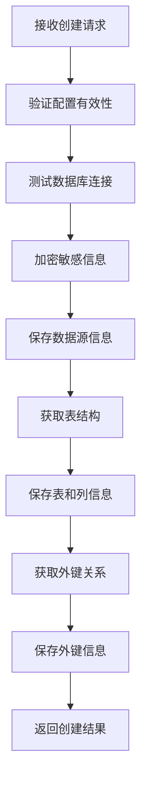
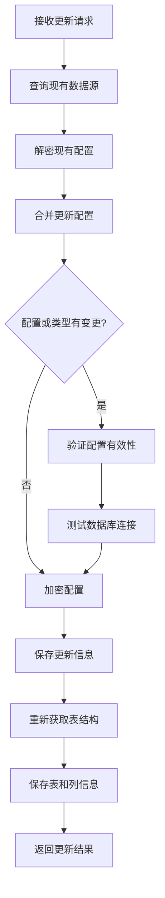
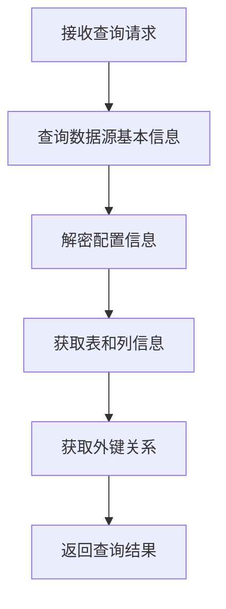
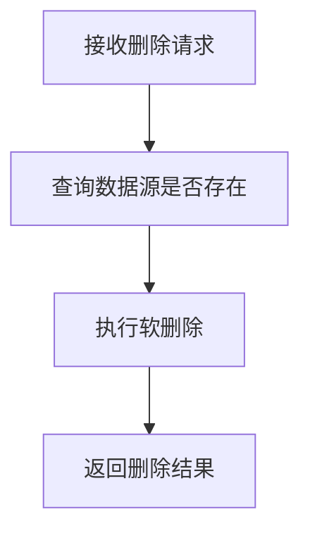
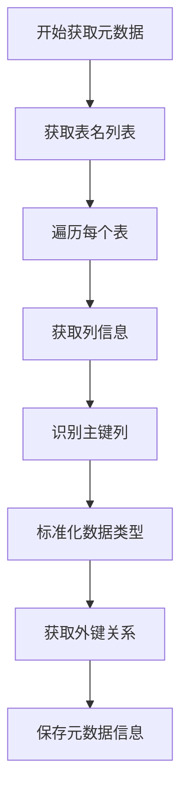

# 数据源模块核心业务逻辑文档

## 1. 模块概述

数据源模块是系统的基础组件，负责管理各种类型的数据源连接、元数据获取和数据处理。该模块支持多种数据源类型，包括 MySQL、PostgreSQL、ClickHouse、CSV 和 Excel。

## 2. 核心业务流程

### 2.1 数据源创建流程

**流程描述**：
1. 接收创建数据源请求，包含数据源名称、类型和配置信息
2. 验证数据源配置的有效性
3. 测试数据库连接
4. 加密配置中的敏感信息（如密码）
5. 保存数据源基本信息到数据库
6. 获取并保存表结构和列信息
7. 获取并保存外键关系
8. 返回创建成功的数据源信息

**流程图**：

**关键步骤说明**：
- **配置验证**：根据不同数据源类型验证配置参数的完整性和有效性
- **连接测试**：使用 Knex 连接工厂创建临时连接，验证数据库可访问性
- **配置加密**：对配置中的密码等敏感信息进行加密处理，确保安全存储
- **元数据获取**：通过数据库系统表查询获取表结构、列信息和外键关系

### 2.2 数据源更新流程

**流程描述**：
1. 接收更新数据源请求，包含数据源ID和更新信息
2. 查询现有数据源信息
3. 解密现有配置以便比较
4. 合并更新的配置信息
5. 验证更新后的配置有效性（如果配置或类型有变更）
6. 测试数据库连接（如果配置有变更）
7. 加密更新后的配置
8. 保存更新后的数据源信息
9. 重新获取并保存表结构和列信息
10. 返回更新成功的数据源信息

**流程图**：

### 2.3 数据源查询流程

**流程描述**：
1. 接收查询请求，包含数据源ID
2. 查询数据源基本信息
3. 解密配置信息
4. 获取已保存的表和列信息
5. 获取已保存的外键关系
6. 返回完整的数据源信息

**流程图**：

### 2.4 数据源删除流程

**流程描述**：
1. 接收删除请求，包含数据源ID
2. 查询数据源是否存在
3. 执行软删除操作
4. 返回删除成功信息

**流程图**：

### 2.5 元数据获取流程

**流程描述**：
1. 根据数据源类型选择对应的元数据查询方法
2. 获取数据库中的表名列表
3. 遍历每个表，获取列信息
4. 识别主键列
5. 标准化数据类型
6. 获取外键关系
7. 保存元数据信息

**流程图**：

## 3. 核心功能模块

### 3.1 配置管理

**功能描述**：
- 支持多种数据源类型的配置结构
- 配置验证确保参数完整性
- 敏感信息加密存储
- 配置变更检测和连接测试

**关键实现**：
- `validateDataSourceConfig` 函数：验证不同类型数据源的配置
- `configEncryption` 和 `configDecryption` 函数：处理配置的加密和解密

### 3.2 连接管理

**功能描述**：
- 基于 Knex 实现多数据源类型的连接
- 连接测试确保数据源可用性
- 连接池管理提高性能

**关键实现**：
- `KnexConnectionFactory` 类：创建和管理数据库连接
- `testConnection` 方法：测试数据库连接的有效性

### 3.3 元数据管理

**功能描述**：
- 自动获取数据库表结构
- 识别列数据类型并标准化
- 提取外键关系
- 元数据缓存和更新

**关键实现**：
- `getTableSchemas` 方法：获取表结构和列信息
- `getForeignKeySchemas` 方法：获取外键关系
- `normalizeDataType` 方法：标准化数据类型

### 3.4 安全管理

**功能描述**：
- 配置敏感信息加密
- 软删除机制保护数据安全
- 连接权限验证

**关键实现**：
- `configEncryption` 函数：加密配置中的敏感信息
- `softDelete` 方法：实现软删除功能

## 4. 支持的数据源类型

| 数据源类型 | 支持的操作 | 配置参数 |
|-----------|------------|----------|
| MySQL | 完整支持 | host, port, database, username, password |
| PostgreSQL | 完整支持 | host, port, database, username, password |
| ClickHouse | 基本支持 | host, port, database, username, password |
| CSV | 基本支持 | filePath, delimiter, encoding |
| Excel | 基本支持 | filePath, sheetName |

## 5. 数据类型处理

### 5.1 原始数据类型到标准化类型的映射

| 原始类型 | 标准化类型 |
|---------|------------|
| char, varchar, text | string |
| int, decimal, numeric, float, double, real | number |
| date, time, timestamp | date |
| bool | boolean |
| 其他类型 | string |

### 5.2 类型处理逻辑

1. 从数据库获取原始数据类型
2. 转换为小写进行统一处理
3. 根据类型特征映射到标准化类型
4. 存储原始类型和标准化类型

## 6. 错误处理机制

### 6.1 常见错误类型

| 错误类型 | 错误消息 | 处理方式 |
|---------|----------|----------|
| 配置无效 | 数据源配置验证失败 | 返回 400 错误，提示具体验证失败原因 |
| 连接失败 | 数据库连接测试失败 | 返回 400 错误，提示连接失败原因 |
| 数据源不存在 | 数据源未找到 | 返回 404 错误，提示数据源不存在 |
| 元数据获取失败 | 保存表和列信息失败 | 记录警告日志，不影响主流程 |

### 6.2 错误处理策略

1. **配置验证错误**：在创建和更新数据源时，先验证配置有效性，无效则直接返回错误
2. **连接测试错误**：配置验证通过后测试连接，失败则返回错误
3. **元数据获取错误**：元数据获取失败不影响数据源的创建和更新，仅记录警告日志
4. **软删除错误**：删除操作采用软删除，即使失败也不会影响系统稳定性

## 7. 性能优化

### 7.1 缓存策略

- 元数据缓存：获取的表结构和列信息存储在数据库中，避免重复查询
- 连接池：使用 Knex 连接池管理数据库连接，减少连接建立开销

### 7.2 批量操作

- 批量保存表和列信息，减少数据库操作次数
- 批量保存外键关系，提高处理效率

### 7.3 异步处理

- 使用异步/await 模式处理数据库操作，提高并发性能
- 元数据获取采用异步方式，不阻塞主流程

## 8. 业务规则和约束

### 8.1 数据验证规则

- 数据源名称不能为空且长度不超过 100 字符
- 数据源类型必须是支持的类型之一
- 配置参数必须符合对应数据源类型的要求
- 连接测试必须成功才能创建或更新数据源

### 8.2 安全约束

- 密码等敏感信息必须加密存储
- 数据源删除采用软删除，保留操作记录
- 连接测试失败时不允许创建或更新数据源

### 8.3 业务流程约束

- 数据源创建成功后必须获取并保存元数据
- 配置变更时必须重新测试连接
- 配置变更时必须重新获取元数据

## 9. 依赖关系

### 9.1 内部依赖

- `DatasourceTableService`：管理数据源表信息
- `DatasourceColumnService`：管理数据源列信息
- `DatasourceForeignKeyService`：管理数据源外键关系
- `KnexConnectionFactory`：创建和管理数据库连接

### 9.2 外部依赖

- `@nestjs/common`：提供控制器和依赖注入功能
- `@nestjs/typeorm`：提供 ORM 功能
- `typeorm`：数据库 ORM 框架
- `knex`：数据库查询构建器
- `@nestjs/config`：配置管理

## 10. 总结

数据源模块是系统的基础组件，通过统一的接口和流程管理多种类型的数据源。其核心功能包括数据源配置管理、连接测试、元数据获取和安全管理。该模块采用分层设计，职责清晰，支持多种数据源类型，为系统提供了灵活、安全、高效的数据访问能力。

通过标准化的数据类型处理和元数据管理，数据源模块为上层应用提供了统一的数据访问接口，简化了数据处理逻辑，提高了系统的可扩展性和可维护性。