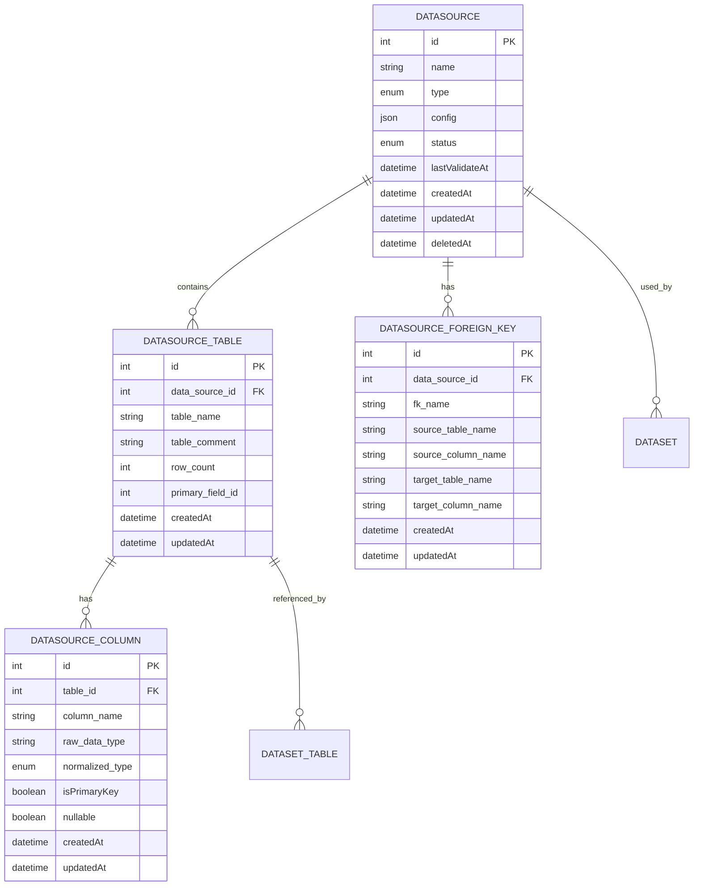

# 数据源模块数据模型文档

## 1. 实体关系图

## 2. 实体详细定义

### 2.1 Datasource 实体

**表名**: `datasources`

**字段定义**:

| 字段名 | 数据类型 | 约束 | 描述 |
|--------|----------|------|------|
| `id` | `int` | `PRIMARY KEY` | 数据源ID |
| `name` | `varchar(100)` | `NOT NULL` | 数据源名称 |
| `type` | `enum` | `NOT NULL` | 数据源类型 (mysql, postgres, clickhouse, csv, excel) |
| `config` | `json` | `NOT NULL` | 数据源配置，根据类型不同而不同 |
| `status` | `enum` | `NOT NULL DEFAULT 'active'` | 数据源状态 (active, invalid, deleted) |
| `lastValidateAt` | `datetime` | `NULL` | 最后验证时间 |
| `createdAt` | `datetime` | `NOT NULL` | 创建时间 |
| `updatedAt` | `datetime` | `NOT NULL` | 更新时间 |
| `deletedAt` | `datetime` | `NULL` | 软删除时间 |

**关联关系**:
- 一对多: `Datasource` → `DatasourceTable` (一个数据源包含多个表)
- 一对多: `Datasource` → `DatasourceForeignKey` (一个数据源包含多个外键关系)
- 一对多: `Datasource` → `Dataset` (一个数据源可被多个数据集使用)

### 2.2 DatasourceTable 实体

**表名**: `datasource_tables`

**字段定义**:

| 字段名 | 数据类型 | 约束 | 描述 |
|--------|----------|------|------|
| `id` | `int` | `PRIMARY KEY` | 表ID |
| `data_source_id` | `int` | `NOT NULL, FOREIGN KEY` | 数据源ID |
| `table_name` | `varchar(255)` | `NOT NULL` | 表名 |
| `table_comment` | `text` | `NULL` | 表注释 |
| `row_count` | `int` | `NULL` | 行数 |
| `primary_field_id` | `int` | `NULL` | 主键字段ID |
| `createdAt` | `datetime` | `NOT NULL` | 创建时间 |
| `updatedAt` | `datetime` | `NOT NULL` | 更新时间 |

**关联关系**:
- 多对一: `DatasourceTable` → `Datasource` (多个表属于一个数据源)
- 一对多: `DatasourceTable` → `DatasourceColumn` (一个表包含多个列)
- 一对多: `DatasourceTable` → `DatasetTable` (一个数据源表可被多个数据集表引用)

### 2.3 DatasourceColumn 实体

**表名**: `datasource_columns`

**字段定义**:

| 字段名 | 数据类型 | 约束 | 描述 |
|--------|----------|------|------|
| `id` | `int` | `PRIMARY KEY` | 列ID |
| `table_id` | `int` | `NOT NULL, FOREIGN KEY` | 表ID |
| `column_name` | `varchar(255)` | `NOT NULL` | 列名 |
| `raw_data_type` | `varchar(255)` | `NOT NULL` | 原始数据类型 |
| `normalized_type` | `enum` | `NOT NULL` | 标准化数据类型 (string, number, date, boolean) |
| `isPrimaryKey` | `boolean` | `NOT NULL DEFAULT false` | 是否为主键 |
| `nullable` | `boolean` | `NOT NULL DEFAULT true` | 是否可空 |
| `createdAt` | `datetime` | `NOT NULL` | 创建时间 |
| `updatedAt` | `datetime` | `NOT NULL` | 更新时间 |

**关联关系**:
- 多对一: `DatasourceColumn` → `DatasourceTable` (多个列属于一个表)

### 2.4 DatasourceForeignKey 实体

**表名**: `datasource_foreign_keys`

**字段定义**:

| 字段名 | 数据类型 | 约束 | 描述 |
|--------|----------|------|------|
| `id` | `int` | `PRIMARY KEY` | 外键ID |
| `data_source_id` | `int` | `NOT NULL, FOREIGN KEY` | 数据源ID |
| `fk_name` | `varchar(255)` | `NOT NULL` | 外键名称 |
| `source_table_name` | `varchar(255)` | `NOT NULL` | 源表名 |
| `source_column_name` | `varchar(255)` | `NOT NULL` | 源列名 |
| `target_table_name` | `varchar(255)` | `NOT NULL` | 目标表名 |
| `target_column_name` | `varchar(255)` | `NOT NULL` | 目标列名 |
| `createdAt` | `datetime` | `NOT NULL` | 创建时间 |
| `updatedAt` | `datetime` | `NOT NULL` | 更新时间 |

**关联关系**:
- 多对一: `DatasourceForeignKey` → `Datasource` (多个外键关系属于一个数据源)

## 3. 配置数据结构

### 3.1 MySQL 配置

| 字段名 | 数据类型 | 必须 | 默认值 | 描述 |
|--------|----------|------|--------|------|
| `host` | `string` | 是 | - | 主机地址 |
| `port` | `string` | 否 | "3306" | 端口号 |
| `database` | `string` | 是 | - | 数据库名称 |
| `username` | `string` | 是 | - | 用户名 |
| `password` | `string` | 是 | - | 密码 |
| `iv` | `string` | 否 | - | 加密向量 (内部使用) |

### 3.2 PostgreSQL 配置

| 字段名 | 数据类型 | 必须 | 默认值 | 描述 |
|--------|----------|------|--------|------|
| `host` | `string` | 是 | - | 主机地址 |
| `port` | `string` | 否 | "5432" | 端口号 |
| `database` | `string` | 是 | - | 数据库名称 |
| `username` | `string` | 是 | - | 用户名 |
| `password` | `string` | 是 | - | 密码 |
| `iv` | `string` | 否 | - | 加密向量 (内部使用) |

### 3.3 ClickHouse 配置

| 字段名 | 数据类型 | 必须 | 默认值 | 描述 |
|--------|----------|------|--------|------|
| `host` | `string` | 是 | - | 主机地址 |
| `port` | `string` | 否 | "8123" | 端口号 |
| `database` | `string` | 是 | - | 数据库名称 |
| `username` | `string` | 是 | - | 用户名 |
| `password` | `string` | 是 | - | 密码 |
| `iv` | `string` | 否 | - | 加密向量 (内部使用) |

### 3.4 CSV 配置

| 字段名 | 数据类型 | 必须 | 默认值 | 描述 |
|--------|----------|------|--------|------|
| `filePath` | `string` | 是 | - | 文件路径 |
| `delimiter` | `string` | 否 | "," | 分隔符 |
| `encoding` | `string` | 否 | "utf-8" | 编码格式 |

### 3.5 Excel 配置

| 字段名 | 数据类型 | 必须 | 默认值 | 描述 |
|--------|----------|------|--------|------|
| `filePath` | `string` | 是 | - | 文件路径 |
| `sheetName` | `string` | 否 | - | 工作表名称 |

## 4. 枚举类型

### 4.1 DataSourceType

| 值 | 描述 |
|-----|------|
| `mysql` | MySQL 数据库 |
| `postgres` | PostgreSQL 数据库 |
| `clickhouse` | ClickHouse 数据库 |
| `csv` | CSV 文件 |
| `excel` | Excel 文件 |

### 4.2 DataSourceStatus

| 值 | 描述 |
|-----|------|
| `active` | 可用 |
| `invalid` | 校验失败 |
| `deleted` | 逻辑删除 |

### 4.3 FieldType (标准化数据类型)

| 值 | 描述 |
|-----|------|
| `string` | 字符串类型 |
| `number` | 数值类型 |
| `date` | 日期时间类型 |
| `boolean` | 布尔类型 |

## 5. 数据流程

### 5.1 数据源创建流程

1. 接收数据源配置
2. 验证配置有效性
3. 测试连接
4. 加密配置中的敏感信息
5. 保存 Datasource 记录
6. 获取数据库表结构
7. 保存 DatasourceTable 记录
8. 保存 DatasourceColumn 记录
9. 获取外键关系
10. 保存 DatasourceForeignKey 记录

### 5.2 数据源更新流程

1. 查询现有 Datasource 记录
2. 解密配置
3. 合并更新的配置
4. 验证配置有效性
5. 测试连接
6. 加密配置
7. 更新 Datasource 记录
8. 重新获取表结构
9. 删除旧的 DatasourceTable 和 DatasourceColumn 记录
10. 保存新的 DatasourceTable 和 DatasourceColumn 记录
11. 更新外键关系

### 5.3 数据源查询流程

1. 查询 Datasource 记录
2. 解密配置
3. 查询关联的 DatasourceTable 记录
4. 查询每个表的 DatasourceColumn 记录
5. 查询关联的 DatasourceForeignKey 记录
6. 组装返回结果

## 6. 数据约束

### 6.1 主键约束
- 所有实体都有自增主键 `id`
- 表的主键字段通过 `primary_field_id` 关联到对应的列

### 6.2 外键约束
- `DatasourceTable.data_source_id` 外键关联 `Datasource.id`
- `DatasourceColumn.table_id` 外键关联 `DatasourceTable.id`
- `DatasourceForeignKey.data_source_id` 外键关联 `Datasource.id`

### 6.3 唯一约束
- 数据源名称在系统中应保持唯一
- 表名在同一数据源中应保持唯一
- 列名在同一表中应保持唯一

### 6.4 非空约束
- `Datasource.name`、`type`、`config`、`status` 不能为空
- `DatasourceTable.data_source_id`、`table_name` 不能为空
- `DatasourceColumn.table_id`、`column_name`、`raw_data_type`、`normalized_type` 不能为空
- `DatasourceForeignKey.data_source_id`、`fk_name`、`source_table_name`、`source_column_name`、`target_table_name`、`target_column_name` 不能为空

## 7. 数据安全

### 7.1 配置加密
- 配置中的敏感信息（如密码）在存储前会被加密
- 加密使用系统配置的密钥
- 查询时会自动解密配置信息

### 7.2 软删除
- 数据源删除采用软删除方式，通过 `deletedAt` 字段标记
- 软删除后的数据仍然保留在数据库中，可用于审计和恢复

### 7.3 权限控制
- 数据源访问需要适当的权限控制
- 配置信息只在必要时解密，减少安全风险

## 8. 数据迁移

### 8.1 表结构迁移
- 使用 TypeORM 的迁移功能管理表结构变更
- 迁移文件应包含所有实体的创建和修改操作

### 8.2 数据迁移
- 当数据源类型变更时，需要重新获取元数据
- 当配置变更时，需要重新测试连接并更新元数据

## 9. 性能考虑

### 9.1 索引
- 所有外键字段都建立了索引，提高查询性能
- 常用查询字段（如数据源类型、状态）应建立索引

### 9.2 批量操作
- 元数据获取和保存采用批量操作，减少数据库交互次数
- 外键关系获取和保存采用批量操作，提高处理效率

### 9.3 缓存
- 元数据信息存储在数据库中，避免重复查询
- 配置信息在内存中缓存，减少解密操作

## 10. 总结

数据源模块的数据模型设计遵循以下原则：

1. **分层设计**：将数据源、表、列、外键关系等概念清晰分离，便于管理和维护
2. **标准化**：对数据类型进行标准化处理，提供统一的数据访问接口
3. **安全性**：对敏感信息进行加密存储，采用软删除机制保护数据
4. **性能优化**：合理设计索引，采用批量操作和缓存策略提高性能
5. **扩展性**：支持多种数据源类型，易于添加新的数据源类型

通过这些设计，数据源模块能够高效地管理各种类型的数据源，为上层应用提供统一、安全、可靠的数据访问能力。