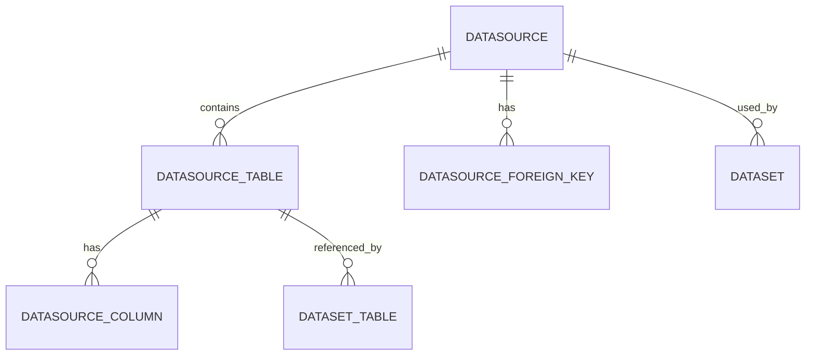

# 数据源模块产品需求文档

## 1. 产品概览

数据源模块是系统的基础组件，负责管理各种类型的数据源连接、元数据获取和数据处理。该模块为上层应用提供统一的数据访问接口，支持多种数据源类型，包括 MySQL、PostgreSQL、ClickHouse、CSV 和 Excel。

**核心目标**：
- 提供统一的数据源管理接口，简化数据接入流程
- 支持多种数据源类型，满足不同业务场景需求
- 自动获取和管理数据源元数据，减少人工操作
- 确保数据源配置的安全性，保护敏感信息
- 提供高效、可靠的数据访问能力，支持系统的数据分析和处理需求

**应用场景**：
- 数据分析师需要连接各种数据源进行分析
- 业务系统需要从不同数据源获取数据进行处理
- 数据集成场景中需要统一管理多个数据源
- 数据迁移和同步场景中需要管理数据源连接

## 2. 核心功能

### 2.1 数据源管理

**功能描述**：管理数据源的生命周期，包括创建、查询、更新和删除操作。

**具体功能**：
- **创建数据源**：支持创建不同类型的数据源，包括 MySQL、PostgreSQL、ClickHouse、CSV 和 Excel
- **查询数据源**：支持查询单个数据源详情，包括配置、表结构和外键关系
- **更新数据源**：支持更新数据源的基本信息和配置
- **删除数据源**：支持软删除数据源，保留操作记录

**业务价值**：
- 提供统一的数据源管理接口，简化数据接入流程
- 支持多种数据源类型，满足不同业务场景需求
- 确保数据源操作的安全性和可靠性

### 2.2 配置管理

**功能描述**：管理数据源的配置信息，包括验证、加密和更新。

**具体功能**：
- **配置验证**：验证不同类型数据源的配置参数完整性和有效性
- **配置加密**：对配置中的敏感信息（如密码）进行加密存储
- **配置更新**：支持更新数据源配置，并自动测试连接

**业务价值**：
- 确保配置的有效性，避免错误配置导致的问题
- 保护敏感信息安全，防止信息泄露
- 提供灵活的配置更新机制，适应业务需求变化

### 2.3 连接管理

**功能描述**：管理数据源的连接，包括测试、创建和维护。

**具体功能**：
- **连接测试**：在创建和更新数据源时自动测试连接
- **连接创建**：根据配置创建数据库连接
- **连接池管理**：优化连接池配置，提高性能

**业务价值**：
- 确保数据源的可访问性，避免连接问题导致的业务中断
- 优化连接管理，提高系统性能
- 提供连接状态监控，及时发现和解决连接问题

### 2.4 元数据管理

**功能描述**：自动获取和管理数据源的元数据，包括表结构、列信息和外键关系。

**具体功能**：
- **表结构获取**：自动获取数据源中的表结构信息
- **列信息获取**：获取表的列信息，包括数据类型、是否可空等
- **外键关系获取**：获取表之间的外键关系
- **数据类型标准化**：将不同数据源的原始数据类型映射到标准化类型

**业务价值**：
- 自动获取元数据，减少人工操作
- 提供统一的元数据视图，简化数据理解和使用
- 支持上层应用的元数据需求，如数据集创建、数据可视化等

### 2.5 安全管理

**功能描述**：确保数据源操作的安全性，包括配置加密、权限控制和审计。

**具体功能**：
- **配置加密**：对配置中的敏感信息进行加密存储
- **软删除**：采用软删除机制，保留操作记录
- **权限控制**：对数据源的访问进行权限控制
- **操作审计**：记录数据源操作日志，便于审计和追溯

**业务价值**：
- 保护敏感信息安全，防止信息泄露
- 提供操作审计能力，满足合规要求
- 确保数据源访问的安全性和可控性

## 3. 核心流程

### 3.1 数据源创建流程

**流程描述**：用户创建新的数据源，系统验证配置、测试连接、加密配置、保存信息并获取元数据。

**流程步骤**：
1. 用户提交创建数据源请求，包含名称、类型和配置
2. 系统验证配置参数的完整性和有效性
3. 系统测试数据库连接
4. 系统加密配置中的敏感信息
5. 系统保存数据源基本信息到数据库
6. 系统获取并保存表结构和列信息
7. 系统获取并保存外键关系
8. 系统返回创建成功的数据源信息

**业务规则**：
- 配置验证失败时，返回错误信息
- 连接测试失败时，返回错误信息
- 元数据获取失败不影响数据源创建，仅记录警告

### 3.2 数据源更新流程

**流程描述**：用户更新现有数据源的信息，系统验证配置、测试连接、更新信息并重新获取元数据。

**流程步骤**：
1. 用户提交更新数据源请求，包含数据源ID和更新信息
2. 系统查询现有数据源信息
3. 系统解密现有配置以便比较
4. 系统合并更新的配置信息
5. 系统验证更新后的配置有效性
6. 系统测试数据库连接（如果配置有变更）
7. 系统加密更新后的配置
8. 系统保存更新后的数据源信息
9. 系统重新获取并保存表结构和列信息
10. 系统返回更新成功的数据源信息

**业务规则**：
- 数据源不存在时，返回错误信息
- 配置验证失败时，返回错误信息
- 连接测试失败时，返回错误信息

### 3.3 数据源查询流程

**流程描述**：用户查询数据源详情，系统返回完整的数据源信息，包括配置、表结构和外键关系。

**流程步骤**：
1. 用户提交查询请求，包含数据源ID
2. 系统查询数据源基本信息
3. 系统解密配置信息
4. 系统获取已保存的表和列信息
5. 系统获取已保存的外键关系
6. 系统返回完整的数据源信息

**业务规则**：
- 数据源不存在时，返回错误信息

### 3.4 数据源删除流程

**流程描述**：用户删除数据源，系统执行软删除操作。

**流程步骤**：
1. 用户提交删除请求，包含数据源ID
2. 系统查询数据源是否存在
3. 系统执行软删除操作
4. 系统返回删除成功信息

**业务规则**：
- 数据源不存在时，返回错误信息
- 采用软删除方式，保留操作记录

## 4. 数据模型

### 4.1 实体关系

### 4.2 核心实体

#### 4.2.1 Datasource 实体

**描述**：数据源基本信息

**字段**：
- `id`：数据源ID（主键）
- `name`：数据源名称
- `type`：数据源类型
- `config`：数据源配置（JSON格式）
- `status`：数据源状态
- `lastValidateAt`：最后验证时间
- `createdAt`：创建时间
- `updatedAt`：更新时间
- `deletedAt`：软删除时间

#### 4.2.2 DatasourceTable 实体

**描述**：数据源表信息

**字段**：
- `id`：表ID（主键）
- `data_source_id`：数据源ID（外键）
- `table_name`：表名
- `table_comment`：表注释
- `row_count`：行数
- `primary_field_id`：主键字段ID
- `createdAt`：创建时间
- `updatedAt`：更新时间

#### 4.2.3 DatasourceColumn 实体

**描述**：数据源列信息

**字段**：
- `id`：列ID（主键）
- `table_id`：表ID（外键）
- `column_name`：列名
- `raw_data_type`：原始数据类型
- `normalized_type`：标准化数据类型
- `isPrimaryKey`：是否为主键
- `nullable`：是否可空
- `createdAt`：创建时间
- `updatedAt`：更新时间

#### 4.2.4 DatasourceForeignKey 实体

**描述**：数据源外键关系

**字段**：
- `id`：外键ID（主键）
- `data_source_id`：数据源ID（外键）
- `fk_name`：外键名称
- `source_table_name`：源表名
- `source_column_name`：源列名
- `target_table_name`：目标表名
- `target_column_name`：目标列名
- `createdAt`：创建时间
- `updatedAt`：更新时间

### 4.3 配置结构

#### 4.3.1 MySQL 配置

**字段**：
- `host`：主机地址
- `port`：端口号（默认：3306）
- `database`：数据库名称
- `username`：用户名
- `password`：密码

#### 4.3.2 PostgreSQL 配置

**字段**：
- `host`：主机地址
- `port`：端口号（默认：5432）
- `database`：数据库名称
- `username`：用户名
- `password`：密码

#### 4.3.3 ClickHouse 配置

**字段**：
- `host`：主机地址
- `port`：端口号（默认：8123）
- `database`：数据库名称
- `username`：用户名
- `password`：密码

#### 4.3.4 CSV 配置

**字段**：
- `filePath`：文件路径
- `delimiter`：分隔符（默认：,）
- `encoding`：编码格式（默认：utf-8）

#### 4.3.5 Excel 配置

**字段**：
- `filePath`：文件路径
- `sheetName`：工作表名称

## 5. 业务规则

### 5.1 数据源类型规则

- 支持的数据源类型：MySQL、PostgreSQL、ClickHouse、CSV、Excel
- 每种数据源类型有特定的配置结构和验证规则
- 新增数据源类型需要扩展代码实现

### 5.2 配置验证规则

- 所有数据源类型都需要验证配置参数的完整性
- 数据库类型的数据源需要验证连接参数
- 文件类型的数据源需要验证文件路径和格式

### 5.3 连接规则

- 创建和更新数据源时必须测试连接
- 连接测试失败时不允许创建或更新数据源
- 连接池配置应合理，避免资源浪费

### 5.4 元数据规则

- 数据源创建成功后必须获取元数据
- 配置变更时必须重新获取元数据
- 元数据获取失败不影响数据源的基本功能

### 5.5 安全规则

- 配置中的敏感信息必须加密存储
- 数据源删除采用软删除方式，保留操作记录
- 对数据源的访问应进行权限控制

### 5.6 性能规则

- 元数据获取应采用批量操作，提高效率
- 连接池配置应合理，避免资源浪费
- 配置缓存机制，减少重复加密解密操作

## 6. 边界和限制

### 6.1 功能边界

- 仅支持已定义的数据源类型，不支持自定义数据源类型
- 元数据获取仅支持系统表查询，不支持复杂的元数据操作
- 连接测试仅验证基本连接，不验证高级功能

### 6.2 性能限制

- 元数据获取速度取决于数据源大小和网络速度
- 连接池大小应根据系统资源和并发需求合理配置
- 加密解密操作会增加系统开销，应合理使用

### 6.3 安全限制

- 配置加密仅保护存储的敏感信息，不保护传输过程
- 权限控制需要依赖上层应用实现
- 软删除机制可能导致数据库存储空间增加

### 6.4 技术限制

- 依赖第三方库和驱动的版本兼容性
- 不同数据源类型的功能支持程度不同
- 网络连接稳定性影响操作成功率

## 7. 非功能需求

### 7.1 性能需求

- **响应时间**：数据源创建和更新操作应在 5 秒内完成（不包括元数据获取）
- **并发处理**：支持同时处理 10 个数据源操作请求
- **元数据获取**：对于包含 100 个表的数据库，元数据获取应在 30 秒内完成

### 7.2 可靠性需求

- **错误处理**：对所有操作提供清晰的错误提示
- **故障恢复**：元数据获取失败不影响数据源的基本功能
- **数据一致性**：确保数据源配置和元数据的一致性

### 7.3 安全性需求

- **配置加密**：对所有敏感信息进行加密存储
- **访问控制**：支持基于角色的访问控制
- **审计日志**：记录所有数据源操作日志

### 7.4 可扩展性需求

- **数据源类型扩展**：支持通过配置或插件方式扩展数据源类型
- **元数据处理扩展**：支持自定义元数据处理逻辑
- **集成扩展**：提供标准接口与其他模块集成

### 7.5 可维护性需求

- **代码结构**：模块化设计，职责清晰
- **文档**：提供完整的API文档和使用指南
- **日志**：详细的操作日志，便于故障排查

## 8. 验收标准

### 8.1 功能验收

- **数据源创建**：成功创建不同类型的数据源，验证配置有效性和连接测试
- **数据源查询**：成功查询数据源详情，包括配置、表结构和外键关系
- **数据源更新**：成功更新数据源信息，验证配置变更和连接测试
- **数据源删除**：成功删除数据源，验证软删除机制
- **元数据获取**：成功获取不同类型数据源的元数据，包括表结构和外键关系

### 8.2 性能验收

- **响应时间**：数据源创建和更新操作在 5 秒内完成
- **并发处理**：同时处理 10 个数据源操作请求，无错误
- **元数据获取**：对于包含 100 个表的数据库，元数据获取在 30 秒内完成

### 8.3 安全性验收

- **配置加密**：敏感信息在存储前被加密，查询时被解密
- **软删除**：删除操作采用软删除方式，保留操作记录
- **权限控制**：数据源访问需要适当的权限

### 8.4 可靠性验收

- **错误处理**：对无效配置和连接失败提供清晰的错误提示
- **故障恢复**：元数据获取失败不影响数据源的基本功能
- **数据一致性**：确保数据源配置和元数据的一致性

### 8.5 兼容性验收

- **数据源类型**：支持所有定义的数据源类型
- **版本兼容性**：与依赖库和驱动的版本兼容
- **系统集成**：与其他模块集成正常

## 9. 风险与依赖

### 9.1 风险

- **连接稳定性**：网络连接不稳定可能导致操作失败
- **性能问题**：大型数据源的元数据获取可能耗时较长
- **安全风险**：配置加密机制可能被破解
- **依赖风险**：第三方库和驱动的版本变更可能影响功能

### 9.2 依赖

- **数据库驱动**：需要安装对应数据源类型的驱动
- **加密库**：需要加密库支持配置加密
- **ORM 框架**：依赖 TypeORM 进行数据存储
- **配置管理**：依赖 @nestjs/config 进行配置管理

## 10. 总结

数据源模块是系统的基础组件，通过统一的接口和流程管理多种类型的数据源。其核心功能包括数据源管理、配置管理、连接管理、元数据管理和安全管理。该模块采用分层设计，职责清晰，支持多种数据源类型，为系统提供了灵活、安全、高效的数据访问能力。

通过本 PRD 文档，明确了数据源模块的业务目标、核心功能、业务流程、数据模型、业务规则、边界和限制、非功能需求、验收标准以及风险与依赖。这些内容为模块的开发、测试和维护提供了清晰的指导，确保模块能够满足业务需求，为上层应用提供可靠的数据访问能力。