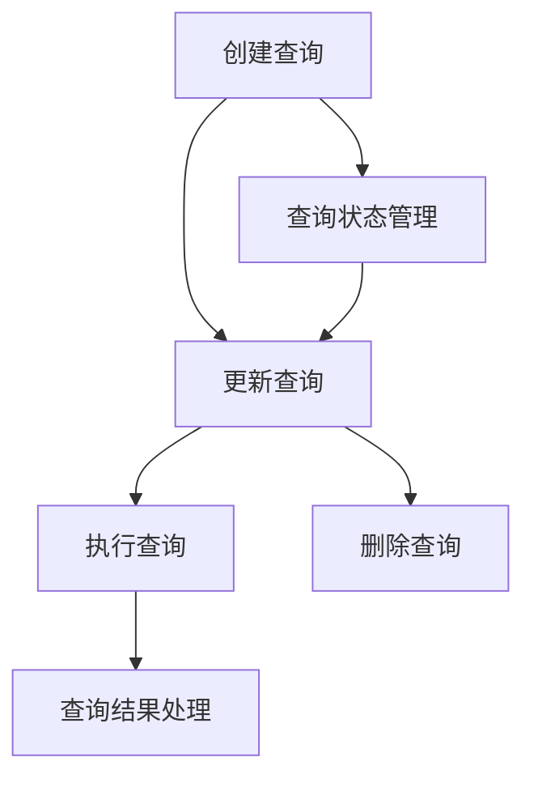
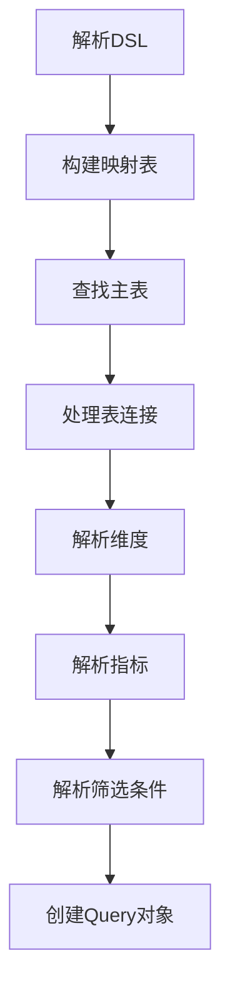

# 查询模块核心业务逻辑文档

## 概述

查询模块是一个负责管理和执行数据查询的核心模块，它提供了完整的查询生命周期管理，包括创建、更新、执行等功能。该模块通过 DSL (Domain Specific Language) 定义查询逻辑，并将其转换为可执行的 SQL 语句。

## 核心业务流程

### 1. 查询生命周期管理

查询模块的核心业务流程围绕查询的完整生命周期展开：

#### 1.1 创建查询

- **功能**：创建新的查询定义
- **流程**：
  1. 接收创建请求，包含查询名称、数据集ID、DSL定义和状态
  2. 验证请求参数
  3. 设置默认状态为 DRAFT（如果未指定）
  4. 保存查询到数据库
  5. 返回创建的查询信息

#### 1.2 更新查询

- **功能**：更新现有查询的定义
- **流程**：
  1. 根据ID查找查询
  2. 验证查询是否存在
  3. 更新查询属性（名称、DSL、状态等）
  4. 保存更新后的查询
  5. 返回更新后的查询信息

#### 1.3 执行查询

- **功能**：执行指定的查询并返回结果
- **流程**：
  1. 根据ID查找查询
  2. 获取关联的数据集信息
  3. 获取数据集对应的数据源信息
  4. 解密数据源配置
  5. 从数据集获取表结构信息
  6. 检查查询DSL是否存在
  7. 将DSL转换为metric-engine的Query对象
  8. 创建数据库连接
  9. 生成SQL语句
  10. 执行SQL并获取结果
  11. 处理执行结果，构建响应
  12. 关闭数据库连接
  13. 返回查询结果

#### 1.4 删除查询

- **功能**：删除指定的查询
- **流程**：
  1. 根据ID删除查询
  2. 验证删除是否成功
  3. 返回删除结果

### 2. DSL转换逻辑

DSL (Domain Specific Language) 是查询模块的核心概念，它定义了查询的结构和逻辑。DSL转换是将查询模块的DSL转换为metric-engine可执行的Query对象的过程。

#### 2.1 DSL结构

查询模块的DSL包含以下核心元素：

- **datasetId**：数据集ID
- **tableId**：主表ID
- **dimensions**：维度列表（使用字段ID引用）
- **metrics**：指标列表（使用指标ID引用）
- **filters**：筛选条件
- **joins**：表连接信息

#### 2.2 转换流程

- **构建映射表**：创建表、字段、指标、连接的映射关系
- **查找主表**：根据DSL中的tableId查找主表信息
- **处理表连接**：解析DSL中的joins配置，创建连接对象
- **解析维度**：将DSL中的维度引用转换为Dimension对象
- **解析指标**：将DSL中的指标引用转换为相应的指标对象（AggregateMetric、RowLevelMetric等）
- **解析筛选条件**：将DSL中的筛选条件转换为Filter对象
- **创建Query对象**：使用解析后的元素创建metric-engine的Query对象

### 3. 查询执行流程

查询执行是查询模块的核心功能，它将DSL转换为SQL并执行，然后处理结果。

#### 3.1 执行步骤

1. **准备阶段**：
   - 查找查询定义
   - 获取数据集和数据源信息
   - 解密数据源配置
   - 准备表结构信息

2. **转换阶段**：
   - 将DSL转换为metric-engine的Query对象

3. **执行阶段**：
   - 创建数据库连接
   - 生成SQL语句
   - 执行SQL并获取结果

4. **处理阶段**：
   - 处理执行结果
   - 构建响应对象
   - 关闭数据库连接

5. **返回阶段**：
   - 返回查询结果，包含SQL语句、结果数据和执行时间

### 4. 与其他模块的交互

查询模块与多个其他模块有紧密的交互：

#### 4.1 与数据集模块的交互

- **依赖关系**：查询模块依赖数据集模块提供的数据集信息
- **交互方式**：通过DatasetService获取数据集详情，包括表、字段、指标等信息
- **使用场景**：执行查询时需要获取数据集的完整结构信息

#### 4.2 与数据源模块的交互

- **依赖关系**：查询模块依赖数据源模块提供的数据源配置和连接能力
- **交互方式**：
  - 通过DatasourceRepository获取数据源信息
  - 使用KnexConnectionFactory创建数据库连接
  - 使用configDecryption解密数据源配置
- **使用场景**：执行查询时需要连接到实际的数据源

#### 4.3 与metric-engine的交互

- **依赖关系**：查询模块依赖metric-engine进行DSL转换和SQL生成
- **交互方式**：
  - 使用DSLTransformer将查询DSL转换为metric-engine的Query对象
  - 使用KnexSQLGenerator生成SQL语句
- **使用场景**：执行查询时需要将DSL转换为可执行的SQL

## 业务规则和约束

### 1. 查询状态管理

查询模块定义了三种状态：

- **DRAFT**：草稿状态，查询正在编辑中
- **ACTIVE**：使用状态，查询可以被执行
- **STOPPED**：停止状态，查询暂时不可用

### 2. 数据验证规则

- **查询名称**：必填，长度不超过255个字符
- **数据集ID**：必填，必须是有效的数据集ID
- **DSL定义**：可选，但执行查询时必须提供
- **状态**：可选，默认为DRAFT

### 3. 执行规则

- **DSL要求**：执行查询时必须提供DSL定义
- **数据源要求**：查询关联的数据集必须有有效的数据源配置
- **权限要求**：用户必须有执行查询的权限

### 4. 错误处理规则

- **查询不存在**：返回404错误
- **数据源不存在**：返回404错误
- **DSL格式错误**：返回400错误
- **执行失败**：返回500错误

## 核心功能点

### 1. DSL转换

DSL转换是查询模块的核心功能之一，它将用户定义的DSL转换为可执行的SQL语句。转换过程包括：

- 解析DSL结构
- 构建映射关系
- 处理表连接
- 解析维度和指标
- 生成Query对象

### 2. 动态数据库连接

查询模块支持动态创建数据库连接，根据数据源配置建立与不同类型数据库的连接。

### 3. SQL生成

使用metric-engine的KnexSQLGenerator生成SQL语句，支持复杂的查询逻辑。

### 4. 结果处理

处理查询执行结果，将其转换为统一的响应格式，包括表头和数据行。

### 5. 执行时间统计

记录查询执行时间，为性能优化提供参考。

## 性能优化考虑

1. **连接管理**：使用try-finally确保数据库连接正确关闭
2. **缓存机制**：考虑对常用查询结果进行缓存
3. **查询优化**：通过DSL转换优化生成的SQL语句
4. **并发控制**：合理控制并发查询数量

## 业务流程示例

### 示例：执行销售数据分析查询

1. **创建查询**：
   - 名称：销售数据分析
   - 数据集ID：1
   - DSL：定义维度（日期）、指标（销售额）、筛选条件（2024年）
   - 状态：ACTIVE

2. **执行查询**：
   - 查找查询定义
   - 获取数据集和数据源信息
   - 解密数据源配置
   - 转换DSL为Query对象
   - 生成SQL语句：`SELECT date, SUM(amount) FROM sales WHERE year = 2024 GROUP BY date`
   - 执行SQL并获取结果
   - 处理结果，构建响应
   - 返回查询结果

3. **结果展示**：
   - SQL语句
   - 结果数据（日期、销售额）
   - 执行时间

## 总结

查询模块是一个功能完整的查询管理系统，它通过DSL定义查询逻辑，转换为SQL并执行，最终返回结构化的查询结果。该模块与数据集、数据源等模块紧密协作，为用户提供了灵活、强大的数据查询能力。

核心业务流程包括查询生命周期管理、DSL转换、查询执行和结果处理，这些流程共同构成了一个完整的查询管理系统。通过合理的业务规则和约束，确保了查询的正确性和可靠性。