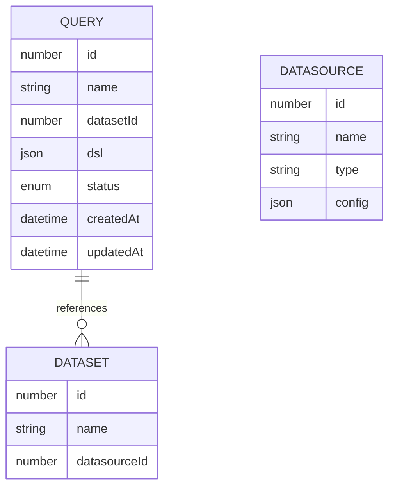

# 查询模块数据模型文档

## 概述

查询模块的数据模型定义了查询相关的核心数据结构，包括查询实体、DSL结构和状态枚举等。这些数据模型支持查询的完整生命周期管理和执行。

## 数据实体关系

### 核心实体关系图



## 核心数据模型

### 1. Query 实体

**表名**: `query`

**描述**: 存储查询定义的核心实体

**字段定义**:

| 字段名 | 数据类型 | 约束 | 描述 |
|--------|----------|------|------|
| `id` | `number` | `PRIMARY KEY, AUTO_INCREMENT` | 查询ID |
| `name` | `string` | `VARCHAR(255), NOT NULL` | 查询名称 |
| `datasetId` | `number` | `NOT NULL, FOREIGN KEY` | 关联的数据集ID |
| `dsl` | `json` | `NULL` | 查询DSL定义 |
| `status` | `enum` | `NOT NULL, DEFAULT 'draft'` | 查询状态 |
| `createdAt` | `datetime` | `NOT NULL, DEFAULT CURRENT_TIMESTAMP` | 创建时间 |
| `updatedAt` | `datetime` | `NOT NULL, DEFAULT CURRENT_TIMESTAMP ON UPDATE CURRENT_TIMESTAMP` | 更新时间 |

**关联关系**:
- 与 `Dataset` 实体是多对一关系：多个查询可以关联到同一个数据集

### 2. QueryDSL 结构

**描述**: 查询的领域特定语言(DSL)结构，定义查询的具体逻辑

**结构定义**:

```typescript
interface QueryDSL {
  /** 数据集ID */
  datasetId: number;
  /** 主表ID */
  tableId: number;
  /** 维度 - 使用字段ID引用 */
  dimensions?: Array<number | { fieldId: number; alias?: string }>;
  /** 指标 - 使用指标ID引用 */
  metrics?: Array<{
    id: number;
    alias?: string;
  }>;
  /** 筛选条件 */
  filters?: Array<{
    fieldId: number;
    op: string;
    value?: any;
    raw?: boolean;
  }>;
  /** 连接 - 使用表ID引用 */
  joins?: Array<{
    id: number;
    type?: 'left' | 'inner' | 'right' | 'full';
  }>;
}
```

**字段说明**:

| 字段名 | 类型 | 描述 |
|--------|------|------|
| `datasetId` | `number` | 数据集ID，与查询实体中的datasetId对应 |
| `tableId` | `number` | 主表ID，引用数据集中的表 |
| `dimensions` | `array` | 维度列表，可以是字段ID或带别名的字段引用 |
| `metrics` | `array` | 指标列表，包含指标ID和可选别名 |
| `filters` | `array` | 筛选条件列表，包含字段ID、操作符和值 |
| `joins` | `array` | 表连接列表，包含连接ID和连接类型 |

### 3. QueryStatus 枚举

**描述**: 查询状态枚举，定义查询的不同状态

**枚举值**:

| 枚举值 | 描述 |
|--------|------|
| `DRAFT` | 草稿状态，查询正在编辑中 |
| `ACTIVE` | 使用状态，查询可以被执行 |
| `STOPPED` | 停止状态，查询暂时不可用 |

## 数据传输对象 (DTOs)

### 1. CreateQueryRequest

**描述**: 创建查询的请求对象

**结构定义**:

| 字段名 | 类型 | 验证规则 | 描述 |
|--------|------|----------|------|
| `name` | `string` | `IsString()` | 查询名称 |
| `datasetId` | `number` | `IsNumber()` | 数据集ID |
| `dsl` | `QueryDSL` | `IsObject(), IsOptional()` | 查询DSL定义 |
| `status` | `QueryStatus` | `IsOptional()` | 查询状态 |

### 2. UpdateQueryRequest

**描述**: 更新查询的请求对象

**结构定义**:

| 字段名 | 类型 | 验证规则 | 描述 |
|--------|------|----------|------|
| `name` | `string` | `IsString(), IsOptional()` | 查询名称 |
| `dsl` | `QueryDSL` | `IsObject(), IsOptional()` | 查询DSL定义 |
| `status` | `QueryStatus` | `IsOptional()` | 查询状态 |

### 3. ExecuteQueryRequest

**描述**: 执行查询的请求对象

**结构定义**:

| 字段名 | 类型 | 验证规则 | 描述 |
|--------|------|----------|------|
| `queryId` | `number` | `IsNumber()` | 查询ID |

### 4. ExecuteQueryResponse

**描述**: 执行查询的响应对象

**结构定义**:

| 字段名 | 类型 | 描述 |
|--------|------|------|
| `sql` | `string` | 生成的SQL语句 |
| `results` | `object` | 查询结果 |
| `results.header` | `array` | 结果表头 |
| `results.rows` | `array` | 结果数据行 |
| `executionTime` | `number` | 执行时间（毫秒） |

## 数据流程

### 1. 查询创建流程

1. 接收 `CreateQueryRequest` 请求
2. 验证请求参数
3. 创建 `Query` 实体，设置默认状态为 `DRAFT`
4. 保存到数据库
5. 返回创建的 `Query` 实体

### 2. 查询执行流程

1. 接收 `ExecuteQueryRequest` 请求
2. 根据 `queryId` 查找 `Query` 实体
3. 获取关联的 `Dataset` 信息
4. 从 `Dataset` 获取表结构信息
5. 解析 `QueryDSL`，转换为 `metric-engine` 的 `Query` 对象
6. 执行查询，获取结果
7. 构建 `ExecuteQueryResponse` 响应
8. 返回响应结果

## 数据约束和验证

### 1. 数据验证

- **查询名称**: 不能为空，长度不超过255个字符
- **数据集ID**: 必须是有效的数据集ID
- **DSL定义**: 执行查询时必须提供，格式必须正确
- **状态**: 必须是 `QueryStatus` 枚举中的值

### 2. 业务约束

- 每个查询必须关联到一个数据集
- 执行查询时，数据集必须有有效的数据源配置
- DSL中的表、字段、指标引用必须存在于数据集中

## 数据模型扩展

### 1. 潜在扩展点

- **查询版本控制**: 可以添加版本字段，支持查询的历史版本管理
- **查询调度**: 可以添加调度相关字段，支持定时执行查询
- **查询权限**: 可以添加权限相关字段，控制查询的访问权限
- **查询结果缓存**: 可以添加缓存相关字段，存储查询结果的缓存信息

### 2. 性能考虑

- **DSL字段**: 使用JSON类型存储DSL，方便灵活扩展，但查询时需要注意性能
- **索引**: 建议在 `datasetId` 和 `status` 字段上创建索引，提高查询性能
- **关联查询**: 执行查询时需要关联数据集和数据源，建议使用预加载减少查询次数

## 数据模型使用示例

### 1. 创建查询

```typescript
// 创建查询对象
const query = {
  name: "销售数据分析",
  datasetId: 1,
  dsl: {
    datasetId: 1,
    tableId: 1,
    dimensions: [1, 2],
    metrics: [
      {
        id: 1,
        alias: "销售额"
      }
    ],
    filters: [
      {
        fieldId: 3,
        op: "=",
        value: "2024"
      }
    ],
    joins: [
      {
        id: 1,
        type: "left"
      }
    ]
  },
  status: QueryStatus.ACTIVE
};

// 保存到数据库
const savedQuery = await queryRepository.save(query);
```

### 2. 执行查询

```typescript
// 查找查询
const query = await queryRepository.findOne({ where: { id: queryId } });

// 获取数据集信息
const dataset = await datasetService.findOne(query.datasetId);

// 转换DSL
const tables = getTablesFromDataset(dataset);
const metricQuery = DSLTransformer.transform(query.dsl, dataset, tables);

// 执行查询并返回结果
const result = await executeQuery(metricQuery, dataset.datasource);
```

## 总结

查询模块的数据模型设计清晰，包含了查询的核心信息和执行所需的所有数据结构。通过 `Query` 实体存储查询定义，`QueryDSL` 定义查询逻辑，以及相关的DTO和枚举类型，构建了一个完整的数据模型体系。

数据模型支持查询的完整生命周期管理，从创建、更新到执行和删除。同时，通过与数据集和数据源的关联，实现了查询与底层数据的连接。

这种设计既保证了数据的完整性和一致性，又提供了足够的灵活性和扩展性，为查询模块的功能实现提供了坚实的基础。