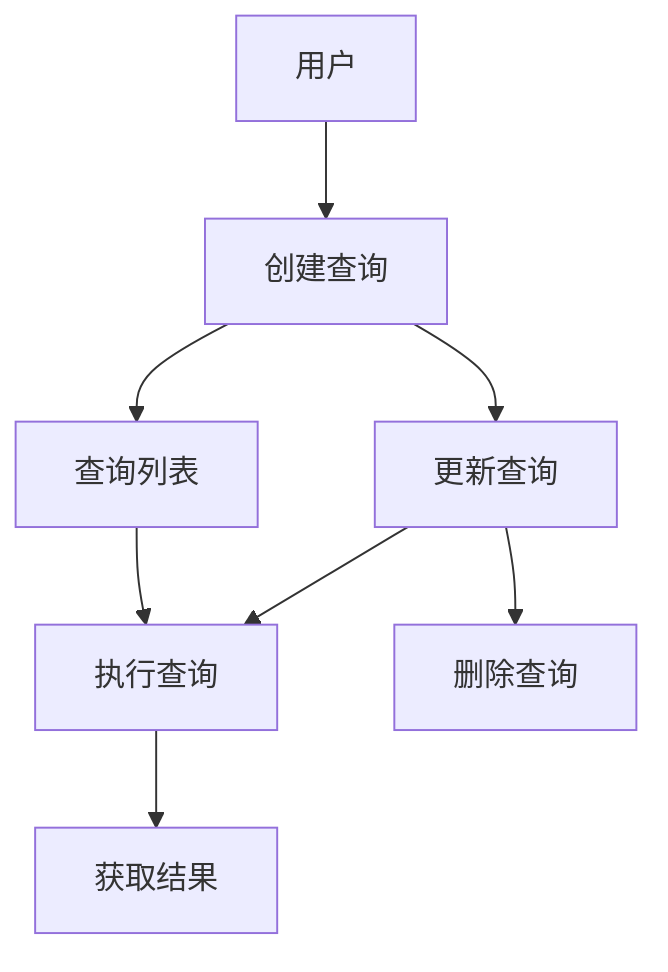

# 查询模块产品需求文档 (PRD)

## 1. 产品概述

查询模块是一个负责管理和执行数据查询的核心模块，旨在为用户提供灵活、强大的数据查询能力。通过该模块，用户可以定义查询逻辑，执行数据查询，并获取结构化的查询结果。

### 1.1 核心目标

- 提供完整的查询生命周期管理，包括创建、更新、执行、删除等功能
- 支持通过 DSL (Domain Specific Language) 定义复杂的查询逻辑
- 实现从 DSL 到 SQL 的转换，支持多种数据库类型
- 提供统一的查询结果格式，方便前端展示和处理
- 确保查询执行的性能和可靠性

### 1.2 应用场景

- **数据分析**：用户可以通过定义查询来分析业务数据，如销售数据、用户行为数据等
- **报表生成**：基于查询结果生成各种业务报表
- **数据探索**：用户可以通过灵活的查询定义来探索数据，发现业务洞察
- **业务监控**：通过定期执行查询来监控业务指标

## 2. 核心功能

### 2.1 功能模块

| 功能模块 | 描述 |
|---------|------|
| 查询管理 | 管理查询的完整生命周期，包括创建、更新、删除、查询列表等 |
| 查询执行 | 执行查询并返回结果，包括 SQL 生成、执行、结果处理等 |
| DSL 转换 | 将查询 DSL 转换为可执行的 SQL 语句 |
| 数据源连接 | 管理与数据源的连接，支持不同类型的数据库 |

### 2.2 核心流程图

## 3. 用户故事

| 角色 | 故事 | 目标 |
|------|------|------|
| 数据分析师 | 我希望能够创建查询来分析销售数据，以便了解销售趋势和业绩表现 | 分析销售数据，获取业务洞察 |
| 业务用户 | 我希望能够执行预定义的查询，以便快速获取业务报表数据 | 快速获取业务报表数据 |
| 系统管理员 | 我希望能够管理查询的生命周期，包括创建、更新、删除查询 | 有效管理查询资源 |
| 开发人员 | 我希望能够通过 API 集成查询功能，以便在应用中使用查询能力 | 集成查询功能到应用中 |

## 4. 功能需求

### 4.1 查询管理

| 需求编号 | 功能点 | 描述 | 优先级 |
|---------|-------|------|--------|
| FQ-001 | 创建查询 | 允许用户创建新的查询定义，包括名称、数据集 ID、DSL 定义和状态 | 高 |
| FQ-002 | 获取查询列表 | 允许用户获取查询列表，支持按状态筛选 | 高 |
| FQ-003 | 获取查询详情 | 允许用户获取单个查询的详细信息 | 高 |
| FQ-004 | 更新查询 | 允许用户更新现有查询的定义，包括名称、DSL、状态等 | 高 |
| FQ-005 | 删除查询 | 允许用户删除指定的查询 | 高 |

### 4.2 查询执行

| 需求编号 | 功能点 | 描述 | 优先级 |
|---------|-------|------|--------|
| FQ-006 | 执行查询 | 允许用户执行指定的查询并返回结果 | 高 |
| FQ-007 | SQL 生成 | 根据查询 DSL 生成可执行的 SQL 语句 | 高 |
| FQ-008 | 结果处理 | 处理查询执行结果，转换为统一的响应格式 | 高 |
| FQ-009 | 执行时间统计 | 记录查询执行时间，为性能优化提供参考 | 中 |

### 4.3 DSL 转换

| 需求编号 | 功能点 | 描述 | 优先级 |
|---------|-------|------|--------|
| FQ-010 | DSL 解析 | 解析用户定义的 DSL，提取查询逻辑 | 高 |
| FQ-011 | 维度处理 | 处理 DSL 中的维度定义，转换为 SQL 中的 GROUP BY 子句 | 高 |
| FQ-012 | 指标处理 | 处理 DSL 中的指标定义，转换为 SQL 中的聚合函数 | 高 |
| FQ-013 | 筛选条件处理 | 处理 DSL 中的筛选条件，转换为 SQL 中的 WHERE 子句 | 高 |
| FQ-014 | 表连接处理 | 处理 DSL 中的表连接定义，转换为 SQL 中的 JOIN 子句 | 高 |

### 4.4 数据源连接

| 需求编号 | 功能点 | 描述 | 优先级 |
|---------|-------|------|--------|
| FQ-015 | 动态连接 | 根据数据源配置动态创建数据库连接 | 高 |
| FQ-016 | 连接管理 | 确保数据库连接正确关闭，避免连接泄漏 | 高 |
| FQ-017 | 配置解密 | 解密数据源配置，确保安全性 | 高 |

## 5. 非功能需求

| 需求编号 | 功能点 | 描述 | 优先级 |
|---------|-------|------|--------|
| NQ-001 | 性能要求 | 查询执行时间应在合理范围内，对于中等数据量的查询，执行时间不应超过 5 秒 | 高 |
| NQ-002 | 可靠性 | 系统应能够处理查询执行过程中的各种异常，确保系统稳定性 | 高 |
| NQ-003 | 安全性 | 数据源配置应加密存储，查询执行应遵循权限控制 | 高 |
| NQ-004 | 可扩展性 | 系统应支持添加新的数据库类型和指标类型 | 中 |
| NQ-005 | 可维护性 | 代码应结构清晰，文档齐全，便于维护和扩展 | 中 |

## 6. 数据需求

### 6.1 数据实体

| 实体名称 | 描述 | 关键字段 |
|---------|------|----------|
| Query | 查询定义 | id, name, datasetId, dsl, status, createdAt, updatedAt |
| QueryDSL | 查询 DSL 结构 | datasetId, tableId, dimensions, metrics, filters, joins |
| QueryStatus | 查询状态 | DRAFT, ACTIVE, STOPPED |

### 6.2 数据传输对象

| DTO 名称 | 描述 | 关键字段 |
|---------|------|----------|
| CreateQueryRequest | 创建查询请求 | name, datasetId, dsl, status |
| UpdateQueryRequest | 更新查询请求 | name, dsl, status |
| ExecuteQueryRequest | 执行查询请求 | queryId |
| ExecuteQueryResponse | 执行查询响应 | sql, results, executionTime |

## 7. 范围限定

### 7.1 功能范围

- 本模块专注于查询的管理和执行，不包括数据源和数据集的管理
- 本模块支持通过 DSL 定义查询逻辑，不支持直接编写 SQL
- 本模块支持基本的查询功能，不包括高级分析功能如预测分析等

### 7.2 技术范围

- 本模块基于 NestJS 框架开发
- 本模块使用 TypeORM 进行数据持久化
- 本模块依赖 metric-engine 进行 DSL 转换和 SQL 生成
- 本模块支持的数据库类型取决于数据源模块的配置

## 8. 验收标准

| 编号 | 验收项 | 测试方法 |
|------|-------|----------|
| AC-001 | 创建查询 | 发送 POST 请求到 /query 接口，验证返回的查询信息 |
| AC-002 | 获取查询列表 | 发送 GET 请求到 /query 接口，验证返回的查询列表 |
| AC-003 | 获取查询详情 | 发送 GET 请求到 /query/:id 接口，验证返回的查询详情 |
| AC-004 | 更新查询 | 发送 PATCH 请求到 /query/:id 接口，验证返回的更新后的查询信息 |
| AC-005 | 删除查询 | 发送 DELETE 请求到 /query/:id 接口，验证查询是否被删除 |
| AC-006 | 执行查询 | 发送 POST 请求到 /query/execute 接口，验证返回的查询结果 |
| AC-007 | DSL 转换 | 创建包含不同元素的 DSL，执行查询，验证生成的 SQL 是否正确 |
| AC-008 | 错误处理 | 测试各种错误场景，如查询不存在、数据源配置错误等，验证错误处理是否正确 |
| AC-009 | 性能测试 | 执行不同复杂度的查询，测量执行时间，验证是否符合性能要求 |
| AC-010 | 安全性测试 | 测试数据源配置加密、权限控制等安全特性 |

## 9. 风险评估

| 风险编号 | 风险描述 | 影响程度 | 可能性 | 缓解措施 |
|---------|---------|---------|---------|----------|
| R-001 | DSL 转换错误 | 高 | 中 | 加强 DSL 验证，提供详细的错误信息 |
| R-002 | 查询执行性能问题 | 高 | 中 | 优化 SQL 生成，添加查询缓存，监控慢查询 |
| R-003 | 数据库连接泄漏 | 高 | 低 | 使用 try-finally 确保连接正确关闭，添加连接池管理 |
| R-004 | 数据源配置安全问题 | 高 | 低 | 加密存储数据源配置，限制配置访问权限 |
| R-005 | 系统扩展性限制 | 中 | 中 | 设计模块化架构，支持插件式扩展 |

## 10. 实施计划

### 10.1 开发阶段

1. **需求分析**：分析用户需求，确定功能范围和技术方案
2. **架构设计**：设计模块架构，包括目录结构、类设计、接口设计等
3. **核心功能开发**：
   - 查询管理功能
   - DSL 转换功能
   - 查询执行功能
   - 数据源连接功能
4. **测试**：编写单元测试、集成测试和端到端测试
5. **文档编写**：编写 API 文档、用户指南等

### 10.2 里程碑

| 里程碑 | 完成时间 | 描述 |
|---------|---------|------|
| 需求分析和架构设计 | 1 周 | 完成需求分析和架构设计文档 |
| 核心功能开发 | 3 周 | 完成查询管理、DSL 转换、查询执行等核心功能 |
| 测试和调试 | 1 周 | 完成测试和调试，确保功能正常 |
| 文档编写 | 1 周 | 完成 API 文档、用户指南等文档 |
| 发布 | 1 周 | 完成模块发布和部署 |

## 11. 总结

查询模块是一个功能完整、设计合理的查询管理系统，它通过 DSL 定义查询逻辑，转换为 SQL 并执行，最终返回结构化的查询结果。该模块与数据集、数据源等模块紧密协作，为用户提供了灵活、强大的数据查询能力。

通过本 PRD 文档，我们明确了查询模块的功能需求、非功能需求、数据需求和范围限定，为开发团队提供了清晰的开发指南。同时，我们也评估了可能的风险，并提出了相应的缓解措施，确保模块的稳定运行。

查询模块的实施将为用户提供一种高效、灵活的数据查询方式，满足各种数据分析需求，为业务决策提供有力支持。