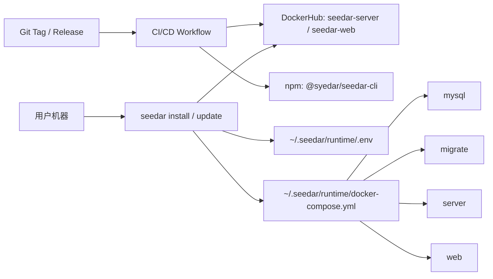

# Seedar 部署架构（v1）

## 目标

Seedar 的生产部署从“仓库内 PowerShell 脚本现场构建”调整为“两层模型”：

1. CI/CD 负责构建并发布 `server` / `web` Docker 镜像到 DockerHub。
2. 用户通过 `@syedar/seedar-cli` 安装、升级、卸载和诊断，不再依赖源码仓库。

## 运行拓扑

## 关键约束

- CLI 用 Node.js 实现，通过 `docker compose` 驱动容器，不直接调用 Docker API。
- 前端镜像固定使用 `/api` 访问后端，避免按客户域名重新构建镜像。
- 默认安装目录：
  - Linux/macOS: `~/.seedar`
  - Windows: `%USERPROFILE%\\.seedar`
- 默认运行时目录结构：
  - `runtime/docker-compose.yml`
  - `runtime/.env`
  - `runtime/.installed-version`
  - `data/`
  - `logs/`
  - `backups/`

## 版本约定

- Git tag 使用 `vX.Y.Z`。
- Docker 镜像：
  - `syedarhandsome/seedar-server:X.Y.Z`
  - `syedarhandsome/seedar-server:latest`
  - `syedarhandsome/seedar-web:X.Y.Z`
  - `syedarhandsome/seedar-web:latest`
- npm CLI 包版本与发布 tag 对齐。

## Legacy 兼容

`deploy/up-prod.ps1` 与 `deploy/migrate-prod.ps1` 仍保留，但已降级为 legacy 入口：

- 不再本地 build 镜像。
- 默认拉取 `syedarhandsome` 下的远端镜像。
- 默认版本为 `latest`，也可通过 `SEEDAR_VERSION` 覆盖。
- 新部署路径应优先使用 `seedar install` / `seedar update`。
