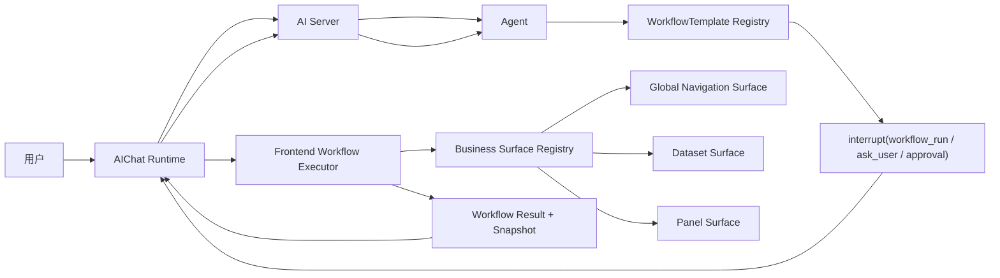

# Seedar AI WorkflowTemplate 驱动前端协作方案

## 1. 文档目标

这份文档用于回答一个更聚焦的问题：

- 在 Seedar 当前的 AI 对话体系上，是否适合让 agent 直接生成长链 UI actions
- 如果不适合，什么样的方案更稳、更容易落地
- 前后端分别需要补哪些能力
- `workflowTemplate` 应该怎么设计，才能既可控又可扩展

文档结论先行：

- 这个方向是可行的
- 当前阶段不建议让 agent 默认自由生成长链 actions
- 推荐采用 `workflowTemplate + interrupt/resume + 前端工作流执行器`
- agent 的主职责应当是“选模板 + 填参数 + 缺参追问 + 失败后接管”
- 工程侧的主职责应当是“定义保证可跑通的模板流程并稳定执行”
- 底层仍然可以保留语义化 atomic actions，但它们应优先服务于模板内部，而不是直接暴露给 agent 自由编排

---

## 2. 当前现状梳理

## 2.1 前端 AIChat 现状

当前 web-client 的 AI 能力主要由以下部分组成：

- `apps/web-client/src/core/components/business/AIChat/AIChat.tsx`
- `apps/web-client/src/core/components/business/AIChat/AIChat.Preview.tsx`
- `apps/web-client/src/core/components/business/AIChat/hooks/useSSEHandler.hook.ts`
- `apps/web-client/src/core/components/business/AIChat/components/InterruptMessage/InterruptMessage.tsx`
- `packages/ui-core/src/api/ai.ts`
- `packages/ui-react/src/hooks/api/useAi.ts`

当前结构的特点如下：

- `AIChat.tsx` 主要负责展示消息、思考链、工具调用和中断消息。
- 真正的会话创建、SSE 建连、消息流转、session 管理主要在 `AIChat.Preview.tsx`。
- `AppLayout` 右侧 SeeMind 侧边栏里实际挂载的也是 `AIChatPreview`。
- `InterruptMessage` 已经支持中断后向用户收集结构化答案，并通过 `isResume=true` 恢复 agent。

当前前端已经具备的关键能力：

- 创建 AI session
- 发起 SSE 流式会话
- 渲染 `text/tool_call/tool_result/reasoning/interrupt/error`
- 在 interrupt 后恢复 agent

当前前端的明显限制：

- interrupt 当前主要服务于 `askQuestion`
- AIChat runtime 还没有被正式抽象成平台层能力
- 没有统一的 workflow 执行器
- 没有统一的页面上下文采集机制
- 没有“业务表面能力注册”机制
- 没有 workflow log / pending workflow / retry / timeout / approval 基础设施

## 2.2 后端 AI 模块现状

当前 server 侧 AI 主要集中在：

- `apps/server/src/module/ai/ai.controller.ts`
- `apps/server/src/module/ai/services/chat.service.ts`
- `apps/server/src/module/ai/services/tool.service.ts`
- `apps/server/src/module/ai/services/ai-session.service.ts`
- `apps/server/src/module/ai/entities/ai-session.entity.ts`

当前后端已经具备的关键能力：

- `POST /v1/ai/session` 创建会话
- `POST /v1/ai/chat/stream` 通过 SSE 推送流式消息
- `ChatService` 使用 LangGraph 运行 agent 图
- `ToolService.askQuestion()` 内部调用 `interrupt(...)`
- `streamChat()` 支持通过 `resume` 恢复 agent

这意味着：

- “agent 暂停 -> 前端/用户处理 -> agent 恢复” 这条主链已经存在
- 当前只是把中断对象主要定义成“向用户提问”
- 从架构上完全可以扩展成“让前端执行一个预定义工作流”

当前后端的明显限制：

- graph checkpoint 使用 `MemorySaver`
- session 状态粒度不足
- resume payload 仍然偏文本化
- interrupt 协议还没有形成真正统一的 shared contract
- 没有 workflow task / workflow log / workflow runtime

## 2.3 当前前端可沉淀为模板的业务流程

从现有页面结构看，Seedar 已经有几类非常适合做 `workflowTemplate` 的业务流程。

### A. 全局导航与布局

相关位置：

- `apps/web-client/src/core/components/business/GlobalNavigation/GlobalNavigation.tsx`
- `apps/web-client/src/layouts/AppLayout.tsx`
- `apps/web-client/src/core/store/index.ts`

适合模板化的动作：

- 导航到 `dashboard/panel/dataset/datasource`
- 打开或关闭 SeeMind 侧边栏

### B. 数据集列表页

相关位置：

- `apps/web-client/src/modules/dataset/pages/datasetPage.tsx`

适合模板化的动作：

- 搜索数据集
- 过滤数据集
- 新建数据集
- 进入数据集详情
- 进入数据集编辑页

### C. 数据集编辑器

相关位置：

- `apps/web-client/src/modules/dataset/components/DatasetEditor/DatasetEditorPage.tsx`
- `apps/web-client/src/modules/dataset/hooks/useDatasetForm.ts`

适合模板化的动作：

- 配置基本信息
- 选择数据源与表
- 配置 join
- 选择字段
- 配置指标
- 步骤流转
- 提交创建或更新

这部分天然就是“业务向导”，非常适合定义成固定 workflow。

### D. 图表面板编辑页

相关位置：

- `apps/web-client/src/modules/panel/pages/panelPage.tsx`
- `apps/web-client/src/modules/panel/components/panelEditor/panelEditor.tsx`
- `apps/web-client/src/modules/panel/components/datasetSelector/datasetSelector.tsx`

适合模板化的动作：

- 创建空 panel
- 为 panel 选择 dataset
- 配置基础图表
- 运行 preview
- 保存草稿
- 发布 panel

这正是最适合先落地 `workflowTemplate` 的场景。

---

## 3. 为什么不建议当前阶段让 agent 自由生成长链 actions

你最初的设想是让 agent 输出长链 actions，前端执行后再唤醒 agent。这个方向不是不能做，但它更适合成熟阶段，不适合现在直接作为默认路径。

核心问题有这些：

### 3.1 页面状态漂移

agent 生成链路时看到的页面状态，和前端真正执行时的状态，可能已经不同。

常见情况：

- 路由已变化
- 数据已刷新
- 对话框未打开
- 当前选中资源不同
- 某一步执行失败后后续动作失效

### 3.2 链路过长后很难定位失败点

如果 agent 输出 10 步链路，前端执行到第 6 步失败，会出现几个问题：

- 前 5 步是否都成功
- 当前页面处于什么中间态
- 第 6 步失败能否重试
- 第 7 到 10 步是否仍然合理

排查成本会很高。

### 3.3 很难做稳定测试

如果长链是 agent 临时生成的，那么：

- 这条链不容易做自动化回归
- 页面改版后很难批量修复
- 版本管理困难

### 3.4 模型能力波动会直接影响执行质量

同一个目标，不同模型版本、不同 prompt、不同上下文都可能生成不同动作链。

这意味着工程可控性太弱。

### 3.5 难以控制危险动作

如果 agent 可自由组合动作，发布、删除、覆盖修改等敏感动作很容易混在链里，风险较高。

---

## 4. 为什么 `workflowTemplate` 更适合当前阶段

`workflowTemplate` 的本质是：

- 工程侧预先定义一批保证能跑通的业务流程模板
- agent 不直接自由编排底层动作
- agent 只负责选择模板、填充参数、必要时补充条件和接管异常

这是把 agent 的角色从“自由执行器”降为“调度器 + 填参器 + 异常处理器”。

这个变化会极大提升稳定性。

### 4.1 更可测试

每个模板都可以：

- 独立做单元测试
- 独立做集成测试
- 独立做 E2E 回归

### 4.2 更可版本化

例如：

- `create_panel_basic_v1`
- `create_panel_basic_v2`

页面改版时只需要升级模板实现，不需要让 agent 重新学会如何操作页面。

### 4.3 更可控

agent 只能调用已定义模板，不能随意操作未注册能力。

### 4.4 更符合复杂业务页面

像 dataset editor、panel page 这种页面，本质上就是流程驱动的业务状态机，非常适合模板化，而不是自由点击式控制。

### 4.5 更容易做审批与兜底

某些步骤需要：

- 用户确认
- 人工接管
- 改参数重跑

这些都更适合放在 workflow policy 里，而不是事后由 agent 临时补救。

---

## 5. 推荐的总体架构

推荐把能力拆成四层。

### 第 1 层：Agent 调度层

职责：

- 理解用户目标
- 选择合适的 workflowTemplate
- 填充 workflow params
- 缺参数时追问用户
- 模板失败后决定改参、换模板或请用户接管

### 第 2 层：WorkflowTemplate 层

职责：

- 定义稳定的业务流程模板
- 约束入参
- 约束前置条件
- 约束执行步骤
- 约束失败策略
- 约束输出结构

### 第 3 层：语义化 Action 层

职责：

- 提供 workflow 内部可复用的语义动作
- 不面向 DOM
- 面向业务 surface 和稳定 targetId

### 第 4 层：业务 Surface 层

职责：

- 直接接入页面、组件、store、路由和业务 hook
- 真正完成 UI 行为



---

## 6. 核心设计原则

### 6.1 模板优先，原子 action 次之

默认模式应该是：

- agent 调用 workflowTemplate

而不是：

- agent 自己拼 action chain

底层 atomic actions 仍然需要，但优先给模板内部使用。

### 6.2 模板要小而稳，不要大而全

不要上来就定义一个超大的：

- `create_panel`

而应该更倾向于：

- `create_empty_panel_draft_v1`
- `select_dataset_for_panel_v1`
- `create_line_chart_panel_v1`
- `run_panel_preview_v1`
- `publish_panel_v1`

模板越窄，越容易保证“稳定跑通”。

### 6.3 模板参数应当强约束

每个模板都必须有清晰的：

- 参数 schema
- 参数必填项
- 参数默认值
- 参数合法取值范围

### 6.4 模板内部优先等待状态，不依赖 delay

推荐：

- `waitFor: "dataset_selected"`
- `waitFor: "dialog_opened"`
- `waitFor: "preview_ready"`

不推荐把 `delay` 作为主策略。

### 6.5 模板必须可回报明确失败原因

失败结果必须结构化，至少说明：

- 哪一步失败
- 为什么失败
- 是否可重试
- 是否需要用户输入或接管

### 6.6 保留受限 fallback

后续可以保留“agent 直接调用 atomic actions”的实验能力，但应作为受限 fallback，而不是默认主路径。

---

## 7. 推荐的数据结构设计

## 7.1 WorkflowTemplate

```ts
type WorkflowTemplate = {
  id: string;
  version: string;
  title: string;
  description: string;
  scene: string;
  paramsSchema: Record<string, unknown>;
  preconditions: WorkflowPrecondition[];
  steps: WorkflowStep[];
  outputsSchema?: Record<string, unknown>;
  policy?: WorkflowPolicy;
};

type WorkflowPrecondition = {
  code: string;
  description: string;
};

type WorkflowPolicy = {
  requireApproval?: boolean;
  allowUserTakeover?: boolean;
  retryable?: boolean;
  timeoutMs?: number;
};
```

## 7.2 WorkflowStep

```ts
type WorkflowStep = {
  stepId: string;
  title: string;
  action: string;
  args: Record<string, unknown>;
  waitFor?: string;
  timeoutMs?: number;
  retry?: number;
  onFailure?: "stop" | "retry" | "fallback";
};
```

这里的 `action` 指向的是语义化 atomic action，而不是 DOM 操作。

## 7.3 Workflow 启动请求

推荐让 agent 输出的核心对象是：

```ts
type StartWorkflowRequest = {
  workflowId: string;
  version?: string;
  params: Record<string, unknown>;
  reason?: string;
};
```

也就是说，agent 不输出底层链，只输出：

- 选择哪个模板
- 给这个模板传什么参数

## 7.4 Workflow 中断载荷

推荐复用 interrupt 机制，但将种类扩展为：

```ts
type AiInterruptPayload =
  | AskUserInterrupt
  | WorkflowRunInterrupt
  | ApprovalInterrupt;

type InterruptContent<T> = {
  id: string;
  value: T;
};
```

其中：

```ts
type WorkflowRunInterrupt = {
  kind: "workflow_run";
  interruptId: string;
  request: StartWorkflowRequest;
};
```

## 7.5 Workflow 执行结果

```ts
type WorkflowRunResult = {
  kind: "workflow_result";
  interruptId: string;
  workflowId: string;
  version?: string;
  status: "success" | "failed" | "blocked" | "partial";
  currentStepId?: string;
  output?: Record<string, unknown>;
  snapshot?: UiSurfaceSnapshot;
  error?: {
    code:
      | "PRECONDITION_FAILED"
      | "STEP_FAILED"
      | "TARGET_NOT_FOUND"
      | "SURFACE_NOT_READY"
      | "INVALID_PARAMS"
      | "TIMEOUT"
      | "USER_ABORTED"
      | "UNSUPPORTED_WORKFLOW";
    message: string;
    retriable?: boolean;
  };
};
```

## 7.6 页面快照

```ts
type UiSurfaceSnapshot = {
  route?: string;
  surface?: string;
  selectedResource?: {
    type: string;
    id: string | number;
    name?: string;
  };
  state?: Record<string, unknown>;
  availableWorkflows?: string[];
  availableActions?: string[];
};
```

## 7.7 resume payload

推荐把恢复对象结构化：

```ts
type AiChatResumeDto = {
  kind: "user_message" | "interrupt_result";
  message?: string;
  interruptResult?: WorkflowRunResult | AskQuestionResult;
};
```

这样可以避免现在“把结构化结果转成字符串再回传”的问题。

---

## 8. Agent 与 Workflow Engine 的职责边界

## 8.1 Agent 负责什么

agent 推荐只负责：

- 理解用户意图
- 选择 workflowTemplate
- 填充参数
- 缺参数时向用户提问
- 根据 workflow 执行结果决定下一步

agent 不应默认负责：

- 自由编排长链底层 UI 动作
- 控制 DOM 细节
- 自行决定页面中间态如何恢复

## 8.2 Workflow Engine 负责什么

workflow engine 负责：

- 校验 workflowId 和 version
- 校验 params schema
- 检查 preconditions
- 执行模板步骤
- 等待状态变化
- 统一处理超时、重试、失败
- 回传结构化结果

一句话总结：

- agent 负责“决策”
- engine 负责“执行”

---

## 9. 推荐的前端能力设计

## 9.1 将 AIChat 正式拆成展示层与 runtime 层

建议新增正式容器：

- `AiChatRuntime`
- `useAiChatRuntime`

职责建议如下。

### AIChat 展示层

- 渲染 messages
- 根据 interrupt kind 渲染卡片
- 不承担 workflow 执行职责

### AiChatRuntime

- 创建 session
- 建立流式会话
- 管理 pending interrupt
- 管理 workflow 执行状态
- 将 `workflow_run` interrupt 交给前端执行器
- 把 workflow result 结构化发回 server

## 9.2 建立 Frontend Workflow Executor

建议新增统一执行器：

```ts
interface WorkflowExecutor {
  run(request: StartWorkflowRequest): Promise<WorkflowRunResult>;
}
```

这个执行器本质上不直接操作页面，而是：

- 找到 workflowTemplate
- 逐步解释模板步骤
- 调用底层语义化 action handler

## 9.3 建立 WorkflowTemplate Registry

```ts
interface WorkflowTemplateRegistry {
  register(template: WorkflowTemplate): void;
  unregister(templateId: string, version?: string): void;
  get(templateId: string, version?: string): WorkflowTemplate | undefined;
  list(): WorkflowTemplate[];
}
```

## 9.4 建立业务 Surface Registry

底层仍然需要语义 action 的 handler 层：

```ts
interface UiActionHandler {
  surface: string;
  canHandle(action: string): boolean;
  execute(args: Record<string, unknown>): Promise<Record<string, unknown>>;
  readContext?(): UiSurfaceSnapshot;
}
```

建议新增：

```ts
interface UiSurfaceRegistry {
  register(handler: UiActionHandler): void;
  unregister(surface: string): void;
}
```

注意：

- 这层是 workflow 内部依赖
- 不建议直接作为 agent 主接口暴露

## 9.5 每个业务表面都应提供上下文快照

例如 `dataset-editor` 可提供：

- 当前步骤
- 当前 datasourceId
- 当前 tables
- 当前 mainTable
- 当前 fields 数量
- 当前 metrics 数量
- 是否允许 next

例如 `panel-page` 可提供：

- 当前 dataset
- 当前 displayType
- 当前 dropFields / dropMetrics / dropFilters 摘要
- 是否允许 run
- panelStatus

## 9.6 聊天 UI 中新增 Workflow 卡片

建议增加：

- `WorkflowRunInterruptCard`
- `WorkflowRunResultCard`
- `ApprovalInterruptCard`

`WorkflowRunInterruptCard` 建议展示：

- workflow 名称
- workflow 参数摘要
- 当前执行阶段
- 当前步骤
- 成功或失败状态
- 错误原因
- 重试
- 用户接管

## 9.7 支持用户接管

当 workflow：

- 参数不足
- 某步骤失败
- 进入危险动作

前端应支持：

- 用户确认后继续
- 用户拒绝
- 用户手动完成后点击“已完成”

---

## 10. 推荐的后端能力设计

## 10.1 默认新增 `startWorkflow` 与 `readUiContext`

建议在 `ToolService` 中新增的主工具是：

- `startWorkflow`
- `readUiContext`
- 可选：`requestApproval`

不再把 `requestUiAction` 作为默认主路径，而是将它降级为：

- 内部调试工具
- 受限 fallback

### startWorkflow

职责：

- 接收 `StartWorkflowRequest`
- 校验 workflow 是否存在
- 触发 `interrupt({ kind: "workflow_run", ... })`

### readUiContext

职责：

- 让 agent 在启动 workflow 前读取当前页面快照
- 帮助 agent 做模板选择与参数判断

## 10.2 Agent prompt 需要调整

需要明确告诉 agent：

- 优先选择 workflowTemplate，而不是自由拼动作链
- 先读当前 UI context，再决定启动哪个模板
- 参数不足时，先向用户提问
- workflow 失败时，优先改参数、换模板或请求用户接管
- 只有极少数场景才使用 direct action fallback

## 10.3 扩展 session/runtime 状态

建议至少包括：

- `running`
- `waiting_user`
- `waiting_workflow`
- `waiting_approval`
- `completed`
- `failed`
- `canceled`

## 10.4 增加 workflow runtime 记录

建议后续新增：

- `ai_session_runtime`
- `ai_workflow_task`
- `ai_session_event_log`

其中 `ai_workflow_task` 可记录：

- workflowId
- version
- params
- currentStepId
- status
- result
- error

## 10.5 持久化 checkpoint

如果 workflow 需要跨时间等待，那么 `MemorySaver` 最终是不够的。

推荐目标：

- checkpoint 可持久化
- 支持服务重启恢复
- 支持多实例部署

## 10.6 增加 workflow policy

建议在后端定义 policy：

- 是否允许自动执行
- 是否需要用户确认
- 是否属于危险写操作
- 是否允许自动重试

---

## 11. 推荐的模板体系

## 11.1 第一批建议定义的模板

建议不要追求多，而要先追求稳定。

| 模板 ID | 用途 | 推荐优先级 |
| --- | --- | --- |
| `navigate_to_dataset_page_v1` | 导航到数据集页 | 高 |
| `create_empty_panel_draft_v1` | 创建一个空白 panel 草稿 | 高 |
| `select_dataset_for_panel_v1` | 为当前 panel 选择 dataset | 高 |
| `create_line_chart_panel_v1` | 创建基础折线图 panel | 高 |
| `run_panel_preview_v1` | 运行 panel 预览 | 高 |
| `publish_panel_v1` | 发布当前 panel | 中 |
| `create_dataset_basic_v1` | 创建基础数据集 | 中 |

## 11.2 第一版不要做超大模板

不建议第一版就做：

- `create_panel_everything_v1`

因为它会带太多分支：

- dataset 是否已选
- chart 类型不同
- 字段是否存在
- metric 是否已存在
- 是否要保存
- 是否要发布

更合理的是做“可组合的小模板”。

---

## 12. `create_panel_basic_v1` 示例

这里给出一个你当前最关心的模板示例。

## 12.1 目标

在 panel 场景中，创建一个基础图表草稿，并返回 panelId 与当前配置结果。

## 12.2 输入参数

```ts
type CreatePanelBasicParams = {
  datasetId: number;
  title: string;
  chartType: "line" | "bar" | "table" | "card";
  dimensions?: string[];
  metrics?: string[];
  saveMode?: "draft" | "publish";
};
```

## 12.3 前置条件

- 当前用户有进入 panel 页面权限
- datasetId 对应的数据集存在
- 当前页面支持 panel 创建

## 12.4 内部步骤示例

```ts
const createPanelBasicV1: WorkflowTemplate = {
  id: "create_panel_basic_v1",
  version: "v1",
  title: "创建基础图表面板",
  description: "为指定数据集创建基础图表 panel",
  scene: "panel",
  paramsSchema: {
    datasetId: "number",
    title: "string",
    chartType: "enum(line|bar|table|card)",
    dimensions: "string[]",
    metrics: "string[]",
    saveMode: "enum(draft|publish)"
  },
  preconditions: [
    { code: "PANEL_PAGE_AVAILABLE", description: "panel 创建页可访问" }
  ],
  steps: [
    {
      stepId: "open-create-page",
      title: "进入 panel 创建页",
      action: "navigate_to_panel_create",
      args: {},
      waitFor: "route:/panel/create"
    },
    {
      stepId: "select-dataset",
      title: "选择数据集",
      action: "select_dataset_for_panel",
      args: { datasetId: "{{params.datasetId}}" },
      waitFor: "panel.dataset_selected"
    },
    {
      stepId: "set-title",
      title: "设置标题",
      action: "set_panel_title",
      args: { title: "{{params.title}}" }
    },
    {
      stepId: "set-chart-type",
      title: "设置图表类型",
      action: "set_panel_display_type",
      args: { chartType: "{{params.chartType}}" },
      waitFor: "panel.display_type_ready"
    },
    {
      stepId: "apply-fields",
      title: "配置字段",
      action: "apply_panel_fields",
      args: {
        dimensions: "{{params.dimensions}}",
        metrics: "{{params.metrics}}"
      }
    },
    {
      stepId: "run-preview",
      title: "运行预览",
      action: "run_panel_preview",
      args: {},
      waitFor: "panel.preview_ready"
    },
    {
      stepId: "save",
      title: "保存草稿",
      action: "save_panel",
      args: { mode: "{{params.saveMode}}" },
      waitFor: "panel.saved"
    }
  ]
};
```

## 12.5 可能失败点

- dataset 不存在
- chartType 与字段组合不合法
- metrics 缺失
- preview 失败
- 保存失败

## 12.6 返回结果

```ts
type CreatePanelBasicOutput = {
  panelId?: string;
  title: string;
  datasetId: number;
  chartType: string;
  status: "draft" | "published";
};
```

## 12.7 agent 侧输出示例

agent 不应输出底层 action chain，而应输出：

```json
{
  "workflowId": "create_panel_basic_v1",
  "params": {
    "datasetId": 12,
    "title": "销售趋势",
    "chartType": "line",
    "dimensions": ["日期"],
    "metrics": ["销售额"],
    "saveMode": "draft"
  },
  "reason": "用户想创建一个基础销售趋势图表"
}
```

---

## 13. 推荐的前后端实施拆分

## 13.1 前端

- 抽出 `AiChatRuntime`
- 增加 workflow interrupt renderer
- 新增 `FrontendWorkflowExecutor`
- 新增 `WorkflowTemplateRegistry`
- 新增 `UiSurfaceRegistry`
- 为 `global-navigation`、`panel-page`、`dataset-editor` 提供 surface handlers
- 增加 workflow 执行进度 UI
- 增加用户接管 UI

## 13.2 后端

- 扩展 shared AI types
- 新增 `startWorkflow` tool
- 新增 `readUiContext` tool
- 扩展 `AiChatRequestDto`，支持结构化 resume payload
- 扩展 session runtime 状态
- 新增 workflow event log
- 后续引入持久化 checkpoint

## 13.3 共享规范

- 明确 workflowId 命名规范
- 明确 template version 策略
- 明确 params schema 规范
- 明确错误码规范
- 明确危险动作 approval 策略

---

## 14. 分阶段实施建议

## 阶段 0：协议与 runtime 清理

目标：

- 统一 shared AI types
- 正式抽出 `AiChatRuntime`
- 让 interrupt/resume 支持结构化 payload

## 阶段 1：打通 workflowTemplate 闭环

目标：

- 新增 `startWorkflow`
- 前端新增 workflow executor
- 先接入 1 到 2 个金路径模板

建议优先模板：

- `create_empty_panel_draft_v1`
- `select_dataset_for_panel_v1`

## 阶段 2：补齐高价值模板

目标：

- `create_panel_basic_v1`
- `run_panel_preview_v1`
- `publish_panel_v1`
- `create_dataset_basic_v1`

## 阶段 3：稳定化

目标：

- checkpoint 持久化
- workflow log / event log
- approval / retry / timeout
- 用户接管与恢复

---

## 15. 复杂度评估

相比“agent 自由输出长链 action”，`workflowTemplate` 方案虽然前期多了一些模板设计工作，但整体更容易落地。

### POC 级

- 中等复杂度
- 重点是打通：
  - `startWorkflow`
  - 前端 workflow executor
  - 1 条金路径模板

### MVP 级

- 中高复杂度
- 重点是：
  - 模板注册与版本化
  - 页面上下文快照
  - 失败回传
  - 用户接管

### 生产级

- 中高到高复杂度
- 重点是：
  - 持久化
  - 可观测性
  - 审批策略
  - 跨版本兼容

核心变化是：

- 复杂度从“模型行为不确定”转移为“工程模板治理”

这通常是更值得的复杂度。

---

## 16. 主要工程风险与应对

| 风险 | 描述 | 应对建议 |
| --- | --- | --- |
| 类型漂移 | server 与 shared types 不一致 | 所有 AI 协议统一收敛到 `packages/types` |
| 状态丢失 | `MemorySaver` 导致等待中的 workflow 状态丢失 | 尽快落地持久化 checkpoint |
| 模板过大 | 一个模板试图覆盖太多业务分支 | 模板拆小、按场景版本化 |
| 页面漂移 | workflow 执行时页面状态已变化 | 每个步骤前后读取 context snapshot |
| DOM 脆弱 | 如果模板内部仍直接依赖 DOM | 模板内部仅调用语义化 surface action |
| 难排查 | 失败时难定位到步骤 | 每步记录 stepId、结果和错误码 |
| 权限风险 | 模板包含发布、删除等危险操作 | policy + approval |
| 模板腐化 | 页面改版后模板失效 | 版本化模板 + E2E 回归 |

---

## 17. 最终建议

Seedar 当前最适合的落地方向，不是：

- 让 agent 默认自由生成长链 UI actions

而是：

- 让工程侧定义一批稳定的 `workflowTemplate`
- 让 agent 选择模板并填充参数
- 让前端 workflow executor 稳定执行模板
- 让 agent 在缺参数和失败场景下接管

一句话总结：

**默认模式是模板工作流，语义化 atomic action 是模板内部实现，agent 自由 action chain 只作为受限 fallback。**

这个方向更符合你们当前的工程成熟度，也更容易先做出一个能稳定跑通的版本。

---

## 18. 推荐下一步

建议按下面顺序推进：

1. 先统一 AI interrupt/resume 的 shared types
2. 把 `AIChatPreview` 重构为正式 runtime 层
3. 新增 `startWorkflow` 和前端 workflow executor
4. 先实现 `create_empty_panel_draft_v1` 与 `select_dataset_for_panel_v1`
5. 再组合出 `create_panel_basic_v1`
6. 最后补 checkpoint 持久化和 workflow log

这样推进，既能保持方案方向正确，也能尽快验证价值。
