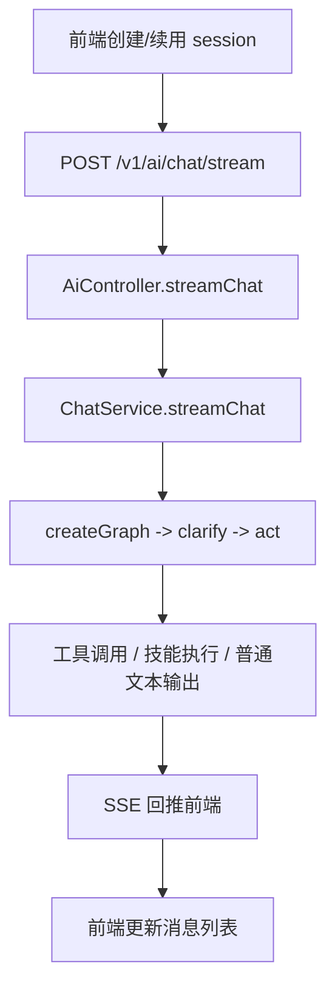

# AI 对话流程

```mermaid
flowchart TD
  A["前端创建/续用 session"] --> B["POST /v1/ai/chat/stream"]
  B --> C["AiController.streamChat"]
  C --> D["ChatService.streamChat"]
  D --> E["createGraph -> clarify -> act"]
  E --> F["工具调用 / 技能执行 / 普通文本输出"]
  F --> G["SSE 回推前端"]
  G --> H["前端更新消息列表"]
```

## 前端关键点

- `AIChatPreview` 会把会话缓存到 `sessionStorage`
- 请求会附带当前页面 `scene`
- 支持 `chat` 与 `agent` 模式

## 后端关键点

- `clarify` 节点决定允许使用哪些工具和技能
- `act` 节点真正执行 agent
