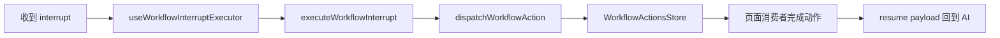

# AI workflow 流程

## 1. 触发方式

当后端 agent 产出 interrupt 时，前端会识别它并进入 workflow 执行逻辑。

## 2. 前端闭环

```mermaid
flowchart LR
  A["收到 interrupt"] --> B["useWorkflowInterruptExecutor"]
  B --> C["executeWorkflowInterrupt"]
  C --> D["dispatchWorkflowAction"]
  D --> E["WorkflowActionsStore"]
  E --> F["页面消费者完成动作"]
  F --> G["resume payload 回到 AI"]
```

## 3. 关键意义

这套机制让 AI 不只是“建议怎么做”，而是能驱动页面按模板执行一组动作。
