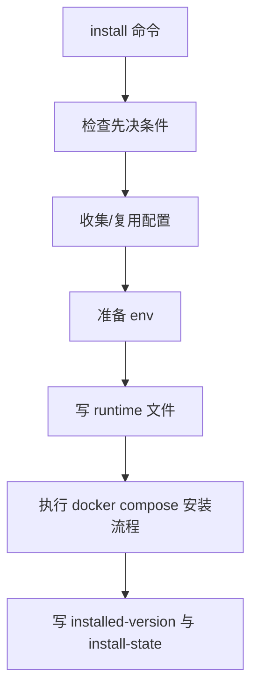
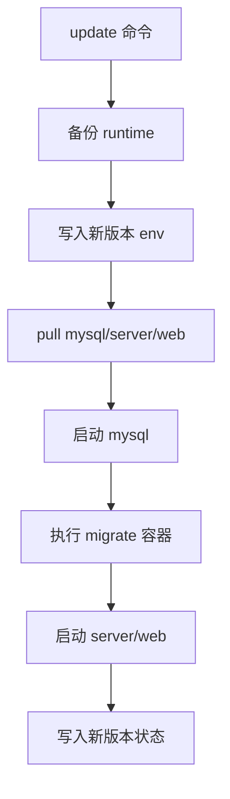

# CLI 安装与升级流程

## 安装流程

```mermaid
flowchart TD
  A["install 命令"] --> B["检查先决条件"]
  B --> C["收集/复用配置"]
  C --> D["准备 env"]
  D --> E["写 runtime 文件"]
  E --> F["执行 docker compose 安装流程"]
  F --> G["写 installed-version 与 install-state"]
```

## 升级流程

```mermaid
flowchart TD
  A["update 命令"] --> B["备份 runtime"]
  B --> C["写入新版本 env"]
  C --> D["pull mysql/server/web"]
  D --> E["启动 mysql"]
  E --> F["执行 migrate 容器"]
  F --> G["启动 server/web"]
  G --> H["写入新版本状态"]
```

## 回滚机制

升级失败时会：

- 恢复 runtime 配置备份
- 写入失败日志

注意：

- 当前回滚重点是运行时配置，不等于自动回滚数据库数据变更
