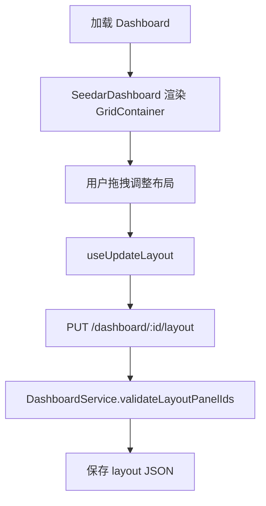

# 仪表盘流程

## 1. 页面职责

[DashboardPage.tsx](/D:/Program/projects/seedar/apps/web-client/src/modules/dashboard/pages/dashboardPage.tsx) 负责：

- 获取 `dashboardId`
- 拉取仪表盘详情
- 编辑 / 浏览模式切换
- 标题修改
- 添加面板
- 跳转面板编辑

## 2. 布局闭环

## 3. 资产关系

- 面板可以复用
- 仪表盘保存关系，不保存面板副本
