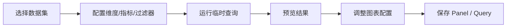

# 面板流程

## 1. 编辑页结构

[PanelPage.tsx](/D:/Program/projects/seedar/apps/web-client/src/modules/panel/pages/panelPage.tsx) 主要由四个区块组成：

1. 标题与主操作区
2. 查询区 `QueryZone`
3. 字段区 `Aside`
4. 配置区 `PanelEditor`
5. 预览区

## 2. 用户操作闭环

## 3. 预览渲染路径

- 卡片型：`MetricCard`
- 其他类型：`SeedarPanel`
