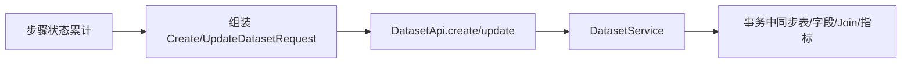

# 数据集编辑器流程

## 1. 编辑器结构

前端数据集编辑器是多步骤流程，主要包括：

1. 基本信息
2. 数据源与表选择
3. 字段配置
4. Join 配置
5. 指标配置
6. 确认与提交

## 2. 关键组件

- `DatasetEditorPage`
- `BasicInfoStep`
- `DataSourceStep`
- `FieldConfigStep`
- `JoinConfigStep`
- `MetricConfigStep`
- `ConfirmStep`

## 3. 状态组织

编辑器状态主要由：

- `useDatasetEditorStore`
- `useDatasetForm`

承载。

这意味着字段、Join、指标并不是分散在页面里各自提交，而是先汇总成一份完整请求，再统一提交给后端。

## 4. 提交流程

