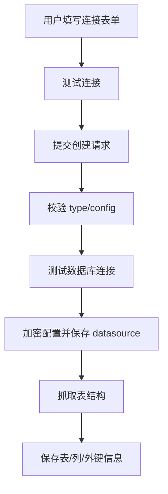

# 数据源模块业务流

## 1. 创建数据源

业务要点：

- `config` 的结构取决于 `type`
- 创建成功后就会尝试抓元数据，不需要手动触发

## 2. 更新数据源

更新时与创建的最大区别：

- 会先读取旧配置并解密
- 对新旧配置做比对
- 如果连接配置变化，会重新测试连接并刷新元数据

## 3. 查询数据源详情

详情页不仅需要基础信息，还需要：

- 表列表
- 列信息
- 外键信息

因此 `findOne` 不是简单查一张主表，而是“主记录 + 元数据缓存”的聚合读取。

## 4. 删除数据源

当前实现是软删除。

这意味着：

- 后续如果需要审计或恢复，有一定基础
- 但下游是否还存在引用关系，需要结合业务策略再补约束
