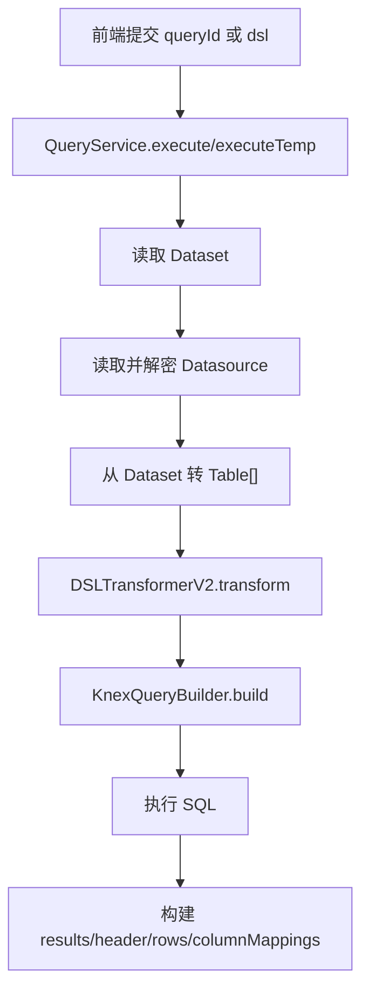

# 查询执行流程

```mermaid
flowchart TD
  A["前端提交 queryId 或 dsl"] --> B["QueryService.execute/executeTemp"]
  B --> C["读取 Dataset"]
  C --> D["读取并解密 Datasource"]
  D --> E["从 Dataset 转 Table[]"]
  E --> F["DSLTransformerV2.transform"]
  F --> G["KnexQueryBuilder.build"]
  G --> H["执行 SQL"]
  H --> I["构建 results/header/rows/columnMappings"]
```

## 临时执行与正式执行的差异

- 正式执行：先查 `Query` 实体，再取其 `dsl`
- 临时执行：直接用前端传入的 `dsl`

## 返回结果的价值

后端不只返回数据，还返回：

- SQL
- `executionTime`
- `columnMappings`

这对面板预览、调试和业务字段展示都很关键。
