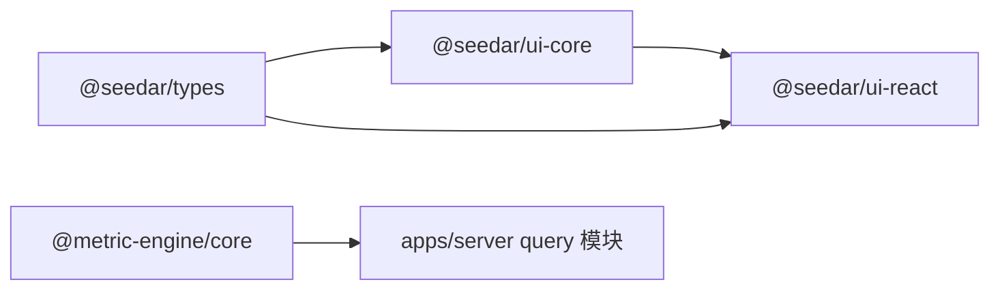

# 共享包概览

## 1. 分层关系

## 2. 为什么这一层重要

共享包层决定了系统是否只是“能跑”，还是“能长期维护”。

在 Seedar 中，这一层至少承担三个核心价值：

1. 统一前后端契约
2. 提供前端复用能力
3. 提供独立查询引擎能力

## 3. 各包职责

### `@seedar/types`

定位：

- 契约层

职责：

- 共享 DTO
- 共享类型
- 共享 AI workflow schema
- 定义 `ApiResponse`、`ApiConfig` 等基础协议

### `@seedar/ui-core`

定位：

- 前端基础通信层

职责：

- API client
- 统一解包后端响应
- 按资源分类暴露 API

### `@seedar/ui-react`

定位：

- 前端复用交互层

职责：

- hooks
- Dashboard/Panel 复用组件
- 图表、表格、卡片等数据展示能力

### `@metric-engine/core`

定位：

- 查询执行内核

职责：

- 表达式 AST
- QuerySpec
- SQL 构建
- 新旧 API 兼容层

## 4. 设计意义

这一层的存在让系统具备更好的：

- 模块边界
- 代码复用
- 技术演进能力

尤其 `metric_engine` 的独立，使查询能力不必和业务层完全耦合。

## 5. 论文可用描述

“系统在应用层之外进一步构建了共享基础包层，以 `types` 统一前后端契约，以 `ui-core` 封装前端通信，以 `ui-react` 提供复用式交互组件，以 `metric-engine` 承担查询执行内核，从而提高了平台的模块化程度与代码复用能力。”
