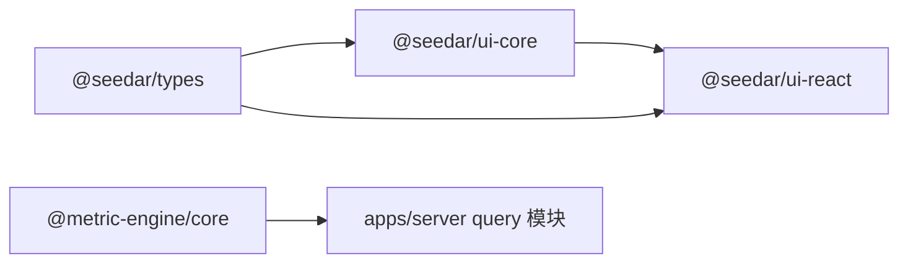

# 共享包概览

## 1. 分层关系

## 2. 各包职责

### `@seedar/types`

- 契约层
- 共享 DTO / 类型 / AI workflow schema

### `@seedar/ui-core`

- API client 层
- 封装 HTTP 请求与资源 API

### `@seedar/ui-react`

- 前端复用层
- 组件、hooks、Dashboard/Panel 展示能力

### `@metric-engine/core`

- 查询执行内核
- 表达式、QuerySpec、SQL 构建、兼容层
