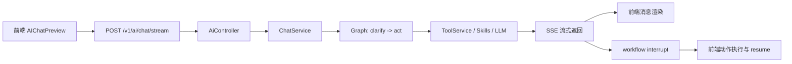

# Seedar AI 与 Workflow 设计

## 1. 文档目的

本文详细说明 Seedar 的 AI 模块设计，重点强调它如何从传统聊天功能演进为“具备工具调用、页面场景感知和 workflow 执行能力的智能助手”。

这部分适合写入毕业论文中的“系统特色功能设计”或“智能辅助模块设计”章节。

## 2. AI 模块的设计目标

从代码实现反推，Seedar 的 AI 模块至少承担以下目标：

1. 为用户提供自然语言交互入口
2. 在当前页面上下文中理解用户意图
3. 借助工具访问数据集、查询结果等结构化信息
4. 在必要时通过 workflow 驱动前端完成操作
5. 支持流式输出、中断、恢复与会话持久化

## 3. 总体架构

## 4. 后端 AI 架构

### 4.1 主要服务

当前后端 AI 能力主要分布在：

- `AiService`
- `AiSessionService`
- `ChatService`
- `ToolService`

### 4.2 `AiService`

职责：

- 管理 AI 模型配置
- 提供 AI 实体 CRUD

这说明系统允许平台维护者维护多个模型配置，而不是写死单一模型。

### 4.3 `AiSessionService`

职责：

- 创建和读取 AI 会话
- 维持对话上下文

### 4.4 `ChatService`

职责：

- 创建 agent graph
- 选择模型
- 组装 prompt
- 流式返回消息
- 处理中断与恢复

### 4.5 `ToolService`

职责：

- 暴露工具列表
- 管理工具市场
- 提供 `askQuestion`
- 提供 `startWorkflow`
- 提供数据集查询与临时查询执行工具

## 5. 模型接入设计

从 [chat.service.ts](/D:/Program/projects/seedar/apps/server/src/module/ai/services/chat.service.ts) 可以看出，系统支持以下模型适配：

- OpenAI
- Anthropic
- DeepSeek

其核心做法是：

1. 从 `Ai` 配置中读取 `llm` 配置
2. 根据 `type` 选择不同的 LangChain 模型类
3. 统一返回 `ChatOpenAI / ChatAnthropic / ChatDeepSeek` 风格实例

这意味着模型接入层做到了“配置驱动”，而不是“代码硬编码”。

## 6. 对话图设计：clarify -> act

### 6.1 设计思路

系统没有把一次对话看作单次 prompt 执行，而是拆成两个阶段：

1. `clarify`
2. `act`

### 6.2 `clarify` 节点

职责：

- 分析用户输入
- 推断本轮允许使用的工具和技能

在实现上，它会基于用户语义粗略判断当前更接近：

- `data-query`
- `chart-recommend`
- `convert-to-backend`

这种设计说明 AI 模块已经开始具备“任务分流”思想。

### 6.3 `act` 节点

职责：

- 基于前一阶段推导出的工具集合真正执行 agent 行为

在这个阶段，系统会：

1. 创建 LLM
2. 选择允许的工具
3. 加载 prompt
4. 创建 DeepAgent
5. 执行工具、技能和消息生成

## 7. Skill 体系设计

当前后端 AI 目录下已经存在 skill：

- `data-query`
- `chart-recommend`
- `clarify`

### 7.1 设计价值

Skill 文件的存在说明系统不是简单用一个超级 prompt 覆盖所有功能，而是尝试按任务域拆分 AI 能力。

### 7.2 `data-query` skill

职责：

- 基于数据集元信息构建查询 DSL
- 必要时主动向用户追问
- 执行临时查询并返回结构化结果

### 7.3 `chart-recommend` skill

职责：

- 根据数据格式、维度、基数与指标结构推荐合适的图表类型

这一点对论文尤其有用，因为它可以作为“智能推荐型辅助功能”的具体案例。

## 8. 工具体系设计

系统当前暴露的关键工具包括：

- `getDatasetInfo`
- `getDataAtTemp`
- `getCurrentTime`
- `askQuestion`
- `workflowMarket`
- `startWorkflow`
- `toolMarket`
- `toolMarketExecutor`

### 8.1 工具设计特点

1. 工具并不直接暴露底层数据库细节，而是暴露业务语义能力。
2. 工具既有“只读型工具”，也有“交互型工具”，如 `askQuestion`。
3. workflow 不是普通工具调用，而是特殊中断机制。

## 9. 前端 AI 架构

### 9.1 `AIChatPreview`

前端 AI 主入口是 [AIChat.Preview.tsx](/D:/Program/projects/seedar/apps/web-client/src/core/components/business/AIChat/AIChat.Preview.tsx)。

它负责：

- 读取和恢复 session 缓存
- 创建新会话
- 发起流式请求
- 管理消息状态
- 管理模型切换
- 管理 `chat/agent` 模式

### 9.2 缓存策略

前端通过 `sessionStorage` 缓存：

- 消息列表
- 当前模型
- 当前模式
- 当前 session
- 已处理 interrupt ID

这保证了刷新后对话仍有机会被恢复。

### 9.3 场景感知

前端会把当前路由构造成 `scene` 并传给后端。

这意味着 AI 可以知道用户当前位于：

- 仪表盘页
- 面板页
- 数据集页
- 数据源页

从而给出更贴合上下文的行为。

## 10. SSE 流式设计

AI 接口 `POST /v1/ai/chat/stream` 使用 SSE 返回消息。

当前支持的事件类型包括：

- `ping`
- `session`
- `message`
- `done`
- `error`

### 10.1 价值

1. 提高交互即时感
2. 支持 tool call 与 tool result 的渐进展示
3. 便于在 workflow 中断时及时插入特殊事件

## 11. Workflow interrupt 设计

### 11.1 核心思想

AI 不是自己直接改 UI，而是通过 interrupt 请求前端执行一个工作流。

### 11.2 后端行为

后端通过 `startWorkflow` 工具构造：

- `WorkflowRunInterrupt`

然后借助 LangGraph 的 interrupt 机制将其抛出到前端。

### 11.3 前端行为

前端收到 interrupt 后，会：

1. 识别 interrupt 类型
2. 调用 `executeWorkflowInterrupt`
3. 把动作塞进 `WorkflowActionsStore`
4. 由页面消费者完成实际动作
5. 把结果作为 `resumePayload` 再交回 AI

这种设计把“执行权”保留在前端页面，而不是让模型直接做黑盒操作。

## 12. Workflow 动作队列设计

`WorkflowActionsStore` 的职责包括：

- enqueue
- start
- finish
- fail
- remove
- 超时处理

这说明 workflow 执行并非一次性函数调用，而是被建模成一组有状态的任务。

对论文来说，这是一种很好的“前端动作编排机制”案例。

## 13. 设计亮点总结

从系统特色角度看，AI 模块至少有五个亮点：

### 13.1 会话化

支持 session 管理，而不是一次性调用。

### 13.2 场景感知

AI 知道用户当前在哪个页面。

### 13.3 工具调用

AI 能读取数据集和查询数据，而不是只会生成文本。

### 13.4 workflow 中断与恢复

AI 能把操作意图交给前端执行，再在执行后继续对话。

### 13.5 Skill 化能力组织

AI 能力被拆分成 skill，而不是完全依赖巨型 prompt。

## 14. 潜在风险与局限

1. workflow 强依赖前端消费者实现，若缺少承接方会卡住。
2. AI 行为较复杂，测试与可观测性要求高。
3. 多模型适配增加灵活性，也增加了兼容性成本。
4. 工具和 skill 的边界需要长期维护，否则容易失控。

## 15. 可直接用于论文的总结表述

可以将 Seedar 的 AI 设计总结为：

“系统构建了一个以会话为中心、以工具调用为核心、以 workflow interrupt 为特色的智能辅助模块。该模块通过 LangGraph 将对话过程分为需求澄清与任务执行两个阶段，并结合数据查询工具、图表推荐技能与前端动作恢复机制，使大模型能够在具体页面场景中辅助用户完成数据分析平台的操作任务，而不仅仅提供静态文本回答。”
