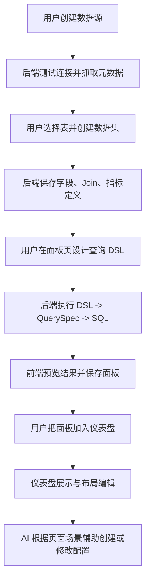

# Seedar 业务流文档

## 1. 业务目标

Seedar 的目标不是单纯“连数据库并画图”，而是提供一条从原始数据到分析资产的完整生产链路：

1. 让用户接入真实数据源
2. 让用户基于表结构建立分析友好的数据集
3. 让用户围绕数据集设计查询 DSL
4. 让用户把查询结果封装成可复用面板
5. 让用户把多个面板编排成仪表盘
6. 让 AI 在页面上下文中辅助用户完成上述动作

## 2. 核心业务切片

### 2.1 数据源管理

用户触发场景：

- 首次接入 MySQL / PostgreSQL / ClickHouse
- 修改连接参数
- 查看已有数据源的表、列和外键信息

业务目标：

- 把外部数据库变成 Seedar 可消费的元数据来源
- 保存连接配置，并抽取表结构与外键关系供后续建模使用

关键规则：

- 创建前必须校验连接配置格式
- 创建和更新时会主动测试连接
- 保存配置前会对密码类字段加密
- 元数据抓取失败不一定回滚数据源创建，但会影响后续建模体验

### 2.2 数据集建模

用户触发场景：

- 从一个或多个数据源表中构建分析视图
- 配置字段、主键、Join、指标
- 编辑已有数据集的字段、指标或关联关系

业务目标：

- 在真实物理表之上构建“语义化、可分析”的业务数据集

关键规则：

- 数据集必须绑定一个数据源
- 字段列表不能为空
- 被纳入数据集的表如果存在主键，则主键字段必须出现在数据集中
- 多表数据集如果没有显式传入 `joins`，则尝试从数据源外键关系自动推导
- 若既没有 `joins` 也无法从外键推导，会拒绝创建
- 删除数据集前会检查是否已有查询依赖它

### 2.3 查询 DSL 与执行

用户触发场景：

- 为面板创建查询
- 临时执行查询预览结果
- 保存查询草稿或正式发布后的查询资产

业务目标：

- 把前端的维度、指标、过滤器、派生维度、临时指标等配置转成可执行 SQL

关键规则：

- Query 自身只保存 DSL 和基础元数据，不直接保存结果
- 执行时必须回溯到数据集和数据源
- 执行时会把 DSL 转成 `metric_engine` 能理解的 QuerySpec，再生成 SQL
- 返回值中除了结果，还会返回 SQL 和列映射，方便面板显示与调试

### 2.4 面板配置与预览

用户触发场景：

- 创建图表、卡片、表格等面板
- 绑定数据集与查询
- 调整可视化类型和配置
- 在编辑页实时预览效果

业务目标：

- 把一次查询与一个具体展示方案绑定为可复用资产

关键规则：

- 面板有 `DRAFT` / `PUBLISHED` 状态
- 面板可独立存在，也可被多个仪表盘引用
- 删除面板时会级联删除其绑定的 Query
- 面板编辑器包含字段区、查询区、配置区和预览区四个高频交互区域

### 2.5 仪表盘编排

用户触发场景：

- 创建仪表盘
- 在仪表盘中添加已有面板
- 调整布局
- 在浏览模式和编辑模式间切换

业务目标：

- 让多个面板组合成可交付的分析看板

关键规则：

- Dashboard 保存的是布局 JSON 和面板关系，而不是面板副本
- 更新布局时会校验布局中的 panelId 是否真实存在
- 移除面板只是删除关系，不会删除面板本身

### 2.6 AI 辅助与 workflow

用户触发场景：

- 在右侧 AI 侧栏中发起对话
- 让 AI 辅助构建查询或推荐图表
- 让 AI 通过 workflow 驱动前端动作

业务目标：

- 把页面上下文、业务场景和前端动作能力注入 AI，形成可执行的交互式助手

关键规则：

- AI 请求会带上当前页面 `scene`
- 流式响应通过 SSE 返回
- AI 结果里可以包含 interrupt，前端收到后会执行 workflow
- workflow 不是直接改数据库，而是先落到前端动作队列，再由页面消费

### 2.7 CLI 运维

用户触发场景：

- 安装 Seedar 运行时
- 升级版本
- 查看容器状态与日志
- 卸载或清理运行目录

业务目标：

- 把部署、升级和常见运维入口从仓库脚本迁移到统一 CLI

关键规则：

- CLI 通过 Docker Compose 管理服务，不直接调用 Docker API
- 运行目录、`.env`、compose 文件、日志和数据目录由 CLI 负责生成和维护

## 3. 端到端业务闭环

## 4. 关键业务链路详解

### 4.1 链路一：创建数据源

用户动作：

- 在 `/datasource` 页面点击“创建数据源”

前端行为：

- 打开 `CreateDatasourceDialog`
- 可能先调用 `/datasource/test-connection`
- 确认后调用 `POST /datasource`

后端行为：

- `DatasourceController.create`
- `DatasourceService.create`

后端内部闭环：

1. 校验 `type + config`
2. 调用 `KnexConnectionFactory.testConnection`
3. 加密配置
4. 保存 `datasources`
5. 读取真实数据库表结构
6. 保存 `datasource_tables`、`datasource_columns`
7. 尝试保存外键信息

用户最终得到：

- 一个可复用的数据源资产
- 可在详情页浏览表、列、外键

### 4.2 链路二：创建数据集

用户动作：

- 在 `/dataset/create` 多步骤编辑器中依次配置数据源、表、字段、Join、指标

前端行为：

- 通过 `useDatasetEditorStore` 管理多步骤状态
- 在步骤间切换时积累建模信息
- 最终调用 `POST /dataset`

后端行为：

- `DatasetController.create`
- `DatasetService.create`

后端内部闭环：

1. 校验数据源存在
2. 校验所选表存在
3. 校验字段非空
4. 校验各表主键是否被纳入数据集
5. 创建 `dataset`
6. 创建 `dataset_table`
7. 创建 `dataset_field`
8. 设置 `primaryFieldId`
9. 保存 `dataset_join`
10. 若未显式传 joins，则尝试从数据源外键自动推导

用户最终得到：

- 一个可供查询与面板消费的语义数据集

### 4.3 链路三：执行查询

用户动作：

- 在面板编辑页拖拽维度、指标、过滤器，点击“运行”

前端行为：

- 组装 Query DSL
- 若是临时预览，则调用 `POST /query/temp`
- 若是已保存查询，则调用 `POST /query/execute`

后端行为：

- `QueryController.executeTemp` 或 `QueryController.execute`
- `QueryService.executeDSL`

后端内部闭环：

1. 读取数据集
2. 读取数据源并解密连接配置
3. 从数据集反推出 `Table[]`
4. 用 `DSLTransformerV2` 转成 QuerySpec
5. 用 `metric_engine` 的 `KnexQueryBuilder` 生成 SQL
6. 在真实数据源上执行 SQL
7. 把原始列、业务列名、结果集一起返回

用户最终得到：

- 结果表头
- 结果行数据
- SQL 文本
- 列映射信息

### 4.4 链路四：保存面板并加入仪表盘

用户动作：

- 在 `/panel/create` 或 `/panel/:id` 配置面板后保存
- 在仪表盘中添加已有面板

前端行为：

- 调用 `PanelApi.create` / `PanelApi.update`
- 在仪表盘页调用 `DashboardApi.addPanel`
- 拖拽布局时调用 `DashboardApi.updateLayout`

后端行为：

- `PanelController`
- `DashboardController`

后端内部闭环：

1. 面板保存自身类型、状态、查询引用和配置
2. 仪表盘通过关系表关联面板
3. 布局 JSON 存在 `dashboard.layout`
4. 更新布局前校验所有 panelId 是否有效

用户最终得到：

- 可复用面板资产
- 可分享的仪表盘布局

### 4.5 链路五：AI 驱动 workflow

用户动作：

- 打开 SeeMind 侧栏，向 AI 提问或发出操作请求

前端行为：

- `AIChatPreview` 创建或续用 AI session
- 发起 `/v1/ai/chat/stream`
- 收到消息时按 SSE 逐条更新 UI
- 收到 interrupt 时交给 workflow 执行器

前端 workflow 执行闭环：

1. 根据 `workflowId` 找模板
2. 把 action 放入 `WorkflowActionsStore`
3. 页面或消费者完成具体动作
4. 收集结果
5. 继续向 AI 恢复会话

用户最终得到：

- 不是一次性答案，而是“AI + 页面动作”协同完成的操作链路

## 5. 业务规则与边界

### 5.1 明确存在的规则

- 数据源更新配置时会重新测试连接
- 数据集删除前会检查关联查询
- 仪表盘布局只接受真实存在的面板 ID
- 面板删除会连带删除查询
- 后端统一包装成功响应与错误响应

### 5.2 可以推断但需要注意的边界

- 推断：数据集是语义层资产，目标是屏蔽物理表结构复杂度。
- 推断：面板与仪表盘被设计为可复用关系，而不是深拷贝关系。
- 推断：AI workflow 当前更偏前端动作编排，不直接承担强事务写操作。

## 6. 高风险点

1. 数据集与查询耦合较深，一旦字段或指标调整不兼容，可能影响已有面板运行。
2. 面板删除会级联删除 Query，如果一个 Query 未来被多处复用，这个策略会有风险。
3. `database.config.ts` 中存在默认数据库账号与密码，开发与生产配置需严格区分。
4. AI workflow 依赖前端动作消费，如果某个 action 没有页面承接方，会出现中断卡住。
