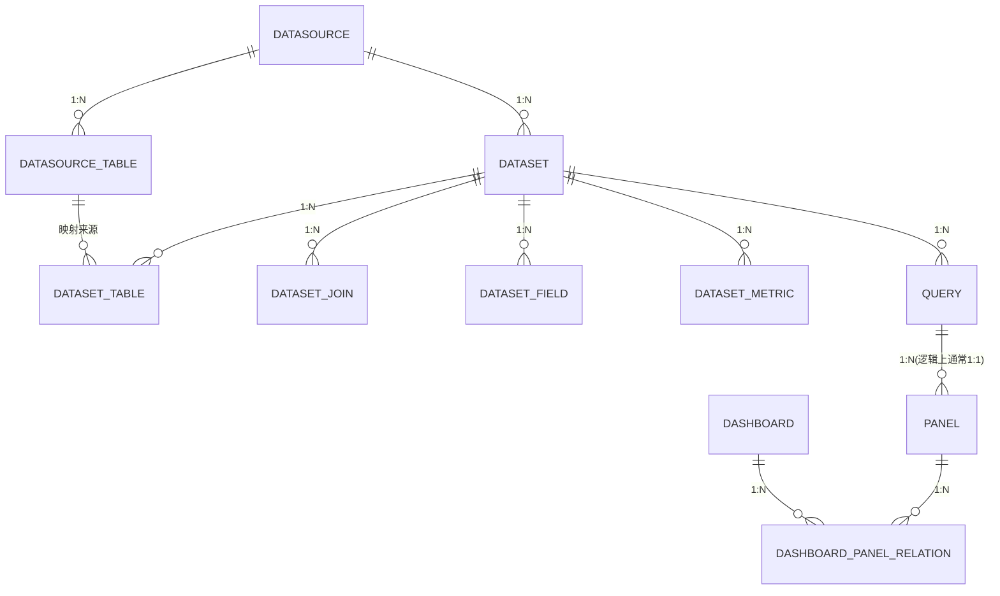

# Seedar 数据模型文档

## 1. 数据模型总览

Seedar 当前至少存在两套“数据模型”：

1. 元数据库模型
2. 查询 / 协议 / 展示模型

### 1.1 元数据库模型

由 `apps/server` 中的 TypeORM 实体负责，存放在 Seedar 自己的 MySQL 元数据库中，主要管理：

- 数据源
- 数据集
- 查询
- 面板
- 仪表盘
- AI 会话与 AI 资源

### 1.2 查询与协议模型

由以下两层组成：

- `packages/types`：前后端共享 DTO 和类型
- `packages/metric_engine`：Query、Field、Table、Metric、Join 等执行模型

## 2. 核心实体关系



## 3. 数据源模型

### 3.1 `Datasource`

实体文件：

- [datasource.entity.ts](/D:/Program/projects/seedar/apps/server/src/module/datasource/entities/datasource.entity.ts)

关键字段：

| 字段 | 含义 |
| --- | --- |
| `id` | 主键 |
| `name` | 数据源名称 |
| `type` | 数据源类型，如 MySQL / PostgreSQL / ClickHouse |
| `config` | 连接配置，数据库账号、主机、端口等 |
| `status` | 状态 |
| `lastValidateAt` | 最近一次校验时间 |
| `createdAt` / `updatedAt` / `deletedAt` | 时间戳 |

关联：

- `Datasource -> DatasourceTable`
- `Datasource -> Dataset`

### 3.2 元数据子模型

围绕数据源还存在：

- `DatasourceTable`
- `DatasourceColumn`
- `DatasourceForeignKey`
- `DatasourceMetaVersion`

职责：

- 把外部数据库的表、列、外键缓存到 Seedar 元数据库中
- 供数据集建模和自动 Join 推断使用

## 4. 数据集模型

### 4.1 `Dataset`

实体文件：

- [dataset.entity.ts](/D:/Program/projects/seedar/apps/server/src/module/dataset/entities/dataset.entity.ts)

关键字段：

| 字段 | 含义 |
| --- | --- |
| `id` | 主键 |
| `name` | 数据集名称 |
| `description` | 描述 |
| `datasource` | 归属数据源 |
| `status` | 状态 |
| `type` | 数据集类型 |
| `mainTableId` | 主表 ID |

关联：

- `datasetTables`
- `joins`
- `mainTable`

### 4.2 `DatasetTable`

职责：

- 记录数据集纳入了哪些源表
- 保存语义层表名与主字段映射

### 4.3 `DatasetField`

职责：

- 描述数据集暴露给查询层的字段

重要属性通常包括：

- `name`
- `alias`
- `type`
- `description`
- `businessName`
- `isPrimaryKey`
- `tableId`
- `dataSourceColumnId`

### 4.4 `DatasetJoin`

职责：

- 描述数据集内表与表之间的连接关系

关键属性：

- `leftTableId`
- `leftField`
- `rightTableId`
- `rightField`
- `joinType`
- `operator`

### 4.5 `DatasetMetric`

职责：

- 描述可用于查询的指标定义

从现有代码看，支持的指标形态至少包括：

- 聚合指标
- 行级指标
- 后聚合指标
- 算术指标
- 同比环比指标
- 表达式指标

## 5. 查询模型

### 5.1 `Query`

实体文件：

- [query.entity.ts](/D:/Program/projects/seedar/apps/server/src/module/query/entities/query.entity.ts)

关键字段：

| 字段 | 含义 |
| --- | --- |
| `id` | UUID |
| `name` | 查询名称 |
| `datasetId` | 归属数据集 |
| `dsl` | 查询 DSL JSON |
| `status` | 状态，默认 `DRAFT` |
| `createdAt` / `updatedAt` | 时间戳 |

### 5.2 Query DSL

当前 Query 实际执行基于 `dsl-transformer.v2.ts` 中的 `QueryDSL`。

从使用方式看，DSL 会描述：

- `datasetId`
- `dimensions`
- `metrics`
- `tempMetrics`
- `filters`
- `sorts`

返回结果中还会生成：

- `columnMappings`

其用途是把 SQL 结果列映射回业务概念，例如：

- 字段
- 指标
- 派生维度
- 临时指标

## 6. 面板与仪表盘模型

### 6.1 `Panel`

实体文件：

- [panel.entity.ts](/D:/Program/projects/seedar/apps/server/src/module/dashboard/entities/panel.entity.ts)

关键字段：

| 字段 | 含义 |
| --- | --- |
| `id` | UUID |
| `title` | 标题 |
| `titleConfig` | 标题配置 |
| `type` | 面板类型 |
| `status` | 草稿 / 已发布 |
| `queryId` | 绑定查询 |
| `config` | 可视化配置 |
| `width` / `height` | 尺寸 |

### 6.2 `Dashboard`

实体文件：

- [dashboard.entity.ts](/D:/Program/projects/seedar/apps/server/src/module/dashboard/entities/dashboard.entity.ts)

关键字段：

| 字段 | 含义 |
| --- | --- |
| `id` | UUID |
| `name` | 名称 |
| `layout` | 多断点布局 JSON |

### 6.3 `DashboardPanelRelation`

职责：

- 维护仪表盘和面板之间的关系

这样设计的结果是：

- 面板可以被多个仪表盘复用
- 仪表盘只保存关系与布局，不复制面板内容

## 7. AI 模型

### 7.1 `AiSession`

实体文件：

- [ai-session.entity.ts](/D:/Program/projects/seedar/apps/server/src/module/ai/entities/ai-session.entity.ts)

关键字段：

| 字段 | 含义 |
| --- | --- |
| `id` | UUID |
| `title` | 会话标题 |
| `type` | 会话类型 |
| `status` | 会话状态 |
| `totalTokens` | token 累计 |
| `createdAt` / `updatedAt` / `deletedAt` | 时间戳 |

### 7.2 共享 AI 类型

`packages/types/src/ai` 下还承载：

- 聊天消息类型
- 会话状态枚举
- workflow schema
- workflow template
- interrupt / resume 类型

这部分是 AI 前后端联动的真正契约层。

## 8. DTO 模型

### 8.1 创建数据源请求

文件：

- [create-datasource.request.ts](/D:/Program/projects/seedar/apps/server/src/module/datasource/dto/create-datasource.request.ts)

核心结构：

```ts
{
  name: string
  type: DataSourceType
  config: MySqlConfig | CsvConfig | ExcelConfig | Record<string, any>
}
```

### 8.2 创建数据集请求

文件：

- [create-dataset.request.ts](/D:/Program/projects/seedar/apps/server/src/module/dataset/dto/create-dataset.request.ts)

核心结构：

```ts
{
  name: string
  datasourceId: number
  datasourceTableIds: number[]
  description: string
  type: DatasetType
  wideTableConfig?: Record<string, any>
  mainTableId?: number
  fields?: CreateDatasetFieldRequest[]
  joins?: CreateDatasetJoinRequest[]
}
```

### 8.3 创建查询请求

文件：

- [create-query.request.ts](/D:/Program/projects/seedar/apps/server/src/module/query/dto/create-query.request.ts)

核心结构：

```ts
{
  name: string
  datasetId: number
  dsl?: QueryDSL
  status?: QueryStatus
}
```

## 9. 前后端共享类型包

### 9.1 `packages/types`

根导出位于：

- [packages/types/src/index.ts](/D:/Program/projects/seedar/packages/types/src/index.ts)

类型分类包括：

- `datasource`
- `dataset`
- `query`
- `dashboard`
- `common`
- `ai`

### 9.2 `#pkg/seedar/*` 路径别名

根 [tsconfig.base.json](/D:/Program/projects/seedar/tsconfig.base.json) 中定义：

```json
"paths": {
  "#pkg/seedar/*": ["./packages/*/src/index.ts"]
}
```

这意味着应用层大量依赖共享包源码直连，而不是仅依赖构建产物。

## 10. 查询执行模型

在 `packages/metric_engine` 中，查询执行并不直接依赖 TypeORM 实体，而是会先转成独立执行模型：

- `Table`
- `Field`
- `Join`
- `Query`
- `Metric`
- `Dimension`
- `Filter`
- `KnexQueryBuilder`

这层的价值是：

- 让 DSL 与数据库执行解耦
- 让方言适配更集中
- 让查询逻辑具备独立演进空间

## 11. 当前数据建模特征总结

1. `Datasource` 负责接入物理世界。
2. `Dataset` 负责构建语义世界。
3. `Query` 负责把语义世界转成执行计划。
4. `Panel` 负责把执行结果转成展示资产。
5. `Dashboard` 负责把多个展示资产组合成工作台。
6. `AiSession + workflow types` 负责把 AI 引入这条链路中。
