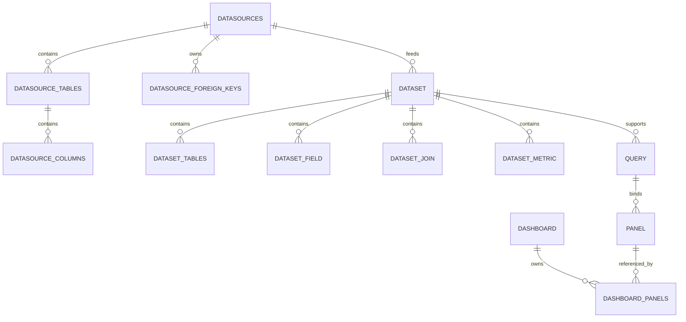

# Seedar 数据库设计

## 1. 文档目的

本文基于：

- TypeORM 实体
- 初始迁移 [1777035081106-InitialSchema.ts](/D:/Program/projects/seedar/apps/server/src/migrations/1777035081106-InitialSchema.ts)

反推 Seedar 的数据库结构设计。

对于毕业论文，这篇文档适合作为“数据库设计”章节核心材料。

## 2. 数据库设计目标

Seedar 的数据库并不直接保存用户的业务明细数据，而是保存平台自身的元数据与分析资产。

因此，其数据库设计目标是：

1. 管理数据源连接与元数据缓存
2. 管理语义数据集
3. 管理查询与可视化资产
4. 管理 AI 配置和会话信息

## 3. 核心表分类

根据迁移文件，可将数据库表分为六组：

### 3.1 数据源相关表

- `datasources`
- `datasource_tables`
- `datasource_columns`
- `datasource_foreign_keys`
- `datasource_meta_version`

### 3.2 数据集相关表

- `dataset`
- `dataset_tables`
- `dataset_field`
- `dataset_join`
- `dataset_metric`
- `wide_table_config`

### 3.3 查询相关表

- `query`

### 3.4 可视化资产相关表

- `panel`
- `dashboard`
- `dashboard_panels`

### 3.5 AI 相关表

- `ai`
- `ai_session`

## 4. 关系总览

## 5. 数据源相关表设计

### 5.1 `datasources`

用途：

- 保存外部数据源连接定义

主要字段：

| 字段 | 类型 | 说明 |
| --- | --- | --- |
| `id` | int | 主键 |
| `name` | varchar(100) | 数据源名称 |
| `type` | enum | `mysql/csv/excel/postgres/clickhouse` |
| `config` | json | 连接配置 |
| `status` | enum | `active/invalid/deleted` |
| `lastValidateAt` | datetime | 最近校验时间 |
| `createdAt/updatedAt/deletedAt` | datetime | 生命周期字段 |

设计特点：

- `config` 使用 JSON，增强了不同数据源类型的扩展性
- 使用 `status + deletedAt` 兼顾逻辑状态与软删除需求

### 5.2 `datasource_tables`

用途：

- 缓存源库中的表信息

主要字段：

- `data_source_id`
- `table_name`
- `table_comment`
- `row_count`
- `primary_field_id`

设计意义：

- 避免每次建模都直接回源扫描 schema

### 5.3 `datasource_columns`

用途：

- 缓存源表中的字段信息

主要字段：

- `table_id`
- `column_name`
- `raw_data_type`
- `normalized_type`
- `isPrimaryKey`
- `nullable`

设计特点：

- 同时保留原始类型和归一化类型
- 便于前端展示，也便于后端统一建模

### 5.4 `datasource_foreign_keys`

用途：

- 缓存外键关系

主要字段：

- `fk_name`
- `source_table_name`
- `source_column_name`
- `target_table_name`
- `target_column_name`

价值：

- 支持数据集自动推导 Join

### 5.5 `datasource_meta_version`

用途：

- 记录某个数据源元数据刷新版本

推断用途：

- 便于后续做元数据刷新追踪与缓存版本管理

## 6. 数据集相关表设计

### 6.1 `dataset`

用途：

- 表示一个语义数据集

主要字段：

| 字段 | 说明 |
| --- | --- |
| `name` | 数据集名称 |
| `description` | 数据集描述 |
| `status` | `active/disabled/deleted` |
| `type` | `semantic/wide` |
| `main_table_id` | 主表 |
| `datasource_id` | 来源数据源 |

设计意义：

- 将分析模型提升到“数据集”层，而不是直接操作源表

### 6.2 `dataset_tables`

用途：

- 记录数据集由哪些源表构成

字段重点：

- `dataset_id`
- `datasource_table_id`
- `dataset_name`
- `table_name`
- `primary_field_id`

### 6.3 `dataset_field`

用途：

- 表示数据集暴露的字段

字段重点：

- `dataset_id`
- `data_source_column_id`
- `table_id`
- `name`
- `type`
- `alias`
- `description`
- `business_name`
- `is_primary_key`

设计特点：

- 兼顾技术名与业务名
- 支持为字段添加描述，明显体现了面向业务分析的语义建模意图

### 6.4 `dataset_join`

用途：

- 保存数据集内部表之间的连接关系

字段重点：

- `joinType`
- `left_table_id`
- `left_field`
- `right_table_id`
- `right_field`
- `operator`

说明：

- 当前 join 结构相对直接，适合单条件 join
- 后续如需支持复杂复合连接，可能要进一步扩展

### 6.5 `dataset_metric`

用途：

- 保存数据集指标定义

字段很多，反映出系统已经把指标设计成一套较完整的抽象体系。

支持的指标类型包括：

- `row_level`
- `aggregate`
- `post_aggregate`
- `arithmetic`
- `period_over_period`

字段大致可分为几组：

1. 通用属性：
   - `name`
   - `alias`
   - `description`
   - `business_name`
2. 聚合指标属性：
   - `data_source_column_id`
   - `aggregate_function`
   - `distinct`
   - `aggregate_condition`
3. 行级指标属性：
   - `left_operand`
   - `row_operator`
   - `right_operand`
4. 后聚合 / 算术指标属性：
   - `source_metric_id`
   - `left_metric_id`
   - `arithmetic_operator`
   - `right_metric_operand`
5. 周期对比指标属性：
   - `base_metric_id`
   - `time_field_id`
   - `time_data_source_column_id`
   - `period_type`
   - `calculation_mode`
6. 表达式属性：
   - `expression`

这张表是论文里非常值得强调的一张核心表，因为它体现了系统“支持多类型业务指标建模”的设计能力。

### 6.6 `wide_table_config`

用途：

- 支持宽表型数据集配置

字段重点：

- `target_table_name`
- `sync_strategy`

推断说明：

- 当前系统既支持语义型数据集，也预留了宽表型数据集能力

## 7. 查询与可视化资产表设计

### 7.1 `query`

用途：

- 保存查询定义而非结果数据

字段重点：

- `id`：UUID
- `name`
- `datasetId`
- `dsl`
- `status`

设计意义：

- 让查询成为可复用的分析资产
- 使用 JSON 保存 DSL，提高灵活性

### 7.2 `panel`

用途：

- 保存图表、卡片、表格等面板资产

字段重点：

- `title`
- `title_config`
- `type`
- `status`
- `query_id`
- `config`
- `width`
- `height`

设计意义：

- 将“数据查询结果”和“展示方式”绑定为单独资产

### 7.3 `dashboard`

用途：

- 保存仪表盘资产

字段重点：

- `name`
- `layout`

设计意义：

- 使用 JSON 存布局，适合响应式多断点网格布局

### 7.4 `dashboard_panels`

用途：

- 维护仪表盘与面板的多对多关系

设计意义：

- 面板可被多个仪表盘复用
- 仪表盘不需要复制面板内容

## 8. AI 相关表设计

### 8.1 `ai`

用途：

- 保存可用 AI 模型配置

字段重点：

- `name`
- `description`
- `type`
- `status`
- `config`

### 8.2 `ai_session`

用途：

- 保存 AI 会话

字段重点：

- `title`
- `type`
- `status`
- `total_tokens`
- `deleted_at`
- `created_at`
- `updated_at`

设计意义：

- 让 AI 功能具备会话化管理能力

## 9. 约束与外键设计

从迁移文件可以看出，系统大量使用外键来维持平台元数据一致性。

典型外键关系包括：

- `dataset.datasource_id -> datasources.id`
- `query.datasetId -> dataset.id`
- `panel.query_id -> query.id`
- `dashboard_panels.dashboard_id -> dashboard.id`
- `dashboard_panels.panel_id -> panel.id`

### 9.1 优点

1. 保证元数据引用完整性
2. 减少脏数据
3. 对论文中的“数据库一致性设计”是明显加分点

### 9.2 注意点

1. 一些业务策略并不完全依赖数据库外键，还叠加了服务层校验
2. 删除策略既有数据库级联，也有服务级联逻辑，需要在实现分析中说明

## 10. 数据生命周期设计

### 10.1 数据源生命周期

`创建 -> 校验 -> 抓取元数据 -> 更新/重抓 -> 软删除`

### 10.2 数据集生命周期

`创建 -> 配置字段/Join/指标 -> 被 Query 引用 -> 变更或禁用 -> 软删除`

### 10.3 Query 生命周期

`创建草稿 -> 更新 DSL -> 执行 -> 被 Panel 引用 -> 删除`

### 10.4 Panel 生命周期

`创建 -> 预览 -> 发布 -> 被 Dashboard 引用 -> 删除`

### 10.5 Dashboard 生命周期

`创建 -> 添加 Panel -> 布局编辑 -> 展示 -> 删除`

## 11. 设计评价

从数据库设计角度看，Seedar 的结构具有以下特点：

1. **平台元数据中心化**：平台核心资产全部落在自己的元数据库中。
2. **语义层建模明显**：`dataset + field + join + metric` 构成了完整语义建模体系。
3. **JSON 扩展性强**：`config`、`layout`、`dsl` 等字段使用 JSON，适合快速演进。
4. **适合论文表达**：表职责清晰，层次分明，容易画出 E-R 图和逻辑结构图。

## 12. 可用于论文的总结表述

可以将 Seedar 的数据库设计概括为：

“系统采用元数据驱动的数据管理方式，在 MySQL 中维护数据源、数据集、查询、面板、仪表盘与 AI 会话等核心平台资产。其中，数据集通过字段、连接关系和指标定义构成语义建模层，查询通过 DSL 形式保存，面板与仪表盘则进一步实现分析资产的可视化封装与组合，从而形成了完整的分析平台元数据体系。”
