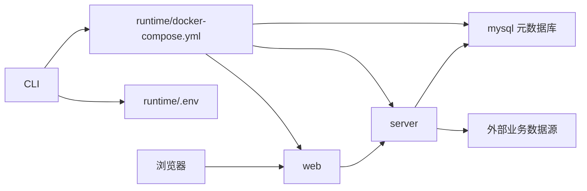
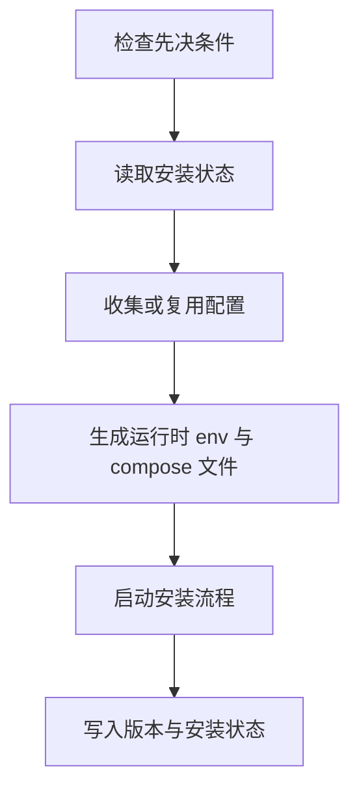

# Seedar 部署与发布设计

## 1. 文档目的

本文说明 Seedar 的运行时部署结构、CLI 设计、Docker 编排方式以及版本发布流程。

在毕业论文中，这部分适合作为“系统部署与运维设计”或“工程化实现”章节素材。

## 2. 部署目标

Seedar 的部署设计目标不是只让开发者在本地运行，而是：

1. 让普通用户无需阅读源码也能安装系统
2. 让升级流程可标准化执行
3. 让发布物具备版本化能力
4. 让运行状态和日志可被统一管理

## 3. 部署路径演进

从现有文档和代码可确认，项目已经从“仓库内脚本驱动部署”演进到“CLI 驱动部署”。

### 3.1 当前推荐路径

```bash
npx @syedar/seedar-cli@latest install
```

### 3.2 遗留兼容路径

仍保留：

- `deploy/up-prod.ps1`
- `deploy/down-prod.ps1`
- `deploy/migrate-prod.ps1`

但这些脚本已被降级为兼容入口。

## 4. 运行时架构

根据 [deploy/templates/docker-compose.runtime.yml](/D:/Program/projects/seedar/deploy/templates/docker-compose.runtime.yml) 和 [deploy/docker-compose.prod.yml](/D:/Program/projects/seedar/deploy/docker-compose.prod.yml)，运行时主要由四个容器组成：

- `mysql`
- `server`
- `migrate`
- `web`

### 4.1 容器职责

#### `mysql`

职责：

- 保存 Seedar 自身元数据库

#### `server`

职责：

- 提供后端 API
- 承担业务逻辑、查询执行和 AI 能力

#### `migrate`

职责：

- 执行数据库迁移
- 通常在服务启动阶段或升级阶段短时运行

#### `web`

职责：

- 提供前端访问入口

## 5. 部署拓扑



## 6. CLI 运行时目录设计

CLI 会在用户目录下生成标准运行时目录。

默认根路径：

- Linux/macOS：`~/.seedar`
- Windows：`%USERPROFILE%\.seedar`

### 6.1 目录结构

- `runtime/docker-compose.yml`
- `runtime/.env`
- `runtime/.installed-version`
- `runtime/.install-state`
- `data/`
- `logs/`
- `backups/`

### 6.2 设计意义

1. 安装状态可追踪
2. 升级前可备份
3. 日志与数据目录清晰分离

## 7. 安装流程

根据 CLI 实现，安装流程大致如下：



关键实现位置：

- [install.ts](/D:/Program/projects/seedar/apps/cli/src/commands/install.ts)
- `install/flow.ts`
- `install/config.ts`
- `runtime/index.ts`

## 8. 升级流程

升级流程是 Seedar 运维设计中最重要的一条链。

### 8.1 升级步骤

1. 校验运行时配置存在
2. 备份当前 runtime
3. 写入新版本配置
4. 拉取镜像
5. 启动 `mysql`
6. 执行 `migrate`
7. 启动 `server` 与 `web`
8. 更新 `.installed-version`

### 8.2 回滚策略

升级失败时，会恢复 runtime 配置备份。

注意：

- 这里的回滚重点是运行时配置层
- 数据库迁移本身未必能被自动完全回滚

这是论文中应诚实说明的工程边界。

## 9. 发布设计

### 9.1 版本管理

根据 [CHANGELOG.md](/D:/Program/projects/seedar/CHANGELOG.md) 与 [docs/release-process.md](/D:/Program/projects/seedar/docs/release-process.md)，项目使用：

- `release-please`
- Git Tag `vX.Y.Z`

### 9.2 发布物

系统至少发布三类产物：

1. `seedar-server` Docker 镜像
2. `seedar-web` Docker 镜像
3. `@syedar/seedar-cli` npm 包

### 9.3 发布流程

标准流程如下：

1. 功能开发并合入主分支
2. `release-please` 创建或更新 Release PR
3. 合并 Release PR
4. 自动生成 Tag 与 Release
5. `release.yml` 发布 Docker 镜像与 npm CLI

## 10. 测试分支发布

根据 [deploy/README.md](/D:/Program/projects/seedar/deploy/README.md)，项目还支持 `test` 分支试发布：

- 测试镜像使用 `test` 与 `test-<sha>` 标签
- CLI 可作为 workflow artifact 输出
- 若配置 `NPM_TOKEN`，可发布 prerelease 版本

## 11. 部署设计评价

从工程角度看，Seedar 的部署设计有以下优势：

### 11.1 用户友好

普通用户不必理解源码结构，也不必手工拼 Docker 命令。

### 11.2 工程规范

版本、镜像、CLI 和运行时目录都被统一纳管。

### 11.3 可运维

支持：

- `status`
- `logs`
- `doctor`
- `update`

### 11.4 便于论文描述

CLI + Docker + 版本发布的组合，使系统具备较强的工程化特征，非常适合在论文中体现“可部署、可维护”的系统实现能力。

## 12. 可直接用于论文的总结表述

可以将 Seedar 的部署与发布设计概括为：

“系统采用 Docker 容器化部署方式，并通过自研 CLI 对安装、升级、日志与诊断流程进行统一封装。运行时由 MySQL、后端服务、迁移任务与前端服务四类容器构成，结合版本化镜像与 npm CLI 发布机制，形成了较完整的交付与运维体系。”
