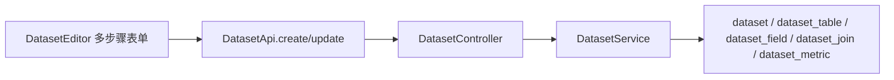
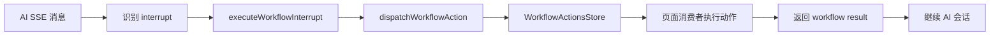

# Seedar 前后端映射文档

## 1. 说明

本文重点回答一个问题：

“用户在某个页面点了一下按钮，最后是谁接住了这个动作，数据从哪里来，又写回到哪里去？”

文档按页面与业务切片组织，而不是按技术层组织。

## 2. 全局入口映射

### 2.1 路由入口

前端主路由定义在 [apps/web-client/src/core/router/index.tsx](/D:/Program/projects/seedar/apps/web-client/src/core/router/index.tsx)：

| 路径 | 页面 | 业务归属 |
| --- | --- | --- |
| `/dashboard/:dashboardId?` | `DashboardPage` | 仪表盘 |
| `/panel` | `PanelListPage` | 面板列表 |
| `/panel/create` | `PanelPage` | 新建面板 |
| `/panel/:panelId` | `PanelPage` | 编辑面板 |
| `/dataset` | `DatasetPage` | 数据集列表 |
| `/dataset/create` | `DatasetCreatePage` | 创建数据集 |
| `/dataset/:id` | `DatasetDetailPage` | 数据集详情 |
| `/dataset/:id/edit` | `DatasetEditPage` | 编辑数据集 |
| `/datasource` | `DatasourcePage` | 数据源列表 |
| `/datasource/:id` | `DatasourceDetailPage` | 数据源详情 |
| `/user` | `UserPage` | 用户页 / 实验性仪表盘容器 |

### 2.2 顶层布局与全局状态

`AppLayout` 负责：

- 渲染 `GlobalNavigation`
- 承载主内容区 `Outlet`
- 根据 `isSeeMindOn` 控制 AI 侧栏

全局状态主要来自：

- [AppState.ts](/D:/Program/projects/seedar/apps/web-client/src/core/store/AppState.ts)
- [WorkflowActionsState.ts](/D:/Program/projects/seedar/apps/web-client/src/core/store/WorkflowActionsState.ts)
- [AIChatScenesState.ts](/D:/Program/projects/seedar/apps/web-client/src/core/store/AIChatScenesState.ts)

## 3. 页面到后端的映射

## 3.1 数据源页面

### 页面入口

- 列表页：[DatasourcePage.tsx](/D:/Program/projects/seedar/apps/web-client/src/modules/datasource/pages/datasourcePage.tsx)
- 详情页：`DatasourceDetailPage.tsx`

### 用户可见操作

- 查看数据源列表
- 创建数据源
- 删除数据源
- 进入详情页查看结构

### 前端状态与交互

- `useDatasources()` 拉取列表
- `CreateDatasourceDialog` 负责创建流程
- `DeleteConfirmDialog` 负责删除确认
- 详情页预计还会展示表结构、关系时间线、表浏览器

### API 映射

由 [packages/ui-core/src/api/datasource.ts](/D:/Program/projects/seedar/packages/ui-core/src/api/datasource.ts) 提供：

| 前端 API | HTTP | 后端 |
| --- | --- | --- |
| `DatasourceApi.findAll()` | `GET /datasource` | `DatasourceController.findAll` |
| `DatasourceApi.findOne(id)` | `GET /datasource/:id` | `DatasourceController.findOne` |
| `DatasourceApi.create(data)` | `POST /datasource` | `DatasourceController.create` |
| `DatasourceApi.testConnection(data)` | `POST /datasource/test-connection` | `DatasourceController.testConnection` |
| `DatasourceApi.update(id, data)` | `PATCH /datasource/:id` | `DatasourceController.update` |
| `DatasourceApi.remove(id)` | `DELETE /datasource/:id` | `DatasourceController.remove` |

### 后端承接点

- Controller：`apps/server/src/module/datasource/datasource.controller.ts`
- Service：`apps/server/src/module/datasource/service/datasource.service.ts`
- Entity：`Datasource`、`DatasourceTable`、`DatasourceColumn`、`DatasourceForeignKey`

### 对用户的最终反馈

- 列表卡片
- 详情中的表、列、外键
- 测试连接成功/失败结果

## 3.2 数据集页面

### 页面入口

- 列表页：[DatasetPage.tsx](/D:/Program/projects/seedar/apps/web-client/src/modules/dataset/pages/datasetPage.tsx)
- 创建页：`datasetCreatePage.tsx`
- 编辑页：`datasetEditPage.tsx`
- 详情页：`datasetDetailPage.tsx`

### 用户可见操作

- 搜索数据集
- 创建数据集
- 编辑数据集
- 删除数据集
- 查看字段、Join、指标与元信息

### 前端状态与交互

列表页：

- `useDatasets()` 拉取所有数据集
- 本地管理搜索输入与中文输入法 composition 状态

编辑器页：

- 多步骤配置器 `DatasetEditorPage`
- 内含步骤：
  - `BasicInfoStep`
  - `DataSourceStep`
  - `FieldConfigStep`
  - `JoinConfigStep`
  - `MetricConfigStep`
  - `ConfirmStep`

状态承载：

- `useDatasetEditorStore`
- `useDatasetForm`

### API 映射

由 [packages/ui-core/src/api/dataset.ts](/D:/Program/projects/seedar/packages/ui-core/src/api/dataset.ts) 提供：

| 前端 API | HTTP | 后端 |
| --- | --- | --- |
| `DatasetApi.findAll()` | `GET /dataset` | `DatasetController.findAll` |
| `DatasetApi.findOne(id)` | `GET /dataset/:id` | `DatasetController.findOne` |
| `DatasetApi.create(data)` | `POST /dataset` | `DatasetController.create` |
| `DatasetApi.update(data)` | `PATCH /dataset` | `DatasetController.update` |
| `DatasetApi.remove(id)` | `DELETE /dataset/:id` | `DatasetController.remove` |

### 后端承接点

- Controller：`apps/server/src/module/dataset/dataset.controller.ts`
- Service：`apps/server/src/module/dataset/services/dataset.service.ts`

### 数据闭环

### 对用户的最终反馈

- 数据集卡片
- 数据集详情页的字段树、Join 图、指标列表
- 失败时的依赖阻断信息，例如“已有查询引用该数据集”

## 3.3 面板页面

### 页面入口

- 列表页：[PanelListPage.tsx](/D:/Program/projects/seedar/apps/web-client/src/modules/panel/pages/panelListPage.tsx)
- 编辑页：[PanelPage.tsx](/D:/Program/projects/seedar/apps/web-client/src/modules/panel/pages/panelPage.tsx)

### 用户可见操作

- 列表搜索和按状态过滤
- 新建面板
- 编辑标题
- 配置查询
- 运行预览
- 发布 / 撤销
- 复制 SQL

### 前端结构

`PanelPage` 的布局非常关键，分成三块：

- 左侧字段区 `Aside`
- 左侧或折叠状态下的配置区 `PanelEditor`
- 主内容区 `QueryZone + 预览区`

主要状态来源：

- `usePanelPageViewModel`
- `usePanelEditorState`
- `usePanelEditorMutations`
- `usePreviewSpec`

### API 映射

#### 面板本身

由 [packages/ui-core/src/api/panel.ts](/D:/Program/projects/seedar/packages/ui-core/src/api/panel.ts) 提供：

| 前端 API | HTTP | 后端 |
| --- | --- | --- |
| `PanelApi.findAll()` | `GET /panel` | `PanelController.findAll` |
| `PanelApi.findOne(id)` | `GET /panel/:id` | `PanelController.findOne` |
| `PanelApi.create(data)` | `POST /panel` | `PanelController.create` |
| `PanelApi.update(id, data)` | `PATCH /panel/:id` | `PanelController.update` |
| `PanelApi.remove(id)` | `DELETE /panel/:id` | `PanelController.remove` |

#### 查询执行

由 [packages/ui-core/src/api/query.ts](/D:/Program/projects/seedar/packages/ui-core/src/api/query.ts) 提供：

| 前端 API | HTTP | 后端 |
| --- | --- | --- |
| `QueryApi.execute(queryId)` | `POST /query/execute` | `QueryController.execute` |
| `QueryApi.executeTemp(dsl)` | `POST /query/temp` | `QueryController.executeTemp` |
| `QueryApi.create(data)` | `POST /query` | `QueryController.create` |
| `QueryApi.update(id, data)` | `PATCH /query/:id` | `QueryController.update` |

### 后端承接点

- Panel：`apps/server/src/module/dashboard/controllers/panel.controller.ts`
- Query：`apps/server/src/module/query/query.controller.ts`

### 页面结果回流

- `QueryZone` 产出 DSL
- Query 执行结果进入预览区
- 面板配置结果保存到 `panel.config`
- 若是卡片型面板，预览区走 `MetricCard`
- 若是其他类型，预览区走 `SeedarPanel`

## 3.4 仪表盘页面

### 页面入口

- [DashboardPage.tsx](/D:/Program/projects/seedar/apps/web-client/src/modules/dashboard/pages/dashboardPage.tsx)

### 用户可见操作

- 按 `dashboardId` 查看仪表盘
- 编辑 / 浏览模式切换
- 修改仪表盘名称
- 添加已有面板
- 新建面板
- 从仪表盘中移除面板

### 前端状态与交互

- `useDashboard(dashboardId)` 获取仪表盘
- `useUpdateDashboard()` 修改名称
- `SeedarDashboard` 组件承载核心布局与拖拽能力
- `panelHeaderExtra` 注入“打开面板”和“移除面板”等操作

### API 映射

由 [packages/ui-core/src/api/dashboard.ts](/D:/Program/projects/seedar/packages/ui-core/src/api/dashboard.ts) 提供：

| 前端 API | HTTP | 后端 |
| --- | --- | --- |
| `DashboardApi.findAll()` | `GET /dashboard` | `DashboardController.findAll` |
| `DashboardApi.findOne(id)` | `GET /dashboard/:id` | `DashboardController.findOne` |
| `DashboardApi.create(data)` | `POST /dashboard` | `DashboardController.create` |
| `DashboardApi.update(id, data)` | `PATCH /dashboard/:id` | `DashboardController.update` |
| `DashboardApi.updateLayout(id, layout)` | `PUT /dashboard/:id/layout` | `DashboardController.updateLayout` |
| `DashboardApi.addPanel(id, panelId)` | `POST /dashboard/:id/panels` | `DashboardController.addPanel` |
| `DashboardApi.removePanel(id, panelId)` | `DELETE /dashboard/:id/panels/:panelId` | `DashboardController.removePanel` |

### 后端承接点

- Controller：`dashboard.controller.ts`
- Service：`dashboard.service.ts`
- 实体：`Dashboard`、`DashboardPanelRelation`

### 最终反馈

- `SeedarDashboard` 以布局 JSON + 面板关系渲染完整看板

## 3.5 AI 侧栏

### 页面入口

- [AIChat.Preview.tsx](/D:/Program/projects/seedar/apps/web-client/src/core/components/business/AIChat/AIChat.Preview.tsx)

### 用户可见操作

- 发送普通对话
- 切换 `chat` / `agent` 模式
- 选择模型
- 清空当前对话
- 在 agent 模式下触发 workflow

### 前端状态

- `useChatState` 维护消息列表
- `useSSEHandler` 消费流式消息
- `useWorkflowInterruptExecutor` 执行 interrupt
- `useAiChatScenesStore` 注入页面场景
- `sessionStorage` 缓存当前会话快照

### API 映射

由 [packages/ui-core/src/api/ai.ts](/D:/Program/projects/seedar/packages/ui-core/src/api/ai.ts) 提供：

| 前端 API | HTTP | 后端 |
| --- | --- | --- |
| `AiApi.findAll()` | `GET /v1/ai` | `AiController.findAll` |
| `AiApi.createSession()` | `POST /v1/ai/session` | `AiController.createSession` |
| `AiApi.streamChat()` | `POST /v1/ai/chat/stream` | `AiController.streamChat` |
| `AiApi.generateFieldBusinessNames()` | `POST /v1/ai/field-business-name` | `AiController.generateFieldBusinessName` |

### workflow 执行链

## 4. 共享层映射

### 4.1 `packages/types`

职责：

- 定义前后端共享 DTO 与类型
- 统一 `ApiConfig`、`ApiResponse`
- 承载 AI workflow schema

这是前后端契约层，修改这里通常会波及：

- `packages/ui-core`
- `apps/web-client`
- `apps/server`

### 4.2 `packages/ui-core`

职责：

- 统一 HTTP Client
- 按资源分类的 API 封装

它的关键价值是把后端统一包装响应自动解包，让前端页面代码更接近业务对象。

### 4.3 `packages/ui-react`

职责：

- 提供 `useDatasources`、`useDatasets`、`useQuery`、`useDashboard` 等 hooks
- 提供 `SeedarDashboard`、`SeedarPanel`、`MetricCard`、`Chart`、`ListTable`

它位于“页面容器”和“底层 API / 类型层”之间，是前端复用能力的核心。

### 4.4 `packages/metric_engine`

职责：

- 提供 `Table`、`Field`、指标类型、QuerySpec 构建与 SQL 生成能力

这个包对前端不可见，但对 Query 模块是关键依赖。

## 5. 特殊页面说明

### `UserPage`

[UserPage.tsx](/D:/Program/projects/seedar/apps/web-client/src/modules/user/pages/UserPage.tsx) 当前直接使用一个固定 `dashboardId` 渲染 `SeedarDashboard`。从实现看，它更像：

- 演示页
- 实验页
- 过渡期页面

而不是完整用户管理模块。

在阅读或修改时不要把它当成平台主业务入口。
