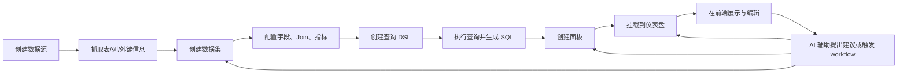

# Seedar 项目总览

## 1. 项目定位

Seedar 是一个围绕“指标分析与可视化搭建”展开的全栈产品，当前仓库同时包含：

- 面向业务用户的前端工作台
- 提供元数据管理、查询执行、仪表盘与 AI 能力的后端服务
- 面向部署与运维的 CLI
- 支撑前后端协作的共享类型、API 封装、可视化组件库和指标引擎

从实现上看，Seedar 的核心业务主线是：

`接入数据源 -> 建模数据集 -> 设计查询 -> 配置面板 -> 编排仪表盘 -> 借助 AI 辅助搭建与修改`

## 2. 仓库识别结果

这是一个 `pnpm` monorepo，workspace 边界来自根目录 [package.json](/D:/Program/projects/seedar/package.json) 和 [pnpm-workspace.yaml](/D:/Program/projects/seedar/pnpm-workspace.yaml)：

- 工作区目录：`apps/*`、`packages/*`
- 包管理器：`pnpm@10.25.0`
- Node 要求：`>=18`

### 2.1 可运行应用

| 目录 | 角色 | 关键技术 | 职责 |
| --- | --- | --- | --- |
| `apps/web-client` | 前端主应用 | React 18、Vite、React Router、React Query、Zustand | 管理数据源、数据集、面板、仪表盘与 AI 侧边栏 |
| `apps/server` | 后端 API 服务 | NestJS、TypeORM、Knex、LangChain、DeepAgents | 元数据管理、查询执行、AI 对话、统一响应与异常处理 |
| `apps/cli` | 部署与运维 CLI | Node.js、交互式命令行、Docker Compose 驱动 | 安装、升级、状态检查、日志查看、卸载、诊断 |

### 2.2 共享包

| 目录 | 类型 | 职责 |
| --- | --- | --- |
| `packages/types` | 共享协议层 | 前后端共用 DTO、类型、AI workflow schema、查询类型 |
| `packages/ui-core` | 前端基础能力层 | Axios API Client、按资源分类的 API 封装、基础工具 |
| `packages/ui-react` | 前端复用组件层 | Dashboard、Panel、图表、表格、hooks、布局与数据展示组件 |
| `packages/metric_engine` | 查询与指标内核 | DSL 转换、字段/表/指标抽象、SQL 生成、数据库方言适配 |

## 3. 代码结构与职责边界

### 3.1 前端入口与布局

前端入口在 [main.tsx](/D:/Program/projects/seedar/apps/web-client/src/main.tsx)：

- 初始化 `ApiClient`
- 默认 API 地址取 `VITE_API_BASE_URL`，未配置时走 `/api`
- 注入 `React Query` 与 `react-dnd`

前端路由定义在 [router/index.tsx](/D:/Program/projects/seedar/apps/web-client/src/core/router/index.tsx)，主页面全部挂在 [AppLayout.tsx](/D:/Program/projects/seedar/apps/web-client/src/layouts/AppLayout.tsx) 下。

主导航由 [GlobalNavigation.tsx](/D:/Program/projects/seedar/apps/web-client/src/core/components/business/GlobalNavigation/GlobalNavigation.tsx) 提供，包含：

- `/dashboard`
- `/panel`
- `/dataset`
- `/datasource`

布局层还有一个重要特征：全局右侧 AI 侧栏。它由 `isSeeMindOn` 状态控制，开启后会在页面右侧挂载 AI 预览面板。

### 3.2 后端入口与模块装配

后端入口在 [main.ts](/D:/Program/projects/seedar/apps/server/src/main.ts)，模块装配在 [app.module.ts](/D:/Program/projects/seedar/apps/server/src/app.module.ts)。

当前注册的核心业务模块为：

- `DatasourceModule`
- `DatasetModule`
- `QueryModule`
- `DashboardModule`
- `AiModule`

基础设施能力包括：

- `ConfigModule`：环境配置加载
- `TypeOrmModule`：MySQL 元数据库连接
- `LoggerModule`：统一日志
- 全局异常过滤器
- 全局日志拦截器
- 全局响应包装拦截器

### 3.3 CLI 与部署层

CLI 入口在 [cli.ts](/D:/Program/projects/seedar/apps/cli/src/cli.ts)，支持的主命令包括：

- `install`
- `start`
- `stop`
- `update`
- `uninstall`
- `remove`
- `purge`
- `status`
- `logs`
- `doctor`

部署模板位于 `deploy/templates/`，生产镜像和遗留 PowerShell 脚本位于 `deploy/`。

## 4. 业务切片总览

从代码结构和页面入口看，当前最值得关注的业务切片是以下 8 个：

1. 数据源管理
2. 数据集建模
3. 查询 DSL 与执行
4. 面板配置与预览
5. 仪表盘编排与展示
6. AI 对话与 workflow 打断恢复
7. 前端全局状态与动作分发
8. CLI 驱动的安装、升级与运维

这些切片之间不是平行关系，而是严格上下游关系。

## 5. 系统主闭环



## 6. 推荐阅读路线

### 6.1 面向新接手开发者

1. 先读本文件，明确三类应用和四类共享包的职责。
2. 再读 [seedar-business-flow.md](./seedar-business-flow.md)，理解业务主闭环。
3. 然后读 [seedar-frontend-backend-map.md](./seedar-frontend-backend-map.md)，理解页面与接口的映射。
4. 需要具体开发时，按所在模块进入 `apps/web-client/src/modules/*` 或 `apps/server/src/module/*` 深读。

### 6.2 面向前端开发者

推荐优先读：

- [router/index.tsx](/D:/Program/projects/seedar/apps/web-client/src/core/router/index.tsx)
- [AppLayout.tsx](/D:/Program/projects/seedar/apps/web-client/src/layouts/AppLayout.tsx)
- `apps/web-client/src/modules/datasource`
- `apps/web-client/src/modules/dataset`
- `apps/web-client/src/modules/panel`
- `apps/web-client/src/modules/dashboard`
- `packages/ui-core/src/api/*`
- `packages/ui-react/src/hooks/*`

### 6.3 面向后端开发者

推荐优先读：

- [app.module.ts](/D:/Program/projects/seedar/apps/server/src/app.module.ts)
- `apps/server/src/module/datasource`
- `apps/server/src/module/dataset`
- `apps/server/src/module/query`
- `apps/server/src/module/dashboard`
- `apps/server/src/module/ai`
- `packages/metric_engine`

### 6.4 面向部署与发布维护者

推荐优先读：

- [apps/cli/src/cli.ts](/D:/Program/projects/seedar/apps/cli/src/cli.ts)
- `apps/cli/src/commands/*`
- [deploy/README.zh-CN.md](/D:/Program/projects/seedar/deploy/README.zh-CN.md)
- [docs/deployment-architecture.md](/D:/Program/projects/seedar/docs/deployment-architecture.md)
- [docs/release-process.md](/D:/Program/projects/seedar/docs/release-process.md)

## 7. 关键实现特征

### 7.1 统一 API 包装

后端通过 [global-response.interceptor.ts](/D:/Program/projects/seedar/apps/server/src/common/global-response.interceptor.ts) 将正常响应包装成统一结构：

```ts
{
  success: true,
  code: 'SUCCESS',
  message,
  data
}
```

前端 [ApiClient](/D:/Program/projects/seedar/packages/ui-core/src/api/client.ts) 默认开启 `autoParseResponse`，会直接把 `data` 取出，因此前端业务代码通常拿到的是解包后的业务对象，而不是完整 HTTP 包装。

### 7.2 AI 不只是聊天窗口

AI 相关实现不仅包含传统问答，还包含：

- 流式 SSE 消息处理
- 会话持久化
- 页面场景注入
- workflow interrupt 执行
- 前端动作队列分发

这意味着 AI 模块已经承担“页面动作编排器”的角色，而不是单纯文本助手。

### 7.3 Query 模块是系统中枢

查询模块连接了：

- 上游 `Dataset`
- 中间 DSL 转换器
- 下游 `metric_engine`
- 真实数据源连接
- 面板数据预览与仪表盘显示

如果要理解“为什么一个面板能显示数据”，必须追到 QueryService 和 Metric Engine。

## 8. 重点关注目录

本次分析中，最值得优先深读的目录和文件如下：

1. [apps/web-client/src/core/router/index.tsx](/D:/Program/projects/seedar/apps/web-client/src/core/router/index.tsx)
2. [apps/web-client/src/modules/dataset](/D:/Program/projects/seedar/apps/web-client/src/modules/dataset)
3. [apps/web-client/src/modules/panel](/D:/Program/projects/seedar/apps/web-client/src/modules/panel)
4. [packages/ui-core/src/api](/D:/Program/projects/seedar/packages/ui-core/src/api)
5. [apps/server/src/module/datasource](/D:/Program/projects/seedar/apps/server/src/module/datasource)
6. [apps/server/src/module/dataset](/D:/Program/projects/seedar/apps/server/src/module/dataset)
7. [apps/server/src/module/query](/D:/Program/projects/seedar/apps/server/src/module/query)
8. [packages/metric_engine](/D:/Program/projects/seedar/packages/metric_engine)

## 9. 当前可确认与待验证点

### 当前可确认

- 前端主业务已围绕数据源、数据集、面板、仪表盘形成完整链路。
- 后端已实现统一响应包装、统一异常处理和模块化资源管理。
- CLI 已被设计为推荐的生产部署入口。
- AI 模块已和页面 workflow、场景状态、流式消息机制打通。

### 待验证点

- 当前生产环境实际采用的数据库和端口配置，仍需结合部署环境变量确认。
- `UserPage` 仍存在固定 `dashboardId` 的实现痕迹，更像实验性或过渡页面。
- AI 场景与 workflow 模板的完整产品策略，需要结合业务方使用方式进一步确认。
