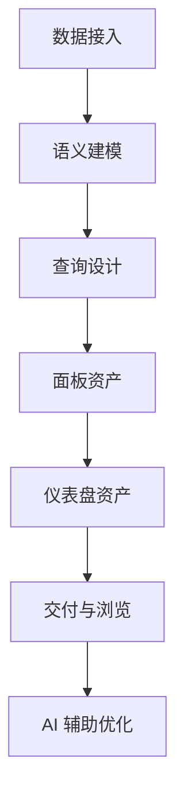

# Seedar 产品反推文档

## 1. 文档目的

本文不是正式 PRD，而是基于当前实现反推：

- 产品想解决什么问题
- 面向什么角色
- 当前已实现到什么程度
- 哪些边界仍然是推断

## 2. 反推出的产品目标

从代码结构和交互设计看，Seedar 的产品目标大致是：

1. 帮助用户把异构数据库快速接入到统一分析工作台。
2. 让用户在不直接写 SQL 的情况下，通过数据集与可视化配置完成分析资产搭建。
3. 让查询、面板、仪表盘形成可复用资产。
4. 让 AI 在具体页面场景里辅助建模、查询和可视化搭建。
5. 让部署和交付可以通过 CLI 完成，降低上线与运维门槛。

## 3. 目标用户

### 3.1 主要用户

推断的主要用户是：

- 数据分析师
- BI / 数据产品同学
- 需要搭建内部分析看板的业务团队
- 具备一定数据理解但未必想手写 SQL 的用户

### 3.2 次级用户

- 前后端开发者
- 平台维护者
- 运维 / 部署人员

## 4. 核心使用场景

### 场景一：把业务数据库接进来

用户需要：

- 输入数据库连接信息
- 验证连接
- 看到表结构和外键关系

产品价值：

- 把原始数据库变成可继续建模的元数据资产

### 场景二：把物理表整理成业务数据集

用户需要：

- 选择分析范围
- 配字段名和业务名
- 配主键和表连接
- 定义指标

产品价值：

- 把复杂物理结构转换成语义层

### 场景三：快速构建分析面板

用户需要：

- 从数据集拖字段与指标
- 运行查询
- 选择图表类型
- 调整配置并预览

产品价值：

- 让“查询 + 展示”绑定成可复用资产

### 场景四：拼装完整仪表盘

用户需要：

- 把多个面板放进同一个视图
- 拖拽布局
- 编辑 / 浏览切换

产品价值：

- 把多个分析视图整合成交付物

### 场景五：让 AI 协助完成搭建

用户需要：

- 在当前页面上下文里直接提问
- 获得图表推荐、查询辅助、workflow 执行

产品价值：

- 降低学习成本和搭建成本

## 5. 已实现范围

从代码可确认，当前已经具备以下能力：

- 数据源 CRUD、连接测试、元数据抓取
- 数据集创建、编辑、字段与 Join 管理、指标管理
- Query CRUD、临时执行、SQL 生成与结果回传
- 面板 CRUD、状态切换、预览
- 仪表盘 CRUD、布局更新、添加 / 移除面板
- AI 会话、流式聊天、字段业务名生成、workflow interrupt
- CLI 安装、升级、状态、日志、卸载、诊断

## 6. 产品结构反推

## 7. 当前产品形态特征

### 7.1 强资产化

实现中明显存在“资产”分层：

- 数据源是资产
- 数据集是资产
- Query 是资产
- 面板是资产
- 仪表盘是资产

这说明产品目标不是一次性分析，而是沉淀长期复用的分析对象。

### 7.2 强页面上下文

AI 会带上 `scenes`，workflow 会根据当前页面上下文执行动作。这说明产品不是把 AI 放在站外，而是把 AI 嵌入工作台内部。

### 7.3 兼顾开发者和业务用户

仓库中同时存在：

- 可视化工作台
- 底层 DSL / SQL 引擎
- 部署 CLI

这通常意味着产品既服务业务使用，也服务内部平台建设。

## 8. 暂未完全确认的部分

以下内容更偏推断，需要结合真实产品团队再确认：

1. 是否计划支持更多非数据库型数据源，例如 CSV / Excel 的完整流程。
2. Query 是否长期设计为面板私有资产，还是未来会成为可跨面板复用的分析资产。
3. AI workflow 是否会继续扩展到“自动创建数据集 / 自动创建面板 / 自动修复错误”等更强动作。
4. 用户、权限、组织等多租户能力是否已在产品规划中，当前代码里并不明显。

## 9. 可视为产品约束的实现事实

1. 产品默认依赖一套 Seedar 自身元数据库。
2. 用户先有数据源，后有数据集，之后才能构建 Query 和面板。
3. 多表数据集要求有明确关联关系。
4. 仪表盘布局依赖已有面板，不能引用不存在的 panelId。
5. AI 不是脱离页面存在，而是依赖页面场景和 workflow 执行器。

## 10. 一句话总结

从当前实现反推，Seedar 更像一个“带 AI 辅助的数据建模与分析工作台”，而不是单纯图表库、查询器或聊天机器人。
