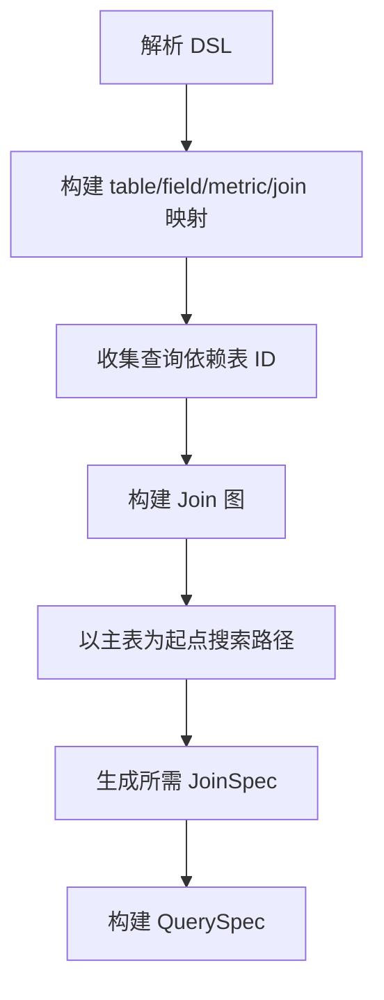

# Seedar 查询与指标引擎设计

## 1. 文档目的

本文详细说明 Seedar 的查询执行机制与指标引擎设计，这是整个系统中最适合写入毕业论文“关键技术实现”章节的部分之一。

重点包括：

- Query DSL 结构
- 动态 Join 计算
- 指标表达式体系
- SQL 生成链路
- 结果映射机制

## 2. 核心问题

在 Seedar 中，用户不是直接写 SQL，而是在前端通过字段、维度、指标、过滤条件和展示配置描述自己的分析需求。

因此系统需要解决以下问题：

1. 如何把业务化的前端配置转成可执行查询。
2. 如何自动决定需要 Join 哪些表。
3. 如何支持聚合指标、行级指标、周期对比指标等复杂表达。
4. 如何把 SQL 执行结果再映射回前端能理解的业务字段。

## 3. Query DSL 的定位

`QueryDSL` 位于前端编辑器和后端执行引擎之间，是一个中间协议层。

它的作用不是直接描述数据库结构，而是描述：

- 要基于哪个数据集查询
- 要选择哪些维度
- 要选择哪些指标
- 需要哪些过滤与排序
- 是否需要临时指标、分页或 TopN

## 4. Query DSL 结构

根据 [dsl-transformer.v2.ts](/D:/Program/projects/seedar/apps/server/src/module/query/dsl-transformer/dsl-transformer.v2.ts)，DSL 主要包括：

```ts
interface QueryDSL {
  datasetId: number;
  tableId?: number;
  dimensions?: QueryDimensionDSL[];
  metrics?: Array<{ id: number; alias?: string }>;
  filters?: Array<{ fieldId: number; op: string; value?: any; raw?: boolean }>;
  tempMetrics?: Array<...>;
  orderBy?: QueryOrderByDSL[];
  topN?: number;
  limit?: number;
  offset?: number;
}
```

### 4.1 维度设计

维度不仅支持普通字段，还支持派生维度：

- `time_grain`
- `bucket`
- `mapping`
- `expression`

这说明系统不仅能查询已有字段，还能在查询期动态构造“时间粒度维度”“分桶维度”“映射维度”和“表达式维度”。

### 4.2 指标设计

Query 中可出现两类指标：

1. 数据集中已定义的指标
2. 查询期临时指标 `tempMetrics`

尤其 `tempMetrics` 中的周期对比型指标，是系统分析能力的一个明显亮点。

## 5. 设计思想：为什么不让前端直接带 joins

从 `DSLTransformerV2` 的注释可以明确看出，本版设计刻意取消了前端 DSL 中的 `joins` 字段。

### 5.1 旧问题

如果让前端显式告诉后端要 Join 哪些表，会带来三个问题：

1. 前端必须理解表之间的关系，复杂度过高。
2. 容易产生不必要的 Join，影响性能。
3. Join 逻辑本质属于后端数据模型，不适合交由前端控制。

### 5.2 新方案

后端根据：

- dimensions
- metrics
- filters

自动推导查询涉及哪些表，再根据数据集内的 Join 配置计算最优连接路径。

这是一种“语义驱动的动态 Join 策略”。

## 6. 动态 Join 算法

### 6.1 总体流程



### 6.2 第一步：建立映射

系统会先把数据集中的：

- tables
- fields
- metrics
- joins

转换成多个 `Map`，便于后续 O(1) 查询。

### 6.3 第二步：收集依赖表

系统会遍历：

- 所有维度
- 所有指标
- 所有过滤条件
- 所有临时指标

递归收集它们依赖的表 ID，形成 `requiredTableIds`。

这里有两个关键点：

1. 指标依赖可能是递归的，因为一个指标可以引用另一个指标。
2. 表达式指标和表达式维度可能包含字段引用与指标引用，因此需要做表达式解析。

### 6.4 第三步：构建 Join 图

系统根据数据集中已有的 `DatasetJoin` 定义构建一个“表连接图”。

图的节点是表，边是 Join 关系。

这一步的价值在于：

- 后续不必再回到原始数组遍历
- 可以直接做路径搜索

### 6.5 第四步：搜索最优路径

系统通过类似 BFS 的方式，从主表出发，搜索到所有 `requiredTableIds` 的路径。

设计目标：

1. 尽量使用更短路径
2. 尽量减少不必要 Join
3. 考虑左右 Join 方向带来的代价

从实现上看，系统引入了：

- `directionPenalty`
- `JoinTraversalCost`

说明它不是只按“步数最短”找路，而是同时考虑 Join 方向是否自然。

### 6.6 第五步：生成 JoinSpec

得到需要的 Join 路径后，系统将其转换为 `QuerySpec` 所需的 `JoinSpec[]`。

此时还会顺便为各表分配别名，如：

- `t1`
- `t2`
- `t3`

这样后续字段表达式就能正确生成带别名的 SQL 引用。

## 7. 指标引擎设计

查询引擎之所以复杂，很大程度上是因为指标不是单一 `SUM(column)` 那么简单。

根据 `dataset_metric` 与 `DSLTransformerV2` 的实现，当前指标体系至少包含以下几类：

### 7.1 聚合指标

例如：

- `SUM`
- `COUNT`
- `AVG`
- `MAX`
- `MIN`
- `DISTINCT_COUNT`

这是最基础的一类指标。

### 7.2 行级指标

通过左右操作数和四则运算组成，例如：

- 单价 × 数量
- 收入 - 成本

这类指标本质上是“单行表达式”，再由聚合逻辑决定是否向上汇总。

### 7.3 后聚合指标

即指标引用指标，例如：

- 在已有聚合结果之上再做一次聚合

### 7.4 算术指标

通过多个指标之间的运算构成，例如：

- 利润 = 销售额 - 成本
- 利润率 = 利润 / 销售额

### 7.5 周期对比指标

例如：

- 日环比
- 周环比
- 月环比
- 季环比
- 年同比

这类指标对论文来说非常有价值，因为它能体现系统支持更高级分析能力，而不是仅支持简单汇总。

### 7.6 表达式型指标与维度

系统还支持使用表达式解析器构造复杂表达式，这使查询层具有更高扩展性。

## 8. `metric_engine` 的作用

`packages/metric_engine` 是查询执行链中的独立内核。

根据 [packages/metric_engine/src/index.ts](/D:/Program/projects/seedar/packages/metric_engine/src/index.ts)，它主要分为三块：

1. V2 表达式 AST
2. V2 SQL 构建器
3. V1 兼容层

### 8.1 V2 表达式层

它抽象了：

- `FieldRefExpr`
- `AggExpr`
- `BinaryExpr`
- `CallExpr`
- `ConditionalExpr`
- `InExpr`
- `BetweenExpr`
- `LikeExpr`
- `IsNullExpr`
- `PeriodComparisonExpr`

这意味着 Seedar 的查询不是用字符串拼接出来的，而是先形成表达式树，再生成 SQL。

### 8.2 V2 SQL 层

SQL 层基于 Knex 进行构建，其职责是：

- 接收 `QuerySpec`
- 按不同数据库方言构造 SQL
- 必要时使用 CTE 处理多层聚合逻辑

### 8.3 兼容层

兼容层的存在说明项目经历过查询引擎演进，目前仍保留旧 API 的迁移能力。

这对论文写作也有帮助，因为可以解释系统是如何从简单查询能力迭代到更规范的表达式与 QuerySpec 架构。

## 9. 查询执行完整链路

### 9.1 正式查询执行

流程：

1. 根据 `queryId` 读取 `Query`
2. 从 `Query` 中读取 `dsl`
3. 查 `Dataset`
4. 查 `Datasource`
5. 解密数据源配置
6. 构建 `Table[]`
7. DSL 转 QuerySpec
8. QuerySpec 转 SQL
9. 执行 SQL
10. 返回结果

### 9.2 临时查询执行

流程更短：

1. 前端直接提交临时 DSL
2. 后端基于 `datasetId` 获取上下文
3. 直接进入转换与执行链

这就是面板编辑页“边配边预览”的技术基础。

## 10. 结果映射机制

系统返回的不只是原始行列结果，还会返回 `columnMappings`。

它的作用是把 SQL 列和业务概念重新关联起来，例如：

- 这是一个字段
- 这是一个指标
- 这是一个派生维度
- 这是一个临时指标

这项机制的意义在于：

1. 前端不必依赖数据库原始列名做展示
2. UI 可以显示业务名、别名和更友好的标题

## 11. 设计亮点总结

从系统设计角度看，查询与指标引擎部分有四个明显亮点：

### 11.1 前端不直写 SQL

降低了前端复杂度，也降低了安全风险。

### 11.2 Join 自动推导

将数据关系的解释权从前端收回到后端数据模型层。

### 11.3 指标表达能力强

不仅支持聚合，还支持行级、后聚合、算术和周期对比指标。

### 11.4 查询引擎独立成包

让业务层与执行层解耦，增强了系统可维护性与可扩展性。

## 12. 可直接用于论文的总结表述

可以将本部分概括为：

“Seedar 采用基于 DSL 的查询执行机制。前端通过维度、指标、过滤条件等语义化配置描述分析需求，后端首先基于数据集元信息推导查询所涉及的表与连接路径，再将 DSL 转换为 QuerySpec，最后借助自研指标引擎生成 SQL 并在外部数据源上执行。该设计有效屏蔽了底层数据库差异，提高了查询构建的灵活性，并支持聚合、行级、算术与周期对比等多种复杂指标表达。”
