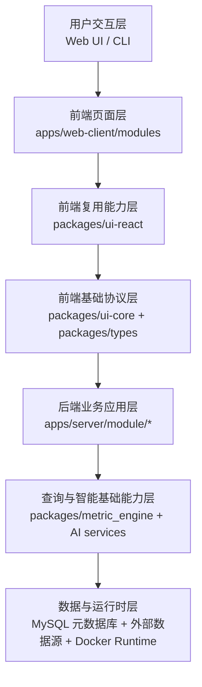
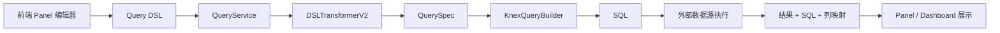
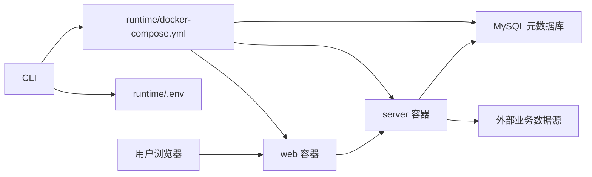

# Seedar 系统总体架构设计

## 1. 文档目的

本文从系统设计角度说明 Seedar 的总体架构，重点描述：

- 项目整体分层
- 前端、后端、CLI 与共享包的关系
- 运行时拓扑
- 关键调用链
- 架构设计背后的考虑

对于毕业论文，这篇文档可以直接支撑“系统总体设计”一章。

## 2. 系统定位

Seedar 是一个围绕“数据接入、语义建模、查询执行、可视化展示与 AI 辅助搭建”展开的全栈分析平台。

与传统的单一图表系统相比，Seedar 的特点在于：

1. 它不仅展示数据，还允许用户构建数据集与查询资产。
2. 它不仅有前后端业务系统，还具备独立的部署 CLI。
3. 它把 AI 从“聊天功能”提升为“带场景感知和 workflow 能力的智能助手”。

## 3. 总体架构分层

从源码结构看，系统可以被抽象成七层：

### 3.1 用户交互层

这一层面向两类用户：

- 业务用户或平台用户：通过 Web 前端完成数据源接入、数据集建模、面板搭建和仪表盘查看。
- 运维或部署用户：通过 CLI 安装、升级、查看运行状态与日志。

### 3.2 前端页面层

对应 `apps/web-client/src/modules/*`，主要负责：

- 页面容器
- 路由与布局
- 表单与交互
- 将用户动作映射到 hooks 和 API 调用

这一层是业务感知最强的一层。

### 3.3 前端复用能力层

对应 `packages/ui-react`，主要负责：

- React Query hooks
- 仪表盘与面板组件
- 图表、卡片、表格等数据展示组件
- 布局容器与通用 UI 交互能力

这一层起到了“业务页面”和“基础 API / 类型层”之间的桥梁作用。

### 3.4 前端基础协议层

对应 `packages/ui-core` 与 `packages/types`：

- `packages/types` 负责共享 DTO、接口类型、AI workflow 类型
- `packages/ui-core` 负责统一 HTTP Client 与资源 API 封装

这一层使得前后端之间的通信具备明确契约。

### 3.5 后端业务应用层

对应 `apps/server/src/module/*`，当前核心模块包括：

- `datasource`
- `dataset`
- `query`
- `dashboard`
- `ai`

这一层负责：

- 业务校验
- 应用服务编排
- 数据库读写
- 对外 API 暴露

### 3.6 查询与智能基础能力层

这一层由两部分组成：

1. `packages/metric_engine`
2. `apps/server/src/module/ai/services/*`

前者负责查询 DSL、表达式、SQL 生成；后者负责大模型、工具调用、skill 与 workflow 逻辑。

### 3.7 数据与运行时层

这一层同时包含：

- Seedar 自身元数据库
- 外部业务数据库 / 文件数据源
- Docker 运行时环境

它是系统持久化和实际执行的底座。

## 4. Monorepo 架构

Seedar 使用 `pnpm` monorepo 管理代码，workspace 由根 [package.json](/D:/Program/projects/seedar/package.json) 和 [pnpm-workspace.yaml](/D:/Program/projects/seedar/pnpm-workspace.yaml) 定义。

### 4.1 应用层目录

| 目录 | 作用 |
| --- | --- |
| `apps/web-client` | 用户前端工作台 |
| `apps/server` | 后端 API 服务 |
| `apps/cli` | 安装与运维 CLI |

### 4.2 共享包目录

| 目录 | 作用 |
| --- | --- |
| `packages/types` | 类型与协议 |
| `packages/ui-core` | API client 与基础工具 |
| `packages/ui-react` | UI 组件与 hooks |
| `packages/metric_engine` | 查询与指标引擎 |

### 4.3 Monorepo 的直接收益

1. 前后端共享类型，降低接口漂移风险。
2. 可视化组件、API hooks、查询引擎可在多个应用间复用。
3. 便于统一构建、统一版本与统一发布。

### 4.4 Monorepo 的代价

1. 目录层级复杂，新人理解成本更高。
2. 一次改动可能联动多个 workspace。
3. 如果契约边界管理不清，容易产生“跨层直接耦合”。

## 5. Web 端架构

### 5.1 Web 端入口

前端入口在 [main.tsx](/D:/Program/projects/seedar/apps/web-client/src/main.tsx)，主要工作包括：

- 初始化 `ApiClient`
- 注入 `React Query`
- 注入 `react-dnd`
- 渲染根组件 `App`

### 5.2 路由结构

路由定义在 [apps/web-client/src/core/router/index.tsx](/D:/Program/projects/seedar/apps/web-client/src/core/router/index.tsx)，采用“顶层布局 + 业务模块页面”的方式组织。

顶层布局 [AppLayout.tsx](/D:/Program/projects/seedar/apps/web-client/src/layouts/AppLayout.tsx) 负责：

- 全局导航
- 主内容区
- AI 侧栏的开关与布局伸缩

### 5.3 状态管理策略

前端状态没有采用单一大 store，而是按场景拆分：

- React Query：服务端数据状态
- Zustand：本地 UI 状态、workflow 动作状态、AI 场景状态

这种分层方式的优点是：

- 请求缓存和本地 UI 状态职责清晰
- 降低了“所有状态都挤到一个全局 store”的复杂度

## 6. 后端架构

### 6.1 后端入口

后端入口在 [main.ts](/D:/Program/projects/seedar/apps/server/src/main.ts)，应用模块装配在 [app.module.ts](/D:/Program/projects/seedar/apps/server/src/app.module.ts)。

### 6.2 基础设施能力

后端全局基础设施包括：

- `ConfigModule`：环境配置
- `TypeOrmModule`：元数据库 ORM
- `LoggerModule`：日志
- `GlobalExceptionFilter`：统一错误响应
- `GlobalLoggingInterceptor`：请求日志
- `GlobalResponseInterceptor`：统一成功响应包装

### 6.3 业务模块组织模式

各业务模块大多采用相近结构：

- `controller`
- `service`
- `entity`
- `dto`
- `docs`

这种结构便于：

- 把 HTTP 入口、业务编排、数据结构与文档沉淀分开
- 为论文中的“模块设计”提供天然边界

## 7. 数据架构

Seedar 的数据架构并非只有一个数据库，而是“两类数据空间”并存：

### 7.1 元数据库

Seedar 自己的 MySQL 元数据库负责保存：

- 数据源配置
- 数据源元数据缓存
- 数据集与字段、Join、指标定义
- Query
- Panel
- Dashboard
- AI 与 AI Session

### 7.2 外部业务数据源

用户接入的真实业务数据源负责保存原始业务数据，例如：

- MySQL
- PostgreSQL
- ClickHouse

Seedar 不直接替代这些数据库，而是在其上构建建模与分析层。

## 8. 查询执行架构

查询执行是系统中枢，其整体调用链如下：

这种设计的关键价值在于：

- 前端无需直接生成 SQL
- 后端可统一控制 join、表达式、字段映射和数据库方言
- `metric_engine` 可以独立演化

## 9. AI 架构

AI 模块的核心不在于“接入了某个模型”，而在于建立了“模型 + 工具 + skill + workflow + 页面动作”的组合架构。

### 9.1 后端 AI 层

主要由以下对象构成：

- `AiService`
- `ChatService`
- `ToolService`
- `AiSessionService`

### 9.2 前端 AI 层

主要由以下对象构成：

- `AIChatPreview`
- `useSSEHandler`
- `useWorkflowInterruptExecutor`
- `WorkflowActionsStore`
- `AiChatScenesStore`

### 9.3 AI 的系统特色

与传统 chatbot 相比，Seedar 的 AI 模块具有三个明显特征：

1. 具备页面场景感知
2. 支持工具调用
3. 支持 workflow interrupt 驱动前端动作

## 10. 部署架构

### 10.1 推荐部署模式

当前推荐部署路径是 CLI 驱动 + Docker 运行时。

运行时包含：

- `mysql`
- `server`
- `migrate`
- `web`

### 10.2 运行时拓扑

## 11. 关键架构特征总结

### 11.1 资产化设计

系统不是临时执行工具，而是通过多层资产沉淀业务结果：

- DataSource
- Dataset
- Query
- Panel
- Dashboard

### 11.2 契约先行

通过 `packages/types` 共享 DTO 和类型，说明系统架构强调前后端契约统一。

### 11.3 引擎化思路

查询部分没有把 SQL 拼接散落在业务代码中，而是抽离出独立引擎层，这一点很适合在论文中强调为“核心设计亮点”。

### 11.4 智能化增强

AI 不是外挂模块，而是贯穿页面上下文、工作流和工具体系的增强层。

## 12. 可直接用于论文的总结表述

可以将 Seedar 的总体架构概括为：

“Seedar 采用基于 monorepo 的分层全栈架构，将系统划分为前端交互层、共享能力层、后端业务层、查询引擎层、智能辅助层与运行时层。该架构既保证了前后端契约一致性，又支持查询执行与 AI 辅助能力的独立演进，从而满足数据接入、语义建模、查询分析、可视化展示与部署运维的综合需求。”
